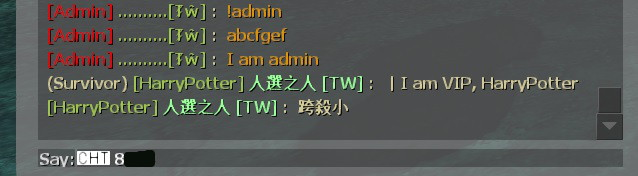
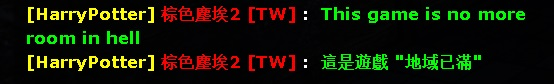

# Description | 內容
Changes the colors of players chat based on config file.

> __Note__ <br/>
This plugin is private, Please contact [me](/#私人插件列表-private-plugins-list)<br/>
此為私人插件, 請聯繫[本人](/#私人插件列表-private-plugins-list)

* Apply to | 適用於
	```
	Any Source Game
	```

* Image | 圖示
	* Chat Colors & Title (聊天的顏色與稱號)
		* L4D1/2
		<br/>
		* Other Source Game - 其他Sourcemod引擎遊戲
		<br/>

* <details><summary>How does it work?</summary>

	* Admin can have different colors and title in chatbox
	* You can customize in [configs/simple-chatcolors.cfg](configs/simple-chatcolors.cfg)
		* Set admin, vip and normal players
		* Set chat colors and title
	* 🟥 Colors are different and some not work in each source engine game, you need to test
</details>

* Require | 必要安裝
	1. [simple_chatprocessor](https://github.com/fbef0102/Sourcemod-Plugins/tree/main/simple_chatprocessor)
	2. [smlib](https://github.com/fbef0102/L4D1_2-Plugins/releases/tag/smlib-Colors)

* <details><summary>Command | 命令</summary>

	* **Reloads settings from the config file (Adm Required: ADMFLAG_ROOT)**
		```php
		sm_reloadscc
		```
		
	* **Prints out the color names in their color (Adm Required: ADMFLAG_ROOT)**
		```php
		sm_printcolors
		```
</details>

* <details><summary>Changelog | 版本日誌</summary>

	* v1.4h (2025-1-8)
		* Fixed error

	* v1.3h (2024-8-3)
		* Require simple_chatprocessor 1.8h or above
		
	* v1.2h (2024-1-20)
		* Compatible with [l4d_ranking_system](/L4D_插件/Fun_娛樂/l4d_ranking_system) by harry

	* v1.1h (2023-12-29)
		* Optimize code and improve performance

	* v1.0h (2023-6-15)
		* Remake code, convert code to latest syntax
		* Fix warnings when compiling on SourceMod 1.11.
		* Optimize code and improve performance
		* Use Steam64 ID instead of STEAM_X:X:XXXXXX

	* v2.2.0
		* [Original Plugin By Antithasys](https://forums.alliedmods.net/showthread.php?t=167814)
</details>

- - - -
# 中文說明
根據管理員或玩家身分修改聊天窗口的對話顏色

* 原理
	* 管理員在聊天窗口輸入文字並送出之後，依照其身分顯示對應的稱號並修改顏色
	* 普通玩家也可以有稱號與顏色
	* 自行在文件裡修改: [configs/simple-chatcolors.cfg](configs/simple-chatcolors.cfg)
		* 可以自行根據玩家身分做調整
		* 設置顏色與稱號
	* 🟥 每個Source引擎遊戲呈現的顏色都不同, 符號也不一定有用, 請自己測試

* <details><summary>命令中文介紹 (點我展開)</summary>

	* **重新載入文件 (權限: ADMFLAG_ROOT)**
		```php
		sm_reloadscc
		```
		
	* **打印所有可用顏色 (權限: ADMFLAG_ROOT)**
		```php
		sm_printcolors
		```
</details>