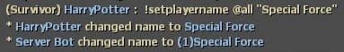
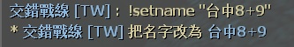
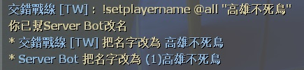

# Description | 內容
Player can set name via cmd + Admin can set other player's name

> __Note__ <br/>
This plugin is private, Please contact [me](https://github.com/fbef0102/Game-Private_Plugin#私人插件列表-private-plugins-list)<br/>
此為私人插件, 請聯繫[本人](https://github.com/fbef0102/Game-Private_Plugin#私人插件列表-private-plugins-list)

* Image | 圖示
	<br/>
	<br/>

* Apply to | 適用於
	```
	Any source game
	```

* <details><summary>How does it work?</summary>

	* Player can type ```!setname xxx``` to changed your name during game
	* Admin can type ```!setplayername <#userid|name> xxx``` to changed other player's name during game
</details>

* Require | 必要安裝
<br>None

* <details><summary>ConVar | 指令</summary>

	* cfg/sourcemod/smd_set_player_name_cmd.cfg
		```php
		// 0=Plugin off, 1=Plugin on.
		smd_set_player_name_cmd_enable "1"

		// Players with these flags have access to use cmd to set his/her own name (Empty = Everyone, -1: Nobody)
		// Usage: !setname xxx
		smd_set_player_name_cmd_self_flag ""

		// Players with these flags have access to use cmd to set other player's name (Empty = Everyone, -1: Nobody).
		// Usage: !setplayername <#userid|name> xxx
		smd_set_player_name_cmd_other_flag "z"

		// If 1, announce name change
		smd_set_player_name_cmd_announce "1"
		```
</details>

* <details><summary>Command | 命令</summary>

	* **Set your name**
		```php
		sm_setname xxx
		```

	* **Set other player's name**
		```php
		sm_setplayername <#userid|name> xxx
		```
</details>

* <details><summary>Translation Support | 支援翻譯</summary>

	```
	English
	繁體中文
	简体中文
	```
</details>

* <details><summary>Changelog | 版本日誌</summary>

	* v1.0 (2024-12-20)
		* Initial Release
</details>

- - - -
# 中文說明
玩家自己改名 + 管理員幫玩家改名

* 圖示
	<br/>
	<br/>

* 原理
	* 玩家輸入  ```!setname xxx``` 幫自己改名
	* 管理員輸入  ```!setplayername <#userid|name> xxx``` 幫別的玩家改名

* <details><summary>指令中文介紹 (點我展開)</summary>

	* cfg/sourcemod/smd_set_player_name_cmd.cfg
		```php
		// 0=關閉插件, 1=啟動插件
		smd_set_player_name_cmd_enable "1"

		// 擁有這些權限的玩家，才可以幫自己改名 (留白 = 任何人都能, -1: 無人)
		// 使用方式: !setname xxx
		smd_set_player_name_cmd_self_flag ""

		// 擁有這些權限的玩家，才可以幫別的玩家改名 (留白 = 任何人都能, -1: 無人)
		// 使用方式: !setplayername <#userid|name> xxx
		smd_set_player_name_cmd_other_flag "z"

		// 為1時，聊天框會提示玩家改名
		smd_set_player_name_cmd_announce "1"
		```
</details>

* <details><summary>命令中文介紹 (點我展開)</summary>

	* **幫自己改名**
		```php
		sm_setname xxx
		```

	* **幫別的玩家改名**
		```php
		sm_setplayername <#userid|name> xxx
		```
</details>