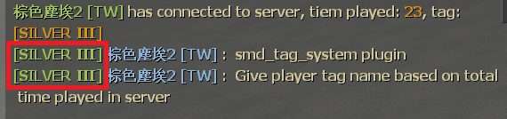
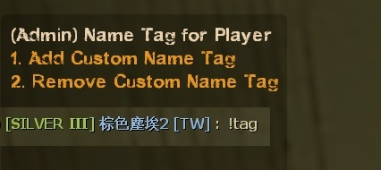
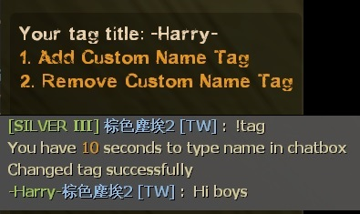
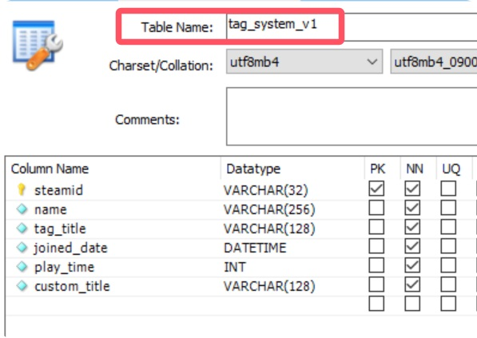
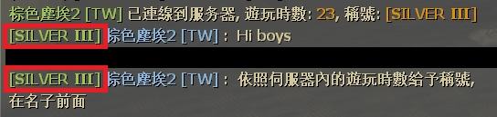
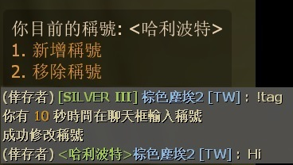

# Description | 內容
Give player tag name based on total time played in server

> __Note__ <br/>
This plugin is private, Please contact [me](https://github.com/fbef0102/Game-Private_Plugin#私人插件列表-private-plugins-list)<br/>
此為私人插件, 請聯繫[本人](https://github.com/fbef0102/Game-Private_Plugin#私人插件列表-private-plugins-list)

* Apply to | 適用於
	```
	Any Source Game
	```

* Image | 圖示
	<br/>

* <details><summary>How does it work?</summary>

	* Give player tag name based on total time played in server
	* Add tag to player name in chatbox
	* Admin can type ```!tag``` to change other player's tag name
	<br/>
	* Non-Admin players can type ```!tag``` to change tag name (if enough time played)
	<br/>
	* You can modify tag and color in [configs/smd_tag_system.cfg](configs/smd_tag_system.cfg)
		* 🟥 Colors are different and some not work in each source engine game, you need to test
	* Save Database (MySQL & SQLite supported)
	<br/>
</details>

* Require | 必要安裝
	1. [simple_chatprocessor](https://github.com/fbef0102/Sourcemod-Plugins/tree/main/simple_chatprocessor)
	2. [smlib](https://github.com/fbef0102/L4D1_2-Plugins/releases/tag/smlib-Colors)

* <details><summary>ConVar | 指令</summary>

	* cfg/sourcemod/smd_tag_system.cfg
		```php
		// 0=Plugin off, 1=Plugin on.
		smd_tag_system_allow "1"

		// Numbers of real survivor + infected player require to add time played in server.
		smd_tag_system_player_require "2"

		// Players with these flags have access to use command to change other player's tag name. type !tag to open menu (Empty = Everyone, -1: Nobody)
		smd_tag_system_menu_access "z"

		// No access players can use command to change his own tag name if time played over this value (hour). type !tag to change tag  (0=off)
		smd_tag_system_time_threshold "800"

		// Database to save tag system. (MySQL & SQLite supported)
		smd_tag_system_database "name_tag"
		```
</details>

* <details><summary>Command | 命令</summary>

	* **(Admin) Open menu to change other player's Name Tag manually**
	* **(No-Admin) Set or Remove custom tag**
		```php
		sm_tag
		```
</details>

* <details><summary>How to Set Database</summary>

	* Choose one of the following method
		1. MySQL: Database across server, set ConVar ```smd_tag_system_database "name_tag"``` and write the following in ```sourcemod/configs/databases.cfg```
			```php
			// There would a data table named "Tag_System_V1" in database
			"name_tag"
			{
				"driver"			"mysql"
				"host"				"x.x.x.x"
				"database"			"yourdatabase"
				"user"				"youruser"
				"pass"				"yourpass"
				"port"				"yourport"
			}
			```

		2. SQLite: Local Database, set ConVar ```smd_tag_system_database "name_tag"``` and write the following in ```sourcemod/configs/databases.cfg```
			```php
			// There would be a file created: sourcemod/data/sqlite/Tag_System.sq3
			"name_tag"
			{
				"driver"			"sqlite"
				"database"			"Tag_System"
			}
			```
</details>

* Translation Support | 支援翻譯
	```
	translations/smd_tag_system.phrases.txt
	```

* <details><summary>Changelog | 版本日誌</summary>

	* v1.0 (2025-3-5)
		* Initial Release
</details>

- - - -
# 中文說明
根據玩家在伺服器內的遊玩時數給予對應的稱號

* 圖示
	<br/>

* 原理
	* 根據玩家在伺服器內的遊玩時數給予對應的稱號
	* 在聊天框的玩家名子前顯示稱號
	* 管理員可以輸入 ```!tag``` 修改其他玩家的稱號
	<br/>
	* 非管理員的玩家可以輸入 ```!tag``` 修改自己的稱號 (必須達到一定的遊玩時數)
	<br/>
	* 想要修改稱號名稱與顏色請查看文件: [configs/smd_tag_system.cfg](configs/smd_tag_system.cfg)
		* 內有中文說明，可點擊查看
		* 🟥 每個Source引擎遊戲呈現的顏色都不同, 符號也不一定有用, 請自己測試
	* 使用資料庫保存玩家在伺服器內的遊玩時數 (支援 MySQL & SQLite)
	<br/>

* <details><summary>指令中文介紹 (點我展開)</summary>

	* cfg/sourcemod/smd_tag_system.cfg
		```php
		// 0=關閉插件, 1=啟動插件
		smd_tag_system_allow "1"

		// 至少需要X位真人玩家在倖存者與特感隊伍，插件才會增加在伺服器內的遊玩時數.
		smd_tag_system_player_require "2"

		// 擁有這些權限的玩家，可以輸入!tag修改其他玩家的稱號. (留白 = 任何人都能, -1: 無人)
		smd_tag_system_menu_access "z"

		// 沒有權限的玩家, 遊玩時數(小時)必須超過此數值才能!tag修改自己的稱號 (0沒有權限的玩家，永遠不能修改自己的稱號)
		smd_tag_system_time_threshold "800"

		// 儲存稱號與遊玩時數的資料庫設定. (支援 MySQL & SQLite)
		smd_tag_system_database "name_tag"
		```
</details>

* <details><summary>命令中文介紹 (點我展開)</summary>

	* **(管理員) 修改其他人的稱號**
	* **(非管理員的玩家) 修改自己的稱號**
		```php
		sm_tag
		```
</details>

* <details><summary>如何設定資料庫</summary>

	* 以下方法二選一
		1. MySQL: 支援跨伺服器儲值，設定指令 ```smd_tag_system_database "name_tag"```，然後設定文件 ```sourcemod/configs/databases.cfg```
			```php
			// 資料庫中自動創建表格，名稱是 "Tag_System_V1"
			"name_tag"
			{
				"driver"			"mysql"
				"host"				"x.x.x.x"
				"database"			"yourdatabase"
				"user"				"youruser"
				"pass"				"yourpass"
				"port"				"yourport"
			}
			```
			
		2. SQLite: 本地資料庫儲值，設定指令 ```smd_tag_system_database "name_tag"```，然後設定文件 ```sourcemod/configs/databases.cfg```
			```php
			// 自動創建檔案: sourcemod/data/sqlite/Tag_System.sq3
			"name_tag"
			{
				"driver"			"sqlite"
				"database"			"Tag_System"
			}
			```
</details>