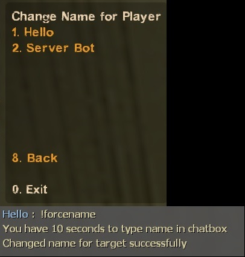
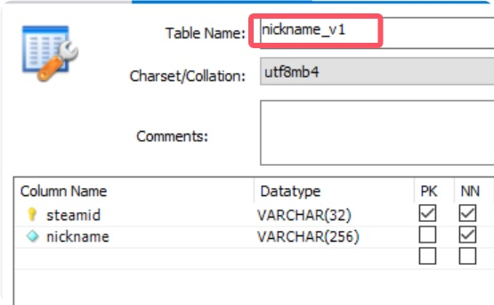

# Description | 內容
Save player's nickname in database and limit name change

> __Note__ <br/>
This plugin is private, Please contact [me](https://github.com/fbef0102/Game-Private_Plugin#私人插件列表-private-plugins-list)<br/>
此為私人插件, 請聯繫[本人](https://github.com/fbef0102/Game-Private_Plugin#私人插件列表-private-plugins-list)

* Apply to | 適用於
	```
	Any source game
	```

* <details><summary>Image | 圖示</summary>

	* Limit name change (限制玩家改名次數)
	<br/>
	* Admin can change player's nickname during the game (管理員可以幫其他玩家改名)
	<br/>
	* Support MySql & Sqlite (支援資料庫，跨伺服器儲存)
	<br/>
</details>

* <details><summary>How does it work?</summary>

	* Stores the clients nickname via MySql/Sqlite storage when player connects to server at first time.
		* Keep the same nickname when player joins server next time.
		* Player can change name but this plugin also limits player name changed, blocks name change if limit reached
	* Admin can types ```!forcename``` to change player's nickname during the game
		* Or change nickname in database table
</details>

* Require | 必要安裝
<br/>None

* <details><summary>ConVar | 指令</summary>

	* cfg/sourcemod/smd_nicknames_lock.cfg
		```php
		// 0=Plugin off, 1=Plugin on.
		smd_nicknames_lock_enable "1"

		// How many times the player can change name until server restarts (-1= No limit, 0=Lock and block change name)
		smd_nicknames_lock_limit "3"

		// Players with these flags have access to use !forcename command to change other player's nickname. (Empty = Everyone, -1: Nobody)
		smd_nicknames_lock_menu_access "z"

		// Database to save player's nickname. (Support MySQL & SQLite)
		smd_nicknames_lock_database "nickname"
		```
</details>

* <details><summary>How to Set Database</summary>

	* Choose one of the following method
		1. MySQL: Database across server, set ConVar ```smd_nicknames_lock_database "nickname"``` and write the following in ```sourcemod/configs/databases.cfg```
			```php
			// There would a data table named "Nickname_V1" in database
			"nickname"
			{
				"driver"			"mysql"
				"host"				"x.x.x.x"
				"database"			"yourdatabase"
				"user"				"youruser"
				"pass"				"yourpass"
				"port"				"yourport"
			}
			```

		2. SQLite: Local Database, set ConVar ```smd_nicknames_lock_database "nickname"``` and write the following in ```sourcemod/configs/databases.cfg```
			```php
			// There would be a file created: sourcemod/data/sqlite/nickname_system.sq3
			"nickname"
			{
				"driver"			"sqlite"
				"database"			"nickname_system"
			}
			```
</details>

* <details><summary>Command | 命令</summary>

	* **Open menu to change other player's nickname manually**
		```php
		sm_forcename
		```
</details>

* <details><summary>Changelog | 版本日誌</summary>

	* v1.0 (2025-2-26)
		* Initial Release
</details>

- - - -
# 中文說明
儲存玩家的遊戲名稱於資料庫並且限制玩家改名

* 原理
	* 當玩家第一次連線到伺服器時儲存玩家的遊戲名稱於資料庫 (MySql/Sqlite)
		* 玩家下次進來伺服器後保持一樣的遊戲名稱
		* 玩家可以改名但是此插件會限制玩家改名的次數
	* 管理員可以輸入 ```!forcename``` 打開菜單修改其他玩家的遊戲名稱
		* 或到資料庫的表格修改

* <details><summary>指令中文介紹 (點我展開)</summary>

	* cfg/sourcemod/smd_set_player_name_cmd.cfg
		```php
		// 0=關閉插件, 1=啟動插件
		smd_nicknames_lock_enable "1"

		// 限制玩家改名的次數直到伺服器重啟 (-1= 無限制, 0=鎖住並禁止改名)
		smd_nicknames_lock_limit "3"

		// 擁有這些權限的玩家，可以輸入 !forcename 打開菜單修改其他玩家的遊戲名稱 (留白 = 任何人都能, -1: 無人)
		smd_nicknames_lock_menu_access "z"

		// 儲存玩家遊戲名稱的資料庫設定. (支援 MySQL & SQLite)
		smd_nicknames_lock_database "nickname"
		```
</details>

* <details><summary>命令中文介紹 (點我展開)</summary>

	* **打開菜單修改其他玩家的遊戲名稱**
		```php
		sm_forcename
		```
</details>

* <details><summary>如何設定資料庫</summary>

	* 以下方法二選一
		1. MySQL: 支援跨伺服器，儲值經驗值，設定指令 ```smd_nicknames_lock_database "rank"```，然後設定文件 ```sourcemod/configs/databases.cfg```
			```php
			// 資料庫中自動創建表格，名稱是 "Nickname_V1"
			"nickname"
			{
				"driver"			"mysql"
				"host"				"x.x.x.x"
				"database"			"yourdatabase"
				"user"				"youruser"
				"pass"				"yourpass"
				"port"				"yourport"
			}
			```
			
		2. SQLite: 本地資料庫，設定指令 ```smd_nicknames_lock_database "rank"```，然後設定文件 ```sourcemod/configs/databases.cfg```
			```php
			// 自動創建檔案: sourcemod/data/sqlite/nickname_system.sq3
			"nickname"
			{
				"driver"			"sqlite"
				"database"			"nickname_system"
			}
			```
</details>