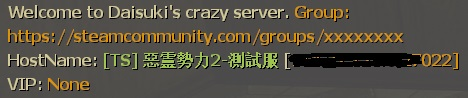

# Description | 內容
Display Welcome Message to new players (support translation)

> __Note__ <br/>
This plugin is private, Please contact [me](https://github.com/fbef0102/Game-Private_Plugin#私人插件列表-private-plugins-list)<br/>
此為私人插件, 請聯繫[本人](https://github.com/fbef0102/Game-Private_Plugin#私人插件列表-private-plugins-list)

* Apply to | 適用於
	```
	Any Source Game
	```

* Image
	<br/>

* <details><summary>How does it work?</summary>

	* Display welcome message when player joins server
	* Message depends on player's country or area
</details>

* Require | 必要安裝
	1. [[INC] Multi Colors](https://github.com/fbef0102/L4D1_2-Plugins/releases/tag/Multi-Colors)

* <details><summary>ConVar | 指令</summary>

	* cfg/sourcemod/server_welcome_message.cfg
		```php
		// Delay to display welcome message after new player joins server
		server_welcome_message_delay "5.0"

		// If 1, display welcome message each time after changing map
		server_welcome_message_each_map "0"

		// If 1, display server hostname and ip to new player
		server_welcome_message_hostname_ip "1"

		// Players with these flags are considered as vip. (Empty=Off)
		server_welcome_message_vip_flag "qr"
		```
</details>
	
* Translation Support | 支援翻譯
	```
	translations/server_welcome_message.phrases.txt
	```

* <details><summary>Changelog | 版本日誌</summary>

	* v1.2 (2024-1-31)
		* Display hostname, ip, vip status

	* v1.1 (2022-12-6)
		* Display welcome message each time after changing map

	* v1.0 (2022-12-4)
		* Initial Release
</details>

- - - -
# 中文說明
玩家加入伺服器後，聊天視窗顯示歡迎訊息 (支援多國語言)

* 圖示
	<br/>

* 原理
	* 玩家加入伺服器後，根據玩家的語言顯示歡迎訊息
	* 可以自行修改歡迎訊息，到```translations\server_welcome_message.phrases.txt```修改

* <details><summary>指令中文介紹 (點我展開)</summary>

	* cfg/sourcemod/server_welcome_message.cfg
		```php
		// 加入伺服器五秒後顯示歡迎訊息
		server_welcome_message_delay "5.0"

		// 為1時，每次換圖都要顯示歡迎訊息
		server_welcome_message_each_map "0"

		// 為1時，歡迎訊息顯示房間名稱與IP
		server_welcome_message_hostname_ip "1"

		// 擁有這些權限的玩家，被視為VIP並顯示 (留白 = 關閉VIP顯示)
		server_welcome_message_vip_flag "qr"
		```
</details>