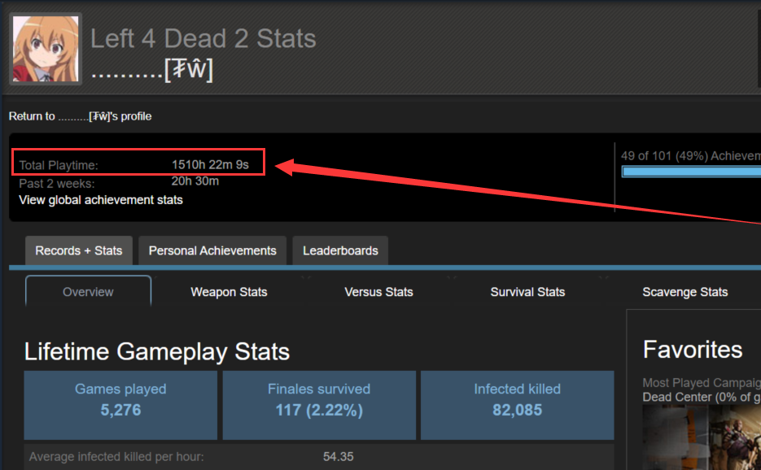
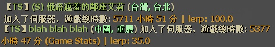
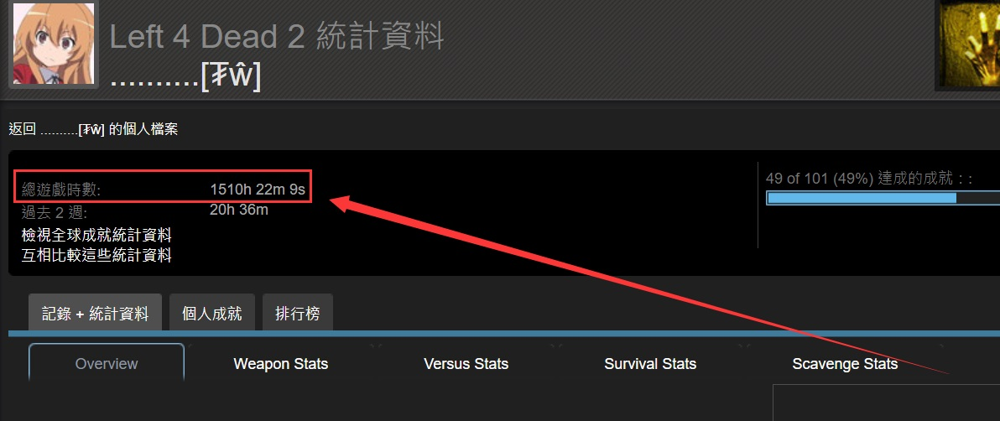

# Description | 內容
Showing the time played in Game Stats while player joins the server
(Get Game total time played even if the steam profile is publicly visible. Private, friends-only, and other privacy settings)

> __Note__ <br/>
This plugin is private, Please contact [me](/#私人插件列表-private-plugins-list)<br/>
此為私人插件, 請聯繫[本人](/#私人插件列表-private-plugins-list)
<br/>🟥Dedicated Server Only
<br/>🟥只能安裝在Dedicated Server

* Apply to | 適用於
	```
	L4D2 Dedicated Server
	CSS Dedicated Server
	```

* Image | 圖示
	* Name, country, city, play time, lerp
	<br/>
	* From Game Stats
	<br/>

* <details><summary>How does it work?</summary>

	* Display Name, country, city, play time, lerp on client connection
	* Played time is from game statistics
	* You can translate country and city name manually (write in translation file)
</details>

* Require | 必要安裝
	1. [[INC] Multi Colors](https://github.com/fbef0102/L4D1_2-Plugins/releases/tag/Multi-Colors)
	2. Steamworks
		- L4D2: [SteamWorks](https://github.com/hexa-core-eu/SteamWorks/releases)
		- CSS: [SteamWorks](https://github.com/hexa-core-eu/SteamWorks/releases/tag/v1.2.3)
	4. [Country and city database](/Tutorial_教學區/English/Server/Install_Other_File#country-and-city-database)
		* 抓取玩家的地理位置，需安裝[國家與城市的資料庫](/Tutorial_教學區/Chinese_繁體中文/Server/安裝其他檔案教學#安裝國家與城市的資料庫)

* <details><summary>ConVar | 指令</summary>

	* cfg/sourcemod/sm_PlayerTime.cfg
		```php
		// Application ID of current game. CS:S (240), L4D2 (550)
		sm_playtime_appid "550"

		// If 1, Announce the time played when player joins the server.
		sm_playtime_announce "1"

		// Announce the time played 1=Every time map change, 0=Only when join server
		sm_PlayerTime_map_change "0"

		// If 1, record to file. (Path: sourcemod/logs/PlayerTime.log)
		sm_playtime_log "1"

		// Check and unblock players with these flags. (Empty = Everyone, -1: Nobody)
		sm_playtime_block_immue_flag "z"

		// Ban duration (Mins) (0=Permanent)
		sm_playtime_block_ban_time "1440"

		// Any player whose total time played is below this value can not join the server. (Mins) (0=off)
		sm_playtime_block_short "0"

		// Any player whose total time played is higher this value can not join the server. (Mins) (0=off)
		sm_playtime_block_long "0"

		// Any player whose total time played is unknown can not join the server. (0=off)
		sm_playtime_block_unknown "0"
		```
</details>

* <details><summary>Command | 命令</summary>

	* **Check total time played of every player in game**
		```php
		sm_timedisplay
		```
</details>

* Translation Support | 支援翻譯
	```
	translations/sm_PlayerTimes.phrases.txt
	```

* <details><summary>Changelog | 版本日誌</summary>

	* v2.5 (2025-4-7)
		* Translate country and city name

	* v2.4 (2024-5-27)
		* Fixed not working well in sourcemod 1.12

	* v2.3 (2024-5-19)
		* Update Cvars

	* v2.2 (2023-3-14)
		* Remove lerp
		* Delay to display message, so player can see his own time played on record.

	* v2.1 (2023-3-1)
		* Add lerp

	* v2.0 (2023-2-26)
		* Add country and city

	* v1.9 (2023-2-21)
		* Remake code and require SteamWorks
		* Get Game total time played even if the steam profile is publicly visible. Private, friends-only, and other privacy settings

	* v1.8
	    * Initial Release
</details>

- - - -
# 中文說明
當玩家連線進來伺服器之後，顯示玩家的遊戲時數

* 圖示
	* 名子、國家、城市、遊戲時數
	<br/>
	* 遊戲統計中的真實時數
	<br/>

* 原理
	* 玩家進來伺服器之時，抓取他的實際遊玩時數 (與'Steam個人檔案上顯示的遊戲時數'會有所不同)
	* 即使玩家的steam個人資料或頁面設定為未公開，依然可以抓取實際遊玩時數
	* 可以顯示中文的地區與城市名稱 (需要自行翻譯)

* <details><summary>指令中文介紹 (點我展開)</summary>

	* cfg/sourcemod/sm_PlayerTime.cfg
		```php
		// 遊戲專屬的ID
		// 安裝在L4D2寫550
		// 安裝在CS:S寫240
		sm_playtime_appid "550"

		// 為1時，玩家連線時顯示遊戲時數
		sm_playtime_announce "1"

		// 何時顯示遊戲時數, 1=每次換圖時, 0=玩家第一次加入伺服器時
		sm_PlayerTime_map_change "0"

		// 為1時，將玩家的遊戲時數記錄到logs裡面 (路徑為: sourcemod/logs/PlayerTime.log)
		sm_playtime_log "1"

		// 擁有這些權限的玩家，不會因為遊戲時數而被封鎖 (留白 = 任何人都不會被封鎖, -1: 任何人都會被封鎖)
		sm_playtime_block_immue_flag "z"

		// 封鎖時間 (單位: 分鐘，0=永久)
		sm_playtime_block_ban_time "1440"

		// 遊戲時數少於此數值的玩家將會被封鎖 (單位: 分鐘，0=關閉這項功能)
		sm_playtime_block_short "0"

		// 遊戲時數大於此數值的玩家將會被封鎖 (單位: 分鐘，0=關閉這項功能)
		sm_playtime_block_long "0"

		// 遊戲時數未知的玩家將會被封鎖 (0=關閉這項功能)
		sm_playtime_block_unknown "0"
		```
</details>

* <details><summary>命令中文介紹 (點我展開)</summary>

	* **查看所有玩家的遊戲時數**
		```php
		sm_timedisplay
		```
</details>