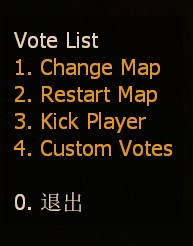
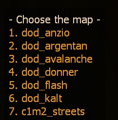
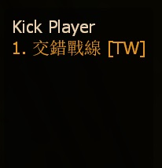
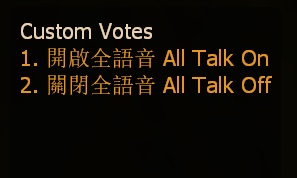
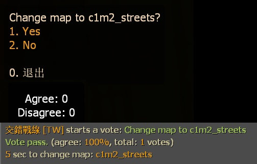
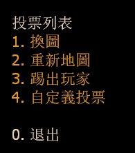
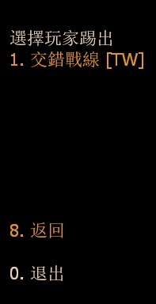
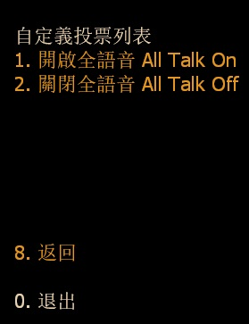
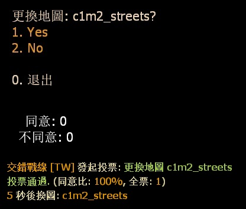

# Description | 內容
Simple menu votes: Change map, restart map, kick player, custom vote

> __Note__ <br/>
This plugin is private, Please contact [me](https://github.com/fbef0102/Game-Private_Plugin#私人插件列表-private-plugins-list)<br/>
此為私人插件, 請聯繫[本人](https://github.com/fbef0102/Game-Private_Plugin#私人插件列表-private-plugins-list)

* <details><summary>Image</summary>

	<br/>
	<br/>
	<br/>
	<br/>
	<br/>
</details>

* Apply to | 適用於
	```
	Any Source Game
	```

* <details><summary>How does it work?</summary>

	* Type ```!votes``` to open vote menu -> select and start a vote
		* Change Map
		* Restart Map
		* Kick Player
		* Customize Vote
	* Add more custom vote in [data/smd_menu_votes.cfg](data/smd_menu_votes.cfg)
	* To read map list, read cvar below
</details>

* Require
<br/>None

* <details><summary>ConVar | 指令</summary>

	* cfg/sourcemod/smd_menu_votes.cfg
		```php
		// 0=Off, 1=On this plugin
		smd_menu_votes_enable "1"

		// Players with these flags have kick immune. (Empty = Everyone, -1: Nobody)
		smd_menu_votes_kick_immue_access "z"

		// Delay to start another vote after vote ends.
		smd_menu_votes_delay "60"

		// Minimum # of players in game to start the vote
		smd_menu_votes_players_required "2"

		// Pass vote percentage.
		smd_menu_votes_pass_percent "0.60"

		// Which map list should this plugin read? Path relative to game directory
		// default: addons/sourcemod/configs/smd_menu_votes.txt
		// Other option: mapcycle.txt
		smd_menu_votes_read_map "addons/sourcemod/configs/smd_menu_votes.txt"
		```
</details>

* <details><summary>Command | 命令</summary>

	* **Open Vote Menu**
		```php
		sm_votes
		```

	* **Open Custom Vote Menu**
		```php
		sm_cvotes
		```
</details>

* <details><summary>Other Version | 其他版本</summary>

    1. [l4d2_vote_change](/L4D_插件/Server_伺服器/l4d2_vote_change): (L4D1/L4D2) New Vote System (use L4D built-in votes UI) + Add custom vote
    	* (L4D1/L4D2) 新型的投票系統，可自行新增投票 (使用官方內建的投票)
</details>

* <details><summary>Translation Support | 支援翻譯</summary>

	```
	English
	繁體中文
	简体中文
	```
</details>

* <details><summary>Changelog | 版本日誌</summary>

	* v1.0 (2025-2-3)
		* Initial Release
</details>

- - - -
# 中文說明
簡單的投票系統: 換圖、重新地圖、踢人、執行指令

* <details><summary>圖示(點我展開)</summary>

	<br/>
	<br/>
	<br/>
	<br/>
	<br/>
</details>

* 原理
	* 輸入 ```!votes``` 打開投票菜單 -> 投票選單表
		* 換圖
		* 重新地圖
		* 踢出玩家
		* 自定義投票
	* 自行新增或修改自定義投票: [data/smd_menu_votes.cfg](data/smd_menu_votes.cfg)
		* 內有中文說明，可點擊查看
	* 讀取地圖列表文件，請查看指令說明
	
* <details><summary>指令中文介紹(點我展開)</summary>

	* cfg/sourcemod/smd_menu_votes.cfg
		```php
		// 0=插件關閉, 1=插件開啟.
		smd_menu_votes_enable "1"

		// 擁有這權限的人無法被投票踢出伺服器 (留白 = 任何人無法被踢, -1: 所有人都可以被踢)
		smd_menu_votes_kick_immue_access "z"

		// 過X秒後才能再發起投票.
		smd_menu_votes_delay "60"

		// 要有X位真人玩家在伺服器內才能發起投票.
		smd_menu_votes_players_required "2"

		// 投票通過所需的百分比
		smd_menu_votes_pass_percent "0.60"

		// 地圖列表該讀取哪個文件? (路徑相對於遊戲根目錄)
		// 預設文件: addons/sourcemod/configs/smd_menu_votes.txt
		// 其他選項: mapcycle.txt
		smd_menu_votes_read_map "addons/sourcemod/configs/smd_menu_votes.txt"
		```
</details>

* <details><summary>命令中文介紹(點我展開)</summary>

	* **打開投票選單**
		```php
		sm_votes
		```

	* **打開"自定義投票"選單**
		```php
		sm_cvotes
		```
</details>