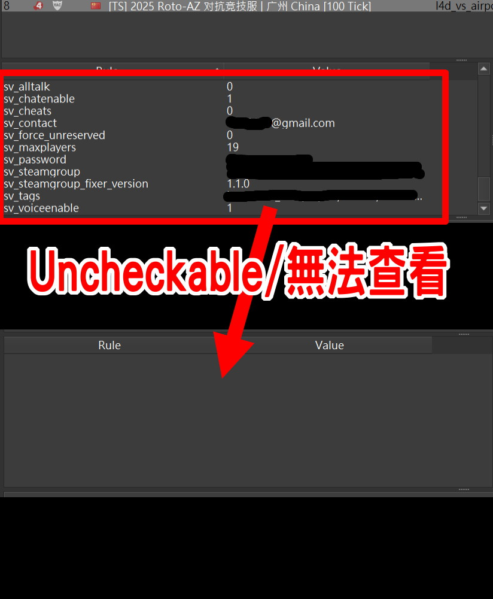

# Description | 內容
Protect and hide sensitive ConVars from the data-file (should not be exposed to clients or logs), and send fake value to clients if possible

> __Note__ <br/>
This plugin is private, Please contact [me](https://github.com/fbef0102/Game-Private_Plugin#私人插件列表-private-plugins-list)<br/>
此為私人插件, 請聯繫[本人](https://github.com/fbef0102/Game-Private_Plugin#私人插件列表-private-plugins-list)

* Image | 圖示
	<br/>
	<br/>

* Apply to | 適用於
	```
	Any Source Game
	```

* <details><summary>How does it work?</summary>

	* Write down ConVars you want to keep secret in [data/sv_protect_cvar.cfg](data/sv_protect_cvar.cfg)
		* When clients try to get convar value, they only get nothing or fake value
		* Not allow game monitor or server broswer to check convar value
</details>

* Require | 必要安裝
<br/>None

* <details><summary>Related Plugin | 相關插件</summary>

	1. [sv_protect_cvar](/Source_插件/Server_伺服器/sv_protect_cvar): Enforces ConVars consistency from the data-file values
    	* 鎖住CVAR的值，不會被遊戲或地圖或玩家竄改
</details>

* <details><summary>Changelog | 版本日誌</summary>

	* v1.1 (2024-10-28)
		* Fixed error

	* v1.0 (2024-10-7)
		* Initial Release
</details>

- - - -
# 中文說明
保護一些敏感的指令數值，不讓外界與客戶端查看，服務器內的客戶端可能會看到假數值

* 原理
	* 寫下你想要保持祕密不想讓玩家看到的指令，於文件[data/sv_protect_cvar.cfg](data/sv_protect_cvar.cfg)
		* 當客戶端查看時，無法得到數值或只得到假數值
		* 外界或伺服器瀏覽時無法查看指令
	* 伺服器原本設定的數值不會被此插件修改或影響

* 用意在哪?
	* 保護比較敏感的資訊外洩，譬如密碼、網址、Steam群組的ID
	* 不會被外界隨意查看指令的數值