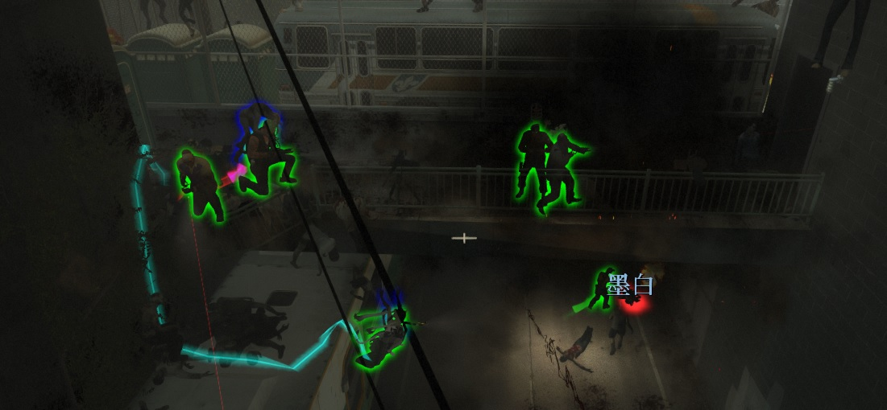

# 安裝總攬
> 2026/2/26 更新
- [安裝總攬](#安裝總攬)
  - [前言](#前言)
  - [準備檔案](#準備檔案)
  - [必要檔案](#必要檔案)
  - [額外檔案](#額外檔案)
  - [娛樂檔案](#娛樂檔案)
  - [不建議安裝的檔案](#不建議安裝的檔案)
  - [問題](#問題)
  - [其他](#其他)
	
- - - -
## 前言
> 本篇教學完成之後，你的伺服器可以多達8位或以上的玩家加入戰役模式大亂鬥
<br/>
<br/>

* [切換英文說明 | English](/Tutorial_教學區/English/Game/L4D2/8%2B_Survivors_In_Coop/)
* 本篇教學適用於L4D1和L4D2
* 專屬伺服器可以開到8位以上的玩家加入戰役模式
* 區域伺服器只能到8位玩家，無法再增加
    * 因為Sourcemod本來就不支援區域伺服器，請自行斟酌
* 此處教學包含修復5+以上玩家會發生的問題

- - - -
## 準備檔案
* [安裝伺服器與Sourcemod + Metamod](/Tutorial_教學區/Chinese_繁體中文/Server/安裝伺服器與插件/README.md#%E9%81%B8%E6%93%87%E5%8D%80%E5%9F%9F%E4%BC%BA%E6%9C%8D%E5%99%A8%E6%88%96%E5%B0%88%E5%B1%AC%E4%BC%BA%E6%9C%8D%E5%99%A8)
* [Stripper:Source](/Tutorial_教學區/Chinese_繁體中文/Server/安裝其他檔案教學#安裝stripper)
* [Left 4 DHooks Direct](https://forums.alliedmods.net/showthread.php?t=321696)
* [8 Slots Lobby Mod](https://steamcommunity.com/sharedfiles/filedetails/?id=2754956355): 可讓大廳有八個位子
    * 訂閱即可，開房後大廳會有八個位子
    * 安裝此Mod之後會導致你在遊戲中無法使用 ESC->閒置功能
* [Actions](https://forums.alliedmods.net/showthread.php?t=336374)

- - - -
## 必要檔案
* [l4dtoolz EXTENSION](/Tutorial_教學區/Chinese_繁體中文/Server/安裝其他檔案教學#安裝l4dtoolz): 解鎖伺服器人數限制
    * 如果是專屬伺服器，在 ```cfg/server.cfg```　寫以下指令 (🟥如果檔案不存在，可自己創建🟥)
    * 如果是區域伺服器，在 ```cfg/listenserver.cfg```　寫以下指令 (🟥如果檔案不存在，可自己創建🟥)
        ```php
        sm_cvar precache_all_survivors 1 // 1=預先載入所有倖存者的角色模組
        sm_cvar sv_consistency 0 // 0=關閉遊戲檔案一致性的檢查，避免玩家使用太多的模組進不來, 1=開啟檔案遊戲一致性的檢查
        ```
    * 可參考我的[Server.cfg](https://github.com/fbef0102/Sourcemod-Server/blob/main/L4D2/Windows%20Server%20Files/left4dead2/cfg/server.cfg)

* [Remove Lobby Reservation (哈利版本)](https://github.com/fbef0102/L4D1_2-Plugins/tree/master/l4d_unreservelobby): 移除伺服器的大廳人數限制，簡單講就是解鎖伺服器，讓第九位以上的玩家透過IP或伺服器瀏覽加入伺服器
    *  🟥只適用於專屬伺服器🟥

* [l4dmultislots (哈利版本)](https://github.com/fbef0102/L4D1_2-Plugins/tree/master/l4dmultislots): 生成bot給第五位玩家取代並加入倖存者陣營
    * 如何回合開始就有8個Bot?
        * 安裝插件之後運行伺服器，等待插件自己生成 cfg/sourcemod/l4dmultislots.cfg 文件
            * 這個文件會自己創建，如果沒有創建表示你安裝l4dmultislots失敗
        * ```cfg/sourcemod/l4dmultislots.cfg``` 設置
            ```php
            l4d_multislots_min_survivors "8"
            l4d_multislots_spawn_survivors_roundstart "1" 
            ```
      
* (L4D2) [Defib_Fix](https://forums.alliedmods.net/showthread.php?t=315483): 修正5+多人遊戲裡，電擊器無法復活屍體或復活到活著的玩家

* [Survivor Identity Fix for 5+ Survivors (Shadowysn版本)](https://forums.alliedmods.net/showpost.php?p=2718792&postcount=36)
    * 修正第五人以上玩家離線或閒置或加入遊戲的時候，Bot模組角色被更換
    * 修正第五人以上玩家死亡的時候，屍體在別的角色身上

* [Survivor_AFK_Fix](https://forums.alliedmods.net/showthread.php?t=326742): 修正5+多人遊戲裡，使用閒置的時候，閒置錯成別的相同模組角色的bot，如果相同模組角色已經有真人玩家取代或閒置，則會變成完全旁觀者

* [l4dafkfix_deadbot](https://github.com/fbef0102/L4D1_2-Plugins/tree/master/l4dafkfix_deadbot): 修正5+多人遊戲裡，當真人玩家閒置的時候如果他的Bot死亡，真人玩家不會取代死亡Bot而是變成完全旁觀者

* (L4D2) [lfd_both_fixUpgradePack (哈利版本)](https://github.com/fbef0102/L4D1_2-Plugins/tree/master/lfd_both_fixUpgradePack): 修正高爆彈與燃燒彈無法被重複角色模組的倖存者撿起來

* (L4D2) [Better_Charger_Collision+patch](https://forums.alliedmods.net/showthread.php?t=315482): Charger無法衝撞第五位以上的玩家

* [witch_target_patch](https://github.com/LuxLuma/Left-4-fix/tree/master/left%204%20fix/witch/witch_target_patch): Witch 追錯第五位以上的玩家目標
	
* (L4D2) [l4d2_trigger_flow_fix (哈利版本)](https://github.com/fbef0102/L4D1_2-Plugins/tree/master/l4d2_trigger_flow_fix): 修復不同模組的倖存者在三方地圖啟動地圖上的機關會出現問題

* (L4D2) [l4d2_vocalizebasedmodel (哈利版本)](https://github.com/fbef0102/L4D1_2-Plugins/tree/master/l4d2_vocalizebasedmodel): 倖存者根據自身模組發出對應的角色語音+修復不同模組的倖存者在三方地圖無法出現語音劇情對話
    * 譬如使用二代角色模組在一代地圖上與對講機溝通呼叫最後救援，但是對講機不會回應

* (L4D2) [l4d2_fix_changelevel](https://github.com/Target5150/MoYu_Server_Stupid_Plugins/tree/master/The%20Last%20Stand/l4d2_fix_changelevel): 解決直接用ForceChangeLevel指令換圖會遇到的問題，導演系統不知道換圖了

* (L4D2) [l4d2_transition_info_fix](https://github.com/fbef0102/L4D1_2-Plugins/tree/master/l4d2_transition_info_fix): 修復中途換地圖的時候(譬如使用Changelevel指令)，會遺留上次的過關保存設定，導致滅團後倖存者被傳送到安全室之外或死亡

* (L4D2) [InputKill Kick Prevention](https://forums.alliedmods.net/showthread.php?t=332860): 防止玩家因為一二代地圖NPC導致被踢
    * 被踢出遊戲的訊息```Kicked by Console : CBaseEntity::InputKill()```
  
* [Command and ConVar - Buffer Overflow Fixer](https://forums.alliedmods.net/showthread.php?t=309656): 修復插件讀不到cfg文件內的指令與命令

* [l4d2_maptankfix](https://github.com/fbef0102/L4D1_2-Plugins/tree/master/l4d2_maptankfix): 防止地圖自帶的機關Tank因為人數不夠問題​​無法刷新而造成卡關

* [l4d2_rescue_vehicle_multi](https://github.com/fbef0102/L4D1_2-Plugins/tree/master/l4d2_rescue_vehicle_multi): 修正第五位以上的玩家無法上救援載具，統計顯示其死亡，無法列入對抗分數

* (L4D2 對抗模式) [Left4Fix](https://forums.alliedmods.net/showthread.php?t=219774): 提供以下三種功能
    * 每一位玩家都算距離分數
    * 雙方分數打平時，依照傷害量最多的隊伍多加分數
    * 靈魂特感可以按E傳送到每位倖存者身上

* (L4D2) [Ladder Server Crash - Patch Fix](https://forums.alliedmods.net/showthread.php?t=336298): 修復玩家爬梯時偶而會導致伺服器崩潰

* (L4D2) [Fix Mixed Characters](https://github.com/Target5150/MoYu_Server_Stupid_Plugins/tree/master/The%20Last%20Stand/l4d2_fix_character_mixed): 修復在一些地圖中有使用一代NPC角色，如果玩家剛好也有使用一代角色，保護玩家不會被踢或是被跟著傳送
    * 譬如玩The Passing地圖，使用一代角色的倖存者會被傳送或是被踢出遊戲

* [l4d_full_slot_bot_replace_fix](https://github.com/fbef0102/L4D1_2-Plugins/tree/master/l4d_full_slot_bot_replace_fix): 修復伺服器客戶端已滿的狀態下無法生成Bot取代玩家所造成的嚴重問題

* [l4d_fix_target_replace](https://github.com/Target5150/MoYu_Server_Stupid_Plugins/tree/master/The%20Last%20Stand/l4d_fix_target_replace): 修復bot取代倖存者或倖存者取代bot的一系列問題

* [Transition Restore Fix](https://forums.alliedmods.net/showthread.php?t=336287): 修復5+倖存者過關時無法保存武器到下一關 (用DHooks與sourcecramble修改遊戲內部涵式)

- - - -
## 額外檔案
> __Note__ 此處額外檔案可以不用裝，自行決定
* [AFK and Join Team Commands Improved Version](https://github.com/fbef0102/L4D1_2-Plugins/tree/master/l4d_afk_commands): 提供多種命令轉換隊伍陣營 (譬如: !afk, !survivors, !infected), 但不可濫用.

* (L4D2) [Save Weapon Improved (哈利版本)](https://github.com/fbef0102/L4D1_2-Plugins/tree/master/l4d2_ty_saveweapons): 戰役模式之下儲存所有玩家身上的武器與血量，保存過關到下一關

* [AutoTakeOver 5+ Survivors Improved (哈利版本)](https://github.com/fbef0102/L4D1_2-Plugins/tree/master/_AutoTakeOver): 當真人玩家死亡時，自動取代另一個有空閒的Bot繼續遊玩倖存者

* [l4d_h_csm (哈利版本)](/L4D_插件/Survivor_人類/l4d_h_csm): 允許玩家在遊戲中更換一二代角色(外觀, 手 和 語音) 或是模組(只有外觀)
    * 此為CSM插件重製版，輸入!csm打開角色選擇介面

* [Survivor Rescue Closet](https://forums.alliedmods.net/showthread.php?t=340659): 救援房間可以復活第五位以上的倖存者

* [5+ Survivor Friendly Fire Quote Fix](https://forums.alliedmods.net/showthread.php?t=321127)
    * 🟥只適用於專屬伺服器🟥
    * 修正五人以上友傷沒有語音
    * 修正玩家被hunter撲/被Charger撞沒有語音
   
* (L4D2) [Survivor Clones Hunter Pounced Warning Fix](https://forums.alliedmods.net/showthread.php?t=248776): 角色看到與自己相同模組的角色被Hunter撲倒，有角色語音互動
    * 🟥只適用於專屬伺服器🟥

* (L4D2) [Team Kill Reactions Vocalize Fix (哈利版本)](https://github.com/fbef0102/L4D1_2-Plugins/tree/master/l4d2_team_kill_reactions): 玩家TK導致隊友倒地或死亡，能有更多的角色語音互動
    * 🟥只適用於專屬伺服器🟥

* (L4D2) [Survivors mourn fix (哈利版本)](https://github.com/fbef0102/L4D1_2-Plugins/tree/master/l4d2_survivor_mourn_fix): 修復一代倖存者互相看見屍體時沒有語音反應
    * 🟥只適用於專屬伺服器🟥

* (L4D2) [8 Player Modified Talker](https://steamcommunity.com/sharedfiles/filedetails/?id=2462741269): 一二代角色能有更多的語音互動

* (L4D1) [L4D Modified Talker](https://www.gamemaps.com/details/3863): 角色有更多語音

- - - -
## 娛樂檔案
> __Note__ 適合多人伺服器的娛樂插件

* [L4D2-Unlimited-Map (哈利版本)](https://github.com/fbef0102/L4D2-Unlimited-Map): 將地圖打造成迷宮與創造多重機關障礙物

* [Survivor Respawn (哈利版本)](https://github.com/fbef0102/L4D1_2-Plugins/tree/master/Survivor_Respawn): 當玩家死亡時，過一段時間自動復活

* [Infected Bots Control Improved](https://github.com/fbef0102/L4D1_2-Plugins/tree/master/l4dinfectedbots): 生成多特感模式，隨著玩家人數越多，特感數量越多、Tank血量越厚

* [Lockdown System Improved](https://github.com/fbef0102/L4D1_2-Plugins/tree/master/lockdown_system_l4d): 終點安全室必須等待一段時間才會開門，這期間必須團隊合作抵抗屍潮與Tank

* [Adrenaline & Pills Powerups Improved](https://github.com/fbef0102/L4D1_2-Plugins/tree/master/l4d2_powerups_rush): 服用腎上腺素或藥丸，提升裝彈速度、開槍速度、近戰砍速、動畫起身速度

* [L4D2 gifts (哈利版本)](https://github.com/fbef0102/L4D1_2-Plugins/tree/master/l4d2_gifts): 當特感被殺死之後掉落禮物，倖存者碰到禮物可得到強力武器與彈藥

* [deathcheck (哈利版本)](https://github.com/fbef0102/L4D1_2-Plugins/tree/master/cge_l4d2_deathcheck): 所有玩家包括AI Bot死亡才會回合結束

* [CSO SupplyBox](https://github.com/fbef0102/L4D1_2-Plugins/tree/master/l4d2_supply_woodbox): 地圖上隨機掉落補給箱，支援倖存者得到強力武器

* [Back 4 Blood Item hint Improved](https://github.com/fbef0102/L4D1_2-Plugins/tree/master/l4d2_item_hint): 使用角色語音"看"，可讓物品標記光圈，亦可以標記特感或地點

* [Witch Follow kill Everyone](/L4D_插件/Witch_女巫/l4d_witch_follow_kill_everyone) : Witch會自動走向倖存者 + Witch殺死倖存者之後轉移攻擊目標繼續

* [5+ Survivors More Supply](/L4D_插件/Survivor_人類/l4d_more_supply): 隨著玩家人數越多，地圖上的資源物品可以重複拿很多次

* [l4d_infected_limit_control](/L4D_插件/Common_Infected_普通感染者/l4d_infected_limit_control): 隨著玩家人數越多，殭屍/屍潮 數量越來越多

* 以下連結提供更多插件自行挖寶 (有中英文說明)
    * [Sourcemod-Plugins](https://github.com/fbef0102/Sourcemod-Plugins)
    * [L4D1_2-Plugins](https://github.com/fbef0102/L4D1_2-Plugins)
    * [Game-Private_Plugin](https://github.com/fbef0102/Game-Private_Plugin): 私人插件列表 (需付費)

- - - -
## 不建議安裝的檔案
> __Note__ 副作用太多，弊大於利，不建議使用

* <s>[Dialogue Criteria Fix](https://forums.alliedmods.net/showthread.php?t=335875)</s>
    * 效果: 八位玩家能有更多的角色語音互動
    * 🟥崩潰: 會導致伺服器崩潰，等待作者修復

* (L4D2) <s>[Real Survivor Mourn Fix](https://forums.alliedmods.net/showthread.php?t=335903)</s>
    * 效果: 一二代倖存者看見屍體能有更多的角色語音互動
    * 🟥崩潰: 會導致伺服器崩潰，等待作者修復

* (L4D2) <s>[Character_manager](https://forums.alliedmods.net/showthread.php?t=309601)</s>
    * 效果: 一二代倖存者能同時存在
    * 效果: 此插件會修改地圖的SurvivorSet，然後當倖存者生成或Bot替換時，插件會幫忙修改角色對應的圖標與名稱還有模型
    * 衝突: 使用此插件時需要移除**Survivor Identity Fix for 5+ Survivors**，功能重複會有衝突
    * 🟥副作用: 此插件會改變survivor set，這將導致部分三方地圖卡關，因為劇情對話與事件無法順利地觸發

* (L4D2) <s>[Force L4D2 survivor arms, names, icons](https://forums.alliedmods.net/showthread.php?t=345947)</s>
    * 效果: 修復每個人都能看到一二代角色正確的名稱、頭像、手臂
    * 🟥副作用: 傳送假情報給客戶端該遊戲模式為dash(僅在C2M2)或是shootzones(所有地圖)
    * 🟥副作用: 此插件會改變survivor set (強制為二代倖存者)，這將導致部分三方地圖卡關，因為劇情對話與事件無法順利地觸發

* (L4D2) <s>[The Passing character fix with DHooks](https://forums.alliedmods.net/showthread.php?t=337428)</s>
    * 效果: 修復人類玩家有使用一代角色，在The Passing或是有使用一代角色NPC的三方地圖，不會被踢或是被跟著傳送
    * 🟥副作用: 在C6M1 切換成一代角色，然後等待滅團重啟，有一代角色的玩家依然會被傳送到橋上
    * 🟥副作用: 一代角色無法在一代地圖順利觸發劇情對話，譬如C8M5呼叫救援無線電

* (L4D2) <s>[The Passing Character Fix with EntityLump](https://forums.alliedmods.net/showthread.php?t=348949)</s>
    * 效果: 避免在The Passing地圖中，一代角色的玩家會被傳送到地圖之外或死亡
    * 🟥副作用: 此插件會移除The Passing地圖上的一代倖存者NPC
    * 可以使用**Fix Mixed Characters**，取代此插件

* <s>[Survivor Character Fixes](https://forums.alliedmods.net/showthread.php?t=336328)</s>
    * 效果: 修復"m_survivorCharacter"角色屬性的內部問題，推薦與能改變角色的插件如CSM一起使用
    * 🟥實際修復什麼效果不明，作者更新緩慢

- - - -
## 問題
* 問題1: 第五位以上玩家進不去伺服器
    * 答: 沒裝好l4dtoolz與l4d_unreservelobby

* 問題2: 第五以上玩家可以加入伺服器但無法遊玩倖存者或特感
    * 答: 沒有裝好多人多特感插件

- - - -
## 其他
* [問題集合區 Questions](/Questions_問題區)

