# 問題總攬
> 2025/8/24 更新 by [Harry](https://steamcommunity.com/profiles/76561198026784913)
- [問題總攬](#問題總攬)
  - [如何開啟遊戲控制台](#如何開啟遊戲控制台)
  - [打開遊戲主目錄的資料夾](#打開遊戲主目錄的資料夾)
  - [設定自己的cfg](#設定自己的cfg)
  - [設定啟動選項](#設定啟動選項)
  - [驗證遊戲檔案的完整性](#驗證遊戲檔案的完整性)
  - [啟動遊戲指導系統](#啟動遊戲指導系統)
  - [下載自訂伺服器內容](#下載自訂伺服器內容)

- - - -
## 如何開啟遊戲控制台
* <details><summary>說明 (點我展開)</summary>

    - 開啟遊戲，選項－＞鍵盤／滑鼠－＞允許使用開發人員命令列－＞已啟用
    - 各個遊戲選項設定有所不同
    <br/>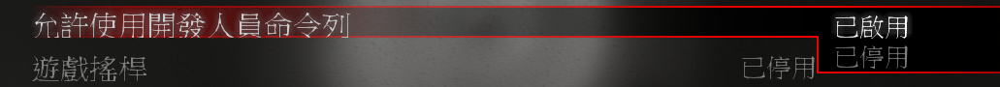
    - 鍵盤上左上角按下 ~ 符號開啟控制台
    <br/>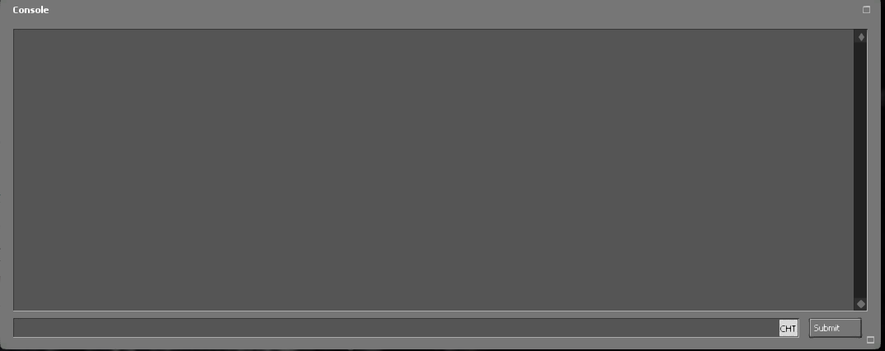

    > __Note__ 與伺服器後台為不同的概念<br/>
</details>

- - - -
## 打開遊戲主目錄的資料夾
* <details><summary>說明 (點我展開)</summary>

    * 依照圖片指示即可知道遊戲本體的主目錄所在位置
    <br/>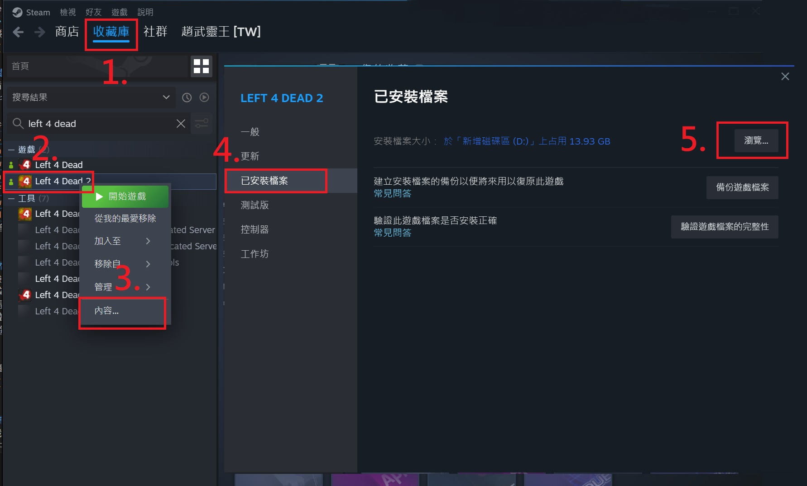
</details>

- - - -
## 設定自己的cfg
* <details><summary>說明 (點我展開)</summary>

    * 官方有很多指令提供玩家使用，但是你不想要每次打開遊戲重新在遊戲控制台輸入一遍，因此把指令寫入cfg是很重要的
        * [L4D Cvars](https://developer.valvesoftware.com/wiki/List_of_L4D_Cvars)
        * [L4D2 Cvars](https://developer.valvesoftware.com/wiki/List_of_L4D2_Cvars)
        * [CSS Cvars](https://developer.valvesoftware.com/wiki/List_of_CS:S_Cvars)
        * [CSGO Cvars](https://developer.valvesoftware.com/wiki/List_of_CS:GO_Cvars)
        * 其他遊戲自行搜索

    * 在遊戲主目錄找到cfg資料夾，其中```autoxec.cfg```是每次啟動遊戲時必定執行的文件
        * 遊戲啟動時自動執行裡面所有的指令
        <br/>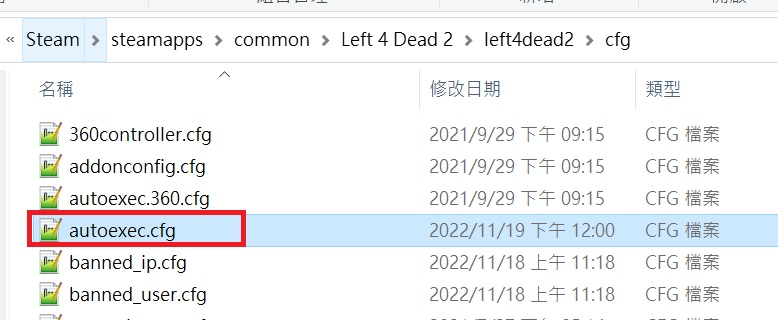
        

    * 可以自己創建新的文件
        1. 在cfg資料夾建立一個文件，改名為```XXX.cfg``` (XXX 自取)
            * 請注意副檔名為.cfg
            <br/>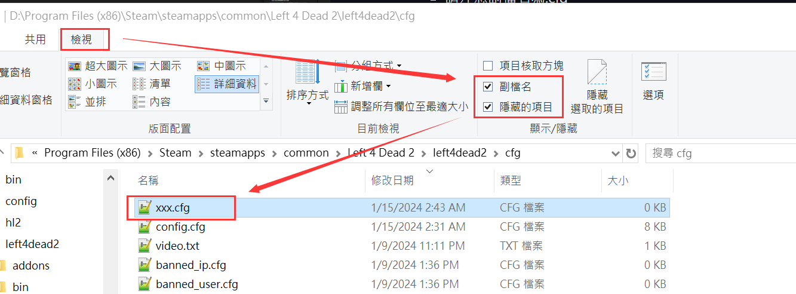
        2. 將想要執行的指令寫入剛創立的文件當中，啟動遊戲之後在控制台輸入```exec xxx.cfg```即可
        <br/>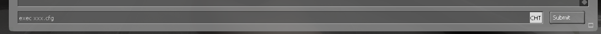
</details>

* <details><summary>我的autoxec.cfg範例 (點我展開)</summary>

    ```php
    c_thirdpersonshoulder "1"
    c_thirdpersonshoulderaimdist "720"
    c_thirdpersonshoulderdist "41"
    c_thirdpersonshoulderheight "0"
    c_thirdpersonshoulderoffset "20"
    cam_collision "1"
    cam_ideallag "4"
    cl_viewmodelfovsurvivor "65"
    net_graph "4"
    net_graphheight 0
    mat_monitorgamma_tv_enabled 0
    mat_monitorgamma 1.6
    crosshair 1
    voice_loopback 1
    cl_glow_ghost_infected_g 1; cl_glow_ghost_infected_r 1
    bind "[" "say_team /boss"
    bind "]" "say_team /cur"
    bind "1" "+left"
    bind "2" "+right"
    bind "kp_end" "slot1"
    bind "kp_downarrow" "slot2"
    bind "kp_pgdn" "slot3"
    bind "kp_leftarrow" "slot4"
    bind "kp_5" "slot5"
    bind "kp_rightarrow" "slot6"
    bind "kp_home" "slot7"
    bind "kp_uparrow" "slot8"
    bind "kp_pgup" "slot9"
    bind "kp_ins" "slot0"
    bind "/" "say_team /admin"
    bind "MOUSE3" "+zoom;firstperson"
    bind "F9" "record last_play"
    bind "F10" "stop"
    bind "v" "+mouse_menu v"
    bind "\" "say !forcepause"
    bind TAB "+score"
    alias "lerp_0" "rate 100000;cl_cmdrate 101;cl_updaterate 101;cl_interp 0.0;cl_interp_ratio -1;alias lerp_change lerp_16.7;echo Lerp set to 0 (rate 100000, cl_cmdrate 101, cl_updaterate 101, cl_interp 0.0, cl_interp_ratio -1).";
    alias "lerp_16.7" "rate 100000;cl_cmdrate 101;cl_updaterate 101;cl_interp 0.0167;cl_interp_ratio -1;alias lerp_change lerp_30.0;echo Lerp set to 16.7 (rate 100000, cl_cmdrate 101, cl_updaterate 101, cl_interp 0.0167, cl_interp_ratio -1).";
    alias "lerp_30.0" "rate 100000;cl_cmdrate 101;cl_updaterate 101;cl_interp 0.03;cl_interp_ratio 0;alias lerp_change lerp_50.1;echo Lerp set to 30.0 (rate 100000, cl_cmdrate 101, cl_updaterate 101, cl_interp 0.03, cl_interp_ratio 0).";
    alias "lerp_50.1" "rate 100000;cl_cmdrate 101;cl_updaterate 101;cl_interp 0.0501;cl_interp_ratio -1;alias lerp_change lerp_66.7;echo Lerp set to 50.1 (rate 100000, cl_cmdrate 101, cl_updaterate 101, cl_interp 0.0501, cl_interp_ratio -1).";
    alias "lerp_66.7" "rate 100000;cl_cmdrate 101;cl_updaterate 101;cl_interp 0.0667;cl_interp_ratio -1;alias lerp_change lerp_0;echo Lerp set to 66.7 (rate 100000, cl_cmdrate 101, cl_updaterate 101, cl_interp 0.0667, cl_interp_ratio -1).";
    sensitivity "11.8"
    cl_crosshair_alpha 255
    bind mouse1 "+attack"
    unbind "ALT"
    unbind "capslock"


    cl_predictweapons 1
    cl_lagcompensation 1 
    gameinstructor_enable 1
    sv_quota_stringcmdspersecond 9999
    ```
</details>

- - - -
## 設定啟動選項
* <details><summary>說明 (點我展開)</summary>

    * 依照圖片指示即可看到啟動選項
    <br/>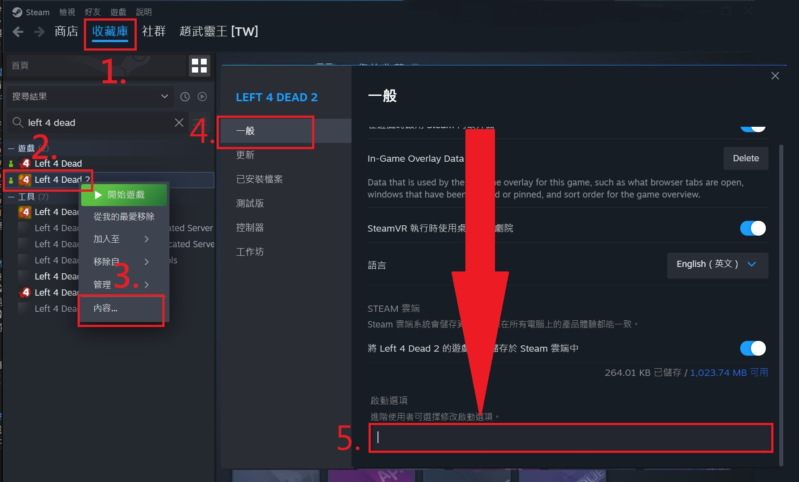

    * 常見啟動參數介紹
        * ```-lv``` - 低暴力模式，遊戲看不到噴血、屍體、斷手斷腳等畫面。遊戲會比較順暢
        * ```-novid``` 或 ```-novideo``` - 直接跳過遊戲開頭動畫
        * ```-w xxx``` - 設定遊戲解析度的寬，xxx為數字
        * ```-h xxx``` - 設定遊戲解析度的高，xxx為數字
        * ```-fullscreen``` - 強制遊戲以全螢幕模式啟動
        * ```-windowed``` 或 ```-sw``` - 強制引擎以視窗模式啟動
        * ```-dev``` - 啟用開發者模式，通常是給開發商除錯用的
        * 想知道更多請上官網: [Steam 客服 設定遊戲啟動選項](https://help.steampowered.com/zh-tw/faqs/view/7d01-d2dd-d75e-2955)
</details>

- - - -
## 驗證遊戲檔案的完整性
* 為什麼要驗證? 何時需要驗證?
    * 模組放太多導致遊戲檔案受損
    * 你覺得遊戲本體有檔案損毀需要修補
    * 遊戲檔案被修改過，你想復原
    * 感覺遊戲比以前更容易出現問題

* <details><summary>如何驗證?</summary>

    * 依照圖片指示即可驗證，Steam平台會自動偵測所有遊戲檔案，如果有與官方不同會復原
    <br/>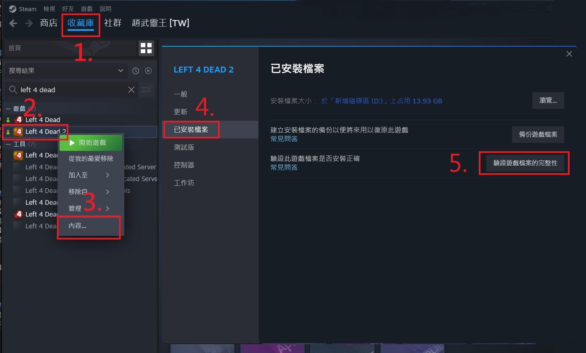
</details>

- - - -
## 啟動遊戲指導系統
* <details><summary>甚麼是遊戲指導系統?</summary>

    * 遊戲中提示你使用治療包、撿起武器、開機關等等
    <br/>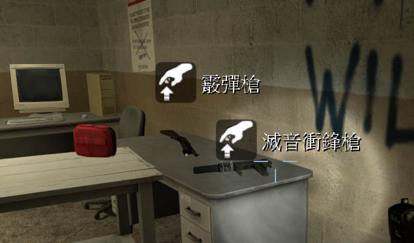
    <br/>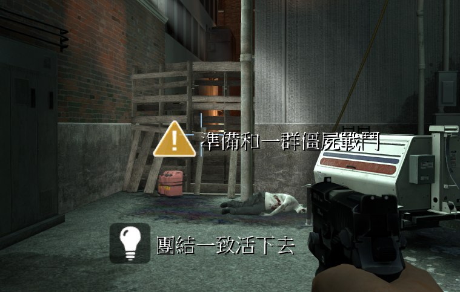
</details>

* <details><summary>如何開啟?</summary>

    * 法一: 打開遊戲控制台輸入```gameinstructor_enable 1```，0 為關閉
        ```php     
        ] gameinstructor_enable 1
        ```
    * 法二: ESC->選項->多人連線->遊戲指導系統->已啟用
    <br/>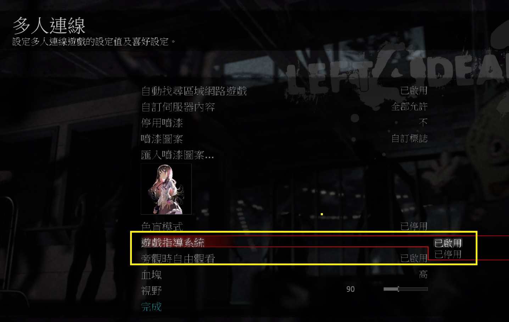
</details>

* <details><summary>何時需要開啟?</summary>

    * 遊玩三方圖，需要知道地圖上的機關如何啟動或路線怎麼走，絕大部分的地圖會有提示
        * 像是[Resident Evil](https://steamcommunity.com/sharedfiles/filedetails/?id=533677587)、[Questionable Ethics](https://steamcommunity.com/sharedfiles/filedetails/?id=2783476025&searchtext=question)等等
    * 有插件會修改遊戲指導系統
        * 像是[l4d2_item_hint](https://github.com/fbef0102/L4D1_2-Plugins/tree/master/l4d2_item_hint)等等
        <br/>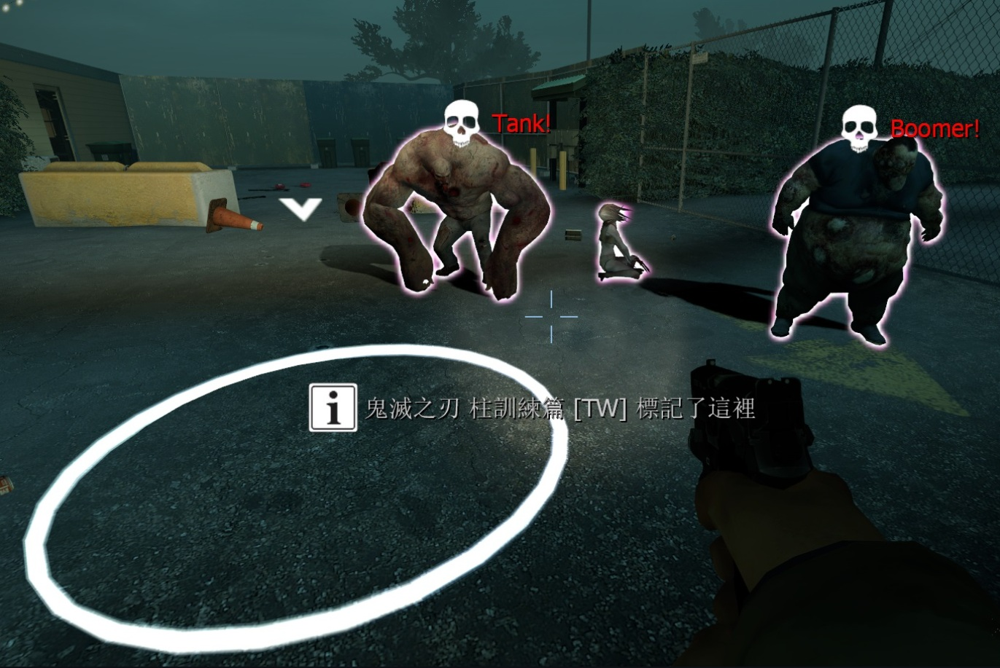
    * 你是新手的時候
</details>

* <details><summary>問題1: 為什麼打開了還是看不到 ?</summary>

  * 原因一： 遊戲指導系統是交由遊戲導演決定，依照當下的倖存者狀態顯示各種恰當的遊戲提示，避免玩家螢幕全塞滿混雜的訊息
  * 原因二： 伺服器端有修改指令 ```sv_gameinstructor_disable 1```，這會關閉伺服器內所有玩家的遊戲指導系統
  * 原因三： 遊玩了寫實模式，寫實模式會關掉大部分的遊戲提示，只留下機關路線提示
</details>

- - - -
## 下載自訂伺服器內容
* <details><summary>自訂伺服器內容?</summary>

    * 遊戲提供社群玩家自己架設伺服器並創造多樣化的玩法，在某些伺服器當中，會使用自製的模組或檔案，提供玩家下載
        * [播放自製音樂](https://github.com/fbef0102/L4D1_2-Plugins/tree/master/l4d_MusicMapStart): 所有人能聽到音樂
        <br/>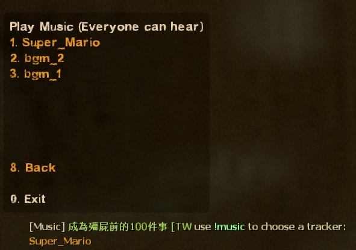
        * [自製地圖塗鴉](https://github.com/fbef0102/Sourcemod-Plugins/tree/main/map-decals): 所有人能看到圖案
        <br/>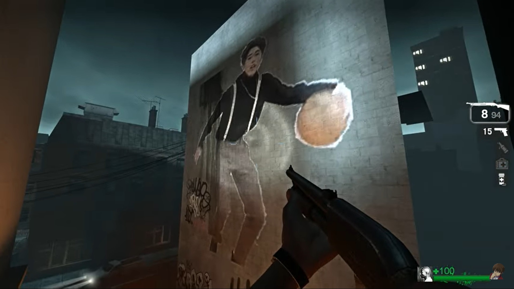
        * [自製角色模組](https://forums.alliedmods.net/showthread.php?t=284157): 所有人能看到自製的人物角色
        <br/>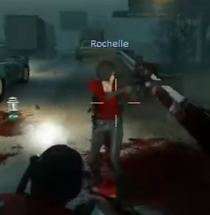
        * [跳舞動作](/L4D_%E6%8F%92%E4%BB%B6/Fun_%E5%A8%9B%E6%A8%82/fortnite_dances_emotes_l4d): 所有人能看到舞蹈動作
        <br/>
</details>

* <details><summary>如何開啟?</summary>
   
    * ESC->選項->多人連線->自訂伺服器內容->全部允許
    <br/>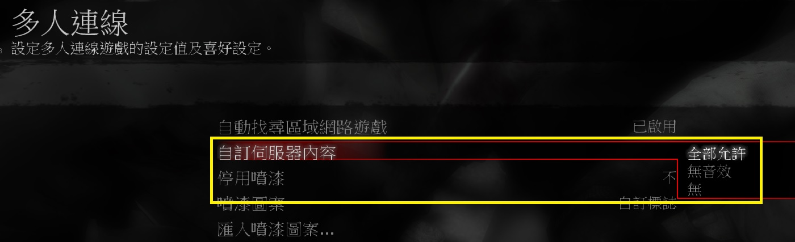
    * 開啟之後，在連線伺服器的過程中會自動下載自製檔案，打開遊戲控制台會看到 (如果有成功的話)
    <br/>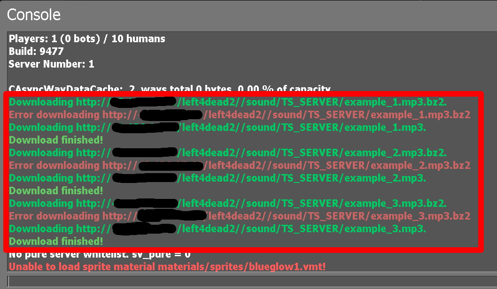
    * L4D1 與部分遊戲不會顯示這些控制台內容，需自行打開遊戲資料夾查看檔案是否已下載
</details>

* <details><summary>問題1: 我可以關閉嗎?</summary>

    * 可以關閉，進去社群玩家伺服器之後不會自動下載檔案，聽不見自製音樂、看不見自製模組
    * 有些玩家不喜歡被強迫下載一堆自製檔案，也不喜歡社群玩家建立的伺服器內容
</details>