# 問題總攬
> 2025/8/25 更新
- [問題總攬](#問題總攬)
  - [前言介紹](#前言介紹)
  - [選擇區域伺服器或專屬伺服器](#選擇區域伺服器或專屬伺服器)
  - [如何安裝專屬伺服器](#如何安裝專屬伺服器)
  - [如何安裝Sourcemod](#如何安裝sourcemod)
  - [如何執行專屬伺服器](#如何執行專屬伺服器)
  - [如何檢查版本](#如何檢查版本)
  - [如何進去我的伺服器](#如何進去我的伺服器)
  - [設置路由器/網路基地台/防火牆/數據機](#設置路由器網路基地台防火牆數據機)
  - [如何從大廳匹配到專屬伺服器](#如何從大廳匹配到專屬伺服器)
  - [如何成為伺服器的管理員](#如何成為伺服器的管理員)
  - [如何編譯源碼](#如何編譯源碼)
  - [如何安裝插件](#如何安裝插件)
  - [如何檢查插件成功運作](#如何檢查插件成功運作)
  - [如何移除插件](#如何移除插件)
  - [如何更新插件](#如何更新插件)
  - [如何手動管理插件](#如何手動管理插件)
  - [如何檢查指令值](#如何檢查指令值)
  - [如何修改指令](#如何修改指令)
  - [如何使用插件的命令](#如何使用插件的命令)
  - [如何更新專屬伺服器](#如何更新專屬伺服器)
  - [如何更新Sourcemod](#如何更新Sourcemod)
  - [專業術語介紹](#專業術語介紹)
  - [其他](#其他)
> __Note__ 本處教學一律是Sourcemod，與AMX Mod X無任何關係

- - - -
## 前言介紹
- Valve上的遊戲像是惡靈勢力、Counter-Strike: Source、No More Room in Hell、TF2等等，提供社群玩家自己架設伺服器
- 社群玩家可以在伺服器上安裝插件隨意修改遊戲內容與玩法，讓這款遊戲創造豐富多樣的玩法
   * 凡舉CS的殭屍、大逃殺、團隊死鬥等等都是玩家架設伺服器並利用插件達成的
   * 惡靈勢力的8V8對抗、多人連線戰役等等也是玩家架設伺服器並利用插件達成的
- 插件上百種，可以使玩家打造屬於自己風格的伺服器，而要讓插件成功運作必須要先安裝Sourcemod
- 本篇教學為指導玩家如何在電腦上架設自己的專屬伺服器並安裝Sourcemod

- - - -
## 選擇區域伺服器或專屬伺服器
- 伺服器有分兩種，區域(Listen)和專屬(Dedicated)
   * 自己開啟遊戲創立遊戲房間是區域伺服器
   * 透過第三方軟體啟動伺服器都是專屬伺服器
- 想安裝區域伺服器可以看[這篇文章](/Tutorial_教學區/Chinese_繁體中文/Server/安裝區域房與插件/README.md#甚麼是區域房)
- 你可以自由選擇Sourcemod要安裝在專屬伺服器還是區域伺服器
	- 我推薦專屬伺服器，因為所有插件都支援專屬伺服器，且Sourcemod不支援區域房
	- 絕大部分的插件作者不會鳥你區域伺服器出現問題
	- 🟥Linux 系統無法安裝Sourcemod在區域房

- - - -
## 如何安裝專屬伺服器
* <details><summary>Windows安裝流程 (點我展開)</summary>

   1. 下載[SteamCMD](https://steamcdn-a.akamaihd.net/client/installer/steamcmd.zip)

   2. 解壓縮到電腦上任一路徑，最好自己創建資料夾且路徑不要有中文
      - 譬如```D:\steamcmd```
      <br/>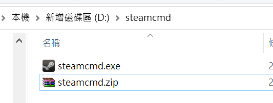

   3. 執行steamcmd.exe，等它自己跑完套件與更新包
      <br/>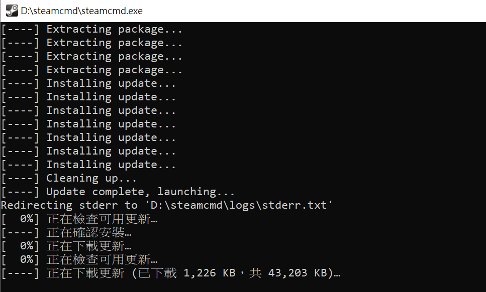

   4. 等到出現Loading Steam API...OK，依序輸入以下指令
      <br/>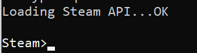
      - ```force_install_dir ./L4D2_Server/```
         - L4D2_Server是創建資料夾名稱，可自取，不要有中文，伺服器所有檔案將會安裝在這裡
      - ```login xxxxx yyyyy```
         - xxxxx 是你的steam帳戶的帳號 (不是顯示名稱也不是steam id)
         - yyyyy 是你的steam帳戶的密碼
         - 🟥 請記得空格
         - 🟥 現在steam政策已改，無法匿名登入安裝伺服器
         - 第一次登入需要二次驗證，輸入Steam Guard Mobile驗證碼
      - ```app_update XXXXXX validate```
         - XXXXXX 為遊戲伺服器的App ID，[steamdb](https://steamdb.info/) 自行搜尋遊戲
            - 222840 為L4D - Dedicated Serverr
            - 222860 為L4D2 - Dedicated Server
            - 232330 為Counter-Strike: Source - Dedicated Server
            - 317670 為No More Room in Hell - Dedicated Server
         
      <br/>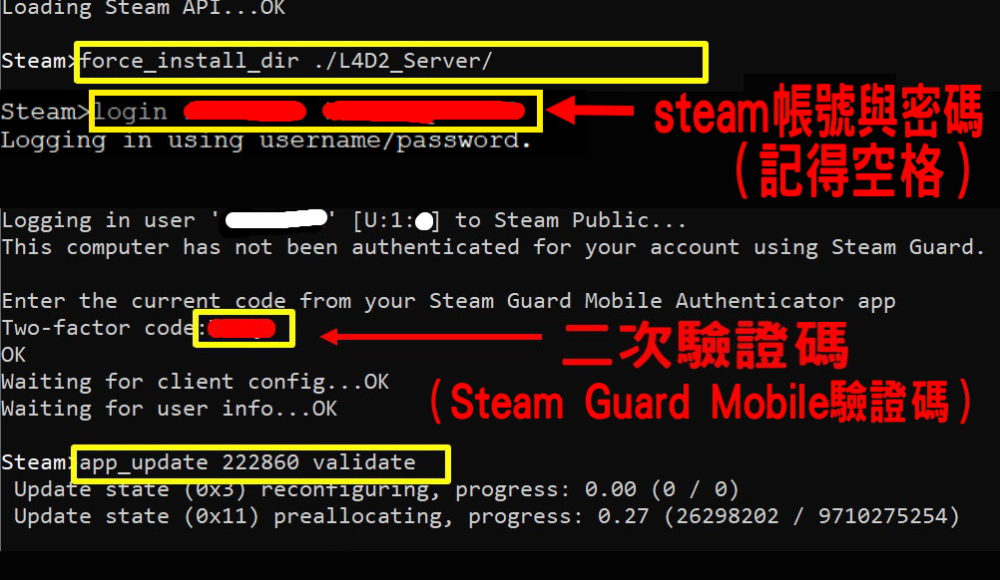

   5. 完成安裝之後輸入exit結束steamcmd
      <br/>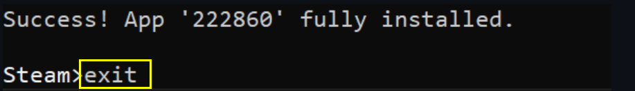

   6. 到所安裝的路徑查看伺服器檔案
      <br/>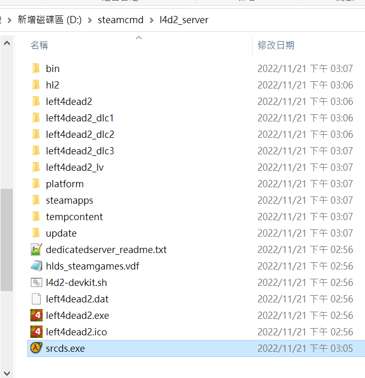
</details>

* <details><summary>Linux安裝流程 (點我展開)</summary>

   1. 啟用終端機輸入以下指令 (你可能需要root 權限)
      - ```cd 任一路徑，最好自己創建資料夾且路徑不要有中文```
      - ```wget http://media.steampowered.com/installer/steamcmd_linux.tar.gz```
      - ```tar -xvzf steamcmd_linux.tar.gz```
      - ```./steamcmd.sh```
      <br/>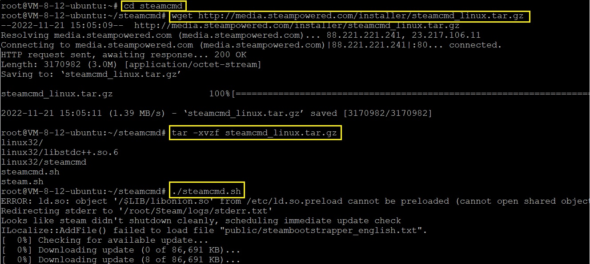

   2. 等到出現Loading Steam API...OK，依序輸入以下指令
      <br/>
      - ```force_install_dir ./L4D2_Server/```
         - L4D2_Server是創建資料夾名稱，可自取，不要有中文，伺服器所有檔案將會安裝在這裡
      - ```login xxxxx yyyyy```
         - xxxxx 是你的steam帳戶的帳號 (不是顯示名稱也不是steam id)
         - yyyyy 是你的steam帳戶的密碼
         - 🟥 請記得空格
         - 🟥 現在steam政策已改，無法匿名登入安裝伺服器
         - 第一次登入需要二次驗證，輸入Steam Guard Mobile驗證碼
      - ```app_update XXXXXX validate```
         - XXXXXX 為遊戲伺服器的App ID，[steamdb](https://steamdb.info/) 自行搜尋遊戲
            - 222840 為L4D - Dedicated Server
            - 222860 為L4D2 - Dedicated Server
            - 232330 為Counter-Strike: Source - Dedicated Server
            - 317670 為No More Room in Hell - Dedicated Server

      <br/>

   3. 完成安裝之後輸入exit結束steamcmd
      <br/>

   4. 到所安裝的路徑查看伺服器檔案
      <br/>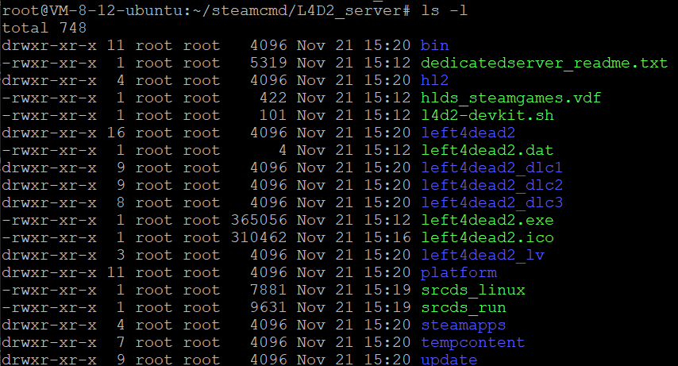

   5. **Linux要安裝環境庫才能繼續下一個步驟，視環境系統輸入對應的指令**，[參考來源](https://linuxgsm.com/servers/l4d2server/)
      * Ubuntu =< 20.04 : **不再支援**
      * Ubuntu => 20.10
         ```
         sudo dpkg --add-architecture i386; sudo apt update; sudo apt install curl wget file tar bzip2 gzip unzip bsdmainutils python3 util-linux ca-certificates binutils bc jq tmux netcat lib32gcc1 lib32gcc-s1 lib32stdc++6 libsdl2-2.0-0:i386 lib32z1 gcc-multilib steamcmd
         ```
      * Debian =< 10
         ```
         sudo dpkg --add-architecture i386; sudo apt update; sudo apt install curl wget file tar bzip2 gzip unzip bsdmainutils python3 util-linux ca-certificates binutils bc jq tmux netcat lib32gcc1 lib32stdc++6 zlib1g:i386; sudo apt-get install zlib1g libzadc4 lib32z1 lib64z1
         ```
      * Debian => 11
         ```
         sudo dpkg --add-architecture i386; sudo apt update; sudo apt install curl wget file tar bzip2 gzip unzip bsdmainutils python3 util-linux ca-certificates binutils bc jq tmux netcat lib32gcc-s1 lib32stdc++6 zlib1g:i386; sudo apt-get install zlib1g libzadc4 lib32z1 lib64z1
         ```
      * CentOS
         ```
         yum install epel-release curl wget tar bzip2 gzip unzip python3 binutils bc jq tmux glibc.i686 libstdc++ libstdc++.i686 zlib.i686
         ```
</details>

- - - -
## 如何安裝Sourcemod
* <details><summary>安裝步驟 (點我展開)</summary>

   1. [Sourcemod Stable](https://www.sourcemod.net/downloads.php?branch=stable)下載最新版本的安裝包
      - 窗戶圖案的是Windows系統，企鵝圖案的是Linux系統，蘋果圖案的是macOs系統，選擇Windows系統下載即可
      - 紅色圖案代表此版本尚未支援該系統平台
      - [請不要下載Dev版本](/Questions_問題區/Chinese_繁體中文/伺服器/README.md#為什麼sourcemod下載有分兩種)
      <br/>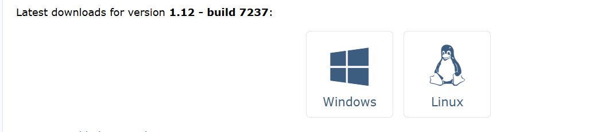

   2. [MetaMod Stable](https://www.sourcemm.net/downloads.php?branch=stable)下載最新版本的安裝包
      - 窗戶圖案的是Windows系統，企鵝圖案的是Linux系統，蘋果圖案的是macOs系統，選擇Windows系統下載即可
      - 紅色圖案代表此版本尚未支援該系統平台
      <br/>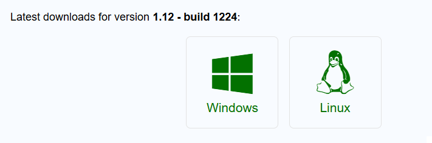
   
   3. 將所有檔案解壓縮到伺服器路徑上，最後會看起來如圖片所示 (注意路徑)
      <br/>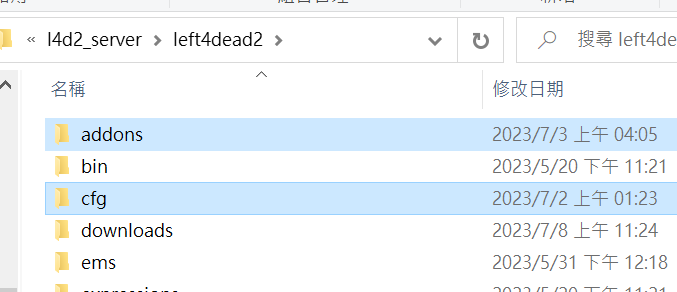
      <br/>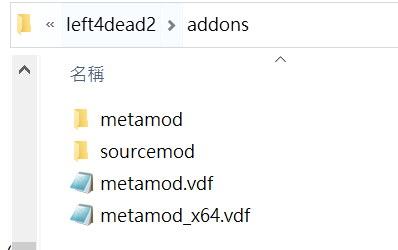

   4. 到[sourcemm.net vdf](https://www.sourcemm.net/vdf)，選擇相對應的遊戲，然後點擊"Generate medamod.vtf"，下載metamod.vtf到addons資料夾上覆蓋原有的檔案
      <br/>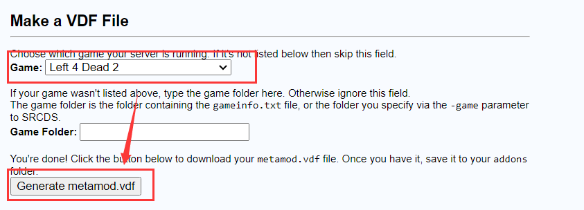
      <br/>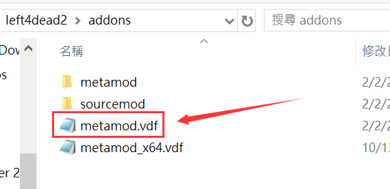
</details>

- - - -
## 如何執行專屬伺服器
* <details><summary>Windows (點我展開)</summary>

   1. 到伺服器檔案所在資料夾位置，新增一個檔案叫```scrds.bat```(注意副檔名)，用筆記本打開它，複製以下內容貼上
      ```
      start srcds.exe -console -game xxxxxx -port 27016 +log on +exec server.cfg +sv_lan 0 -maxplayers 31 +map c1m1_hotel
      ```
      <br/>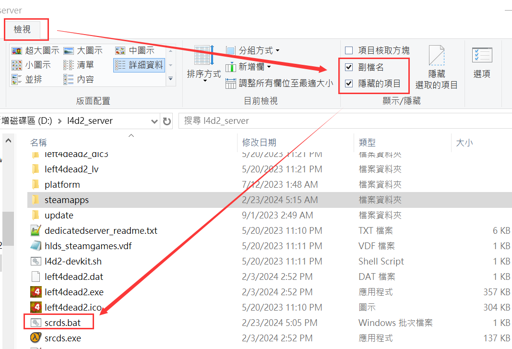
      <br/>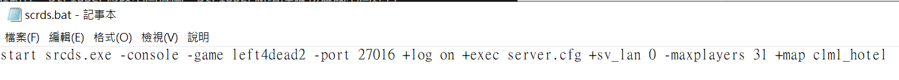
      - 這些都是啟動選項的參數, 以後要新增其他啟動選項都是寫這裡
      - ```xxxxxx``` 為設定的遊戲
         - 如果是L4D1，xxxxxx改成left4dead
         - 如果是L4D2，xxxxxx改成left4dead2
         - 如果是Counter-Strike: Source，xxxxxx改成cstrike
         - 如果是No More Room in Hell，xxxxxx改成nmrih
      - ```-port 27016``` 為設定的Port
         - 🟥UDP Port 別亂改數值，安全的範圍最好是27016 ~ 27035之間🟥
      - ```+log on``` 打開伺服器紀錄儀
      - ```exec server``` 伺服器啟動先執行cfg/server.cfg文件
         * 🟥 沒有此文件請自行創立, 內容依照不同遊戲的需求自行修改
         * 我的[server.cfg範例](https://github.com/fbef0102/Sourcemod-Server/blob/main/L4D2/Windows%20Server%20Files/left4dead2/cfg/server.cfg)
      - ```+sv_lan 0``` 改成網際網路 (廢話)
      - ```-maxplayers 31``` 最多的客戶端人數上限，即使設定31人，伺服器人數受到遊戲模式的限制
         - L4D 戰役模式最多4人、對抗模式最多8人
      - 可自行添加其他參數(啟動選項)，譬如
         - ```+map c2m2_fairgrounds``` 開啟伺服器的預設地圖
         - ```+sv_password 12345``` 伺服器密碼為12345，不要寫中文

   2. 直接左鍵雙擊```scrds.bat```執行－＞啟動伺服器－＞會跑出一個黑視窗，此視窗即為伺服器的控制台(後台)
   <br/>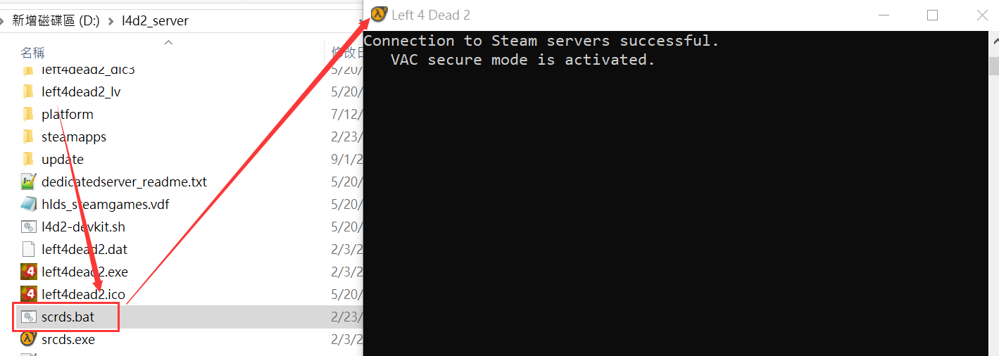

   3. (Windows) 第一次執行時，如果windows系統有跳出防火牆視窗警訊，請兩個都勾選並允許存取
      * 只有你在使用電腦，不用怕
   <br/>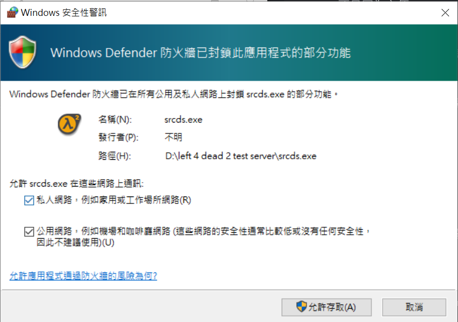

   4. 檢查Sourcemod是否有正常運作，輸入```sm version```，沒有出現如下圖所示的內容代表前面的步驟有誤，請檢查
      - 到伺服器的後台
      <br/>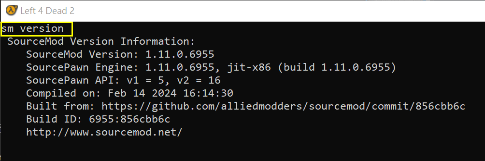
</details>

* <details><summary>Linux (點我展開)</summary>

   1. 啟用終端機到伺服器檔案所在資料夾位置，輸入
      ```
      ./srcds_run -console -game xxxxxx -port 27016 +log on +exec server +sv_lan 0 -maxplayers 31
      ```
      - ```xxxxxx``` 為設定的遊戲
         - 如果是L4D1，xxxxxx改成left4dead
         - 如果是L4D2，xxxxxx改成left4dead2
         - 如果是Counter-Strike: Source，xxxxxx改成cstrike
         - 如果是No More Room in Hell，xxxxxx改成nmrih
      - ```-port 27016``` 為設定的Port
         - 🟥UDP Port 別亂改數值，安全的範圍最好是27016 ~ 27035之間
      - ```+log on``` 打開伺服器紀錄儀
      - ```exec server``` 伺服器啟動先執行cfg/server.cfg文件
      - ```+sv_lan 0``` 改成網際網路
      - ```-maxplayers 31``` 最多客戶端人數上限
      - 可自行添加其他參數(啟動選項)，譬如
         - ```+map c2m2_fairgrounds``` 開啟伺服器的預設地圖
         - ```+sv_password 12345``` 伺服器密碼為12345
   2. 檢查Sourcemod是否有正常運作
      - 輸入```sm version```，沒有出現如下圖所示的內容代表前面的步驟有誤，請檢查
      <br/>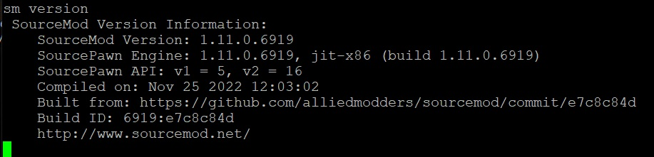
</details>

- - - -
## 如何檢查版本
* <details><summary>查找伺服器的後台 (點我展開)</summary>

   * 如果是利用.bat開啟伺服器，此視窗即是伺服器的控制台(後台)，不用懷疑
   <br/>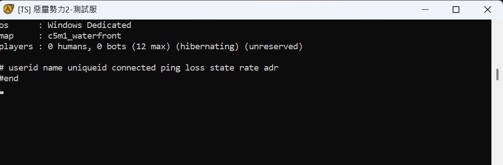
   * 如果是執行scrd.exe，視窗開啟後尋找"命令列"
   <br/>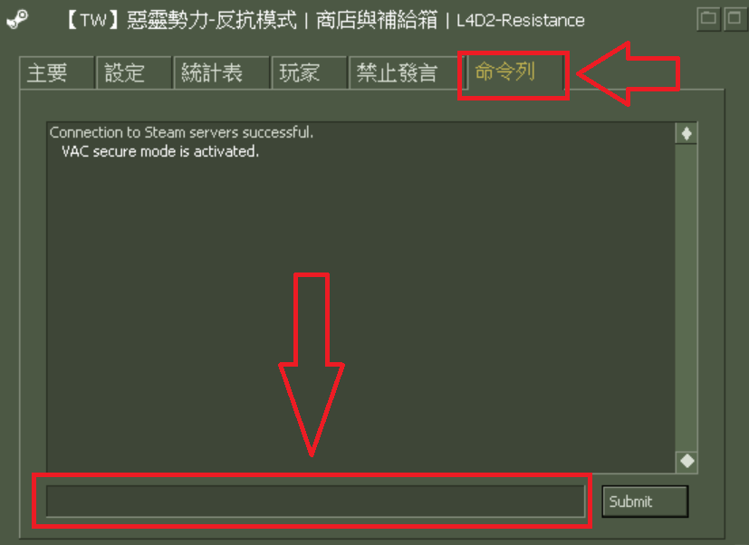
   
   > __Note__ 若是用其他的開服軟體，請自行摸索找到後台 
</details>

* <details><summary>檢查遊戲平台版本 (點我展開)</summary>
  
   * 伺服器的後台輸入```version```
      ```php
      ] version
      Version 2.2.2.5 (left4dead2)
      Network Version 2.1.0.0
      Exe build: 16:48:59 Feb  4 2022 (8490) (550)
      ```
</details>

* <details><summary>檢查sourcemod平台版本 (點我展開)</summary>

   * 伺服器的後台輸入```sm version```
      ```php
      ] sm version
         SourceMod Version Information:
            SourceMod Version: 1.11.0.6905
            SourcePawn Engine: 1.11.0.6905, jit-x86 (build 1.11.0.6905)
            SourcePawn API: v1 = 5, v2 = 16
            Compiled on: Jul  3 2022 01:15:17
            Built from: https://github.com/alliedmodders/sourcemod/commit/5e3a1896
            Build ID: 6905:5e3a1896
            http://www.sourcemod.net/
      ```
</details>

* <details><summary>檢查metamod平台版本 (點我展開)</summary>

   * 伺服器的後台輸入```meta version```
      ```php
      ] meta version
         Metamod:Source Version Information
            Metamod:Source version 1.11.0-dev+1148
            Plugin interface version: 16:14
            SourceHook version: 5:5
            Loaded As: Valve Server Plugin
            Compiled on: Jun 24 2022 14:34:21
            Built from: https://github.com/alliedmodders/metamod-source/commit/4bdc218
            Build ID: 1148:4bdc218
            http://www.metamodsource.net/
      ```
</details>

* <details><summary>檢查所有Extension版本 (點我展開)</summary>

   * 伺服器的後台輸入```sm exts list```
      ```php
         ] sm exts list
         [SM] Displaying 11 extensions:
         [01] Automatic Updater (1.11.0.6905): Updates SourceMod gamedata files
         [02] Webternet (1.11.0.6905): Extension for interacting with URLs
         [02] Top Menus (1.11.0.6905): Creates sorted nested menus
         [04] SDK Tools (1.11.0.6905): Source SDK Tools
         [05] BinTools (1.11.0.6905): Low-level C/C++ Calling API
         [06] SDK Hooks (1.11.0.6905): Source SDK Hooks
         [07] Client Preferences (1.11.0.6905): Saves client preference settings
         [08] SQLite (1.11.0.6905): SQLite Driver
         [09] DHooks (1.11.0.6905): Dynamic Hooks
         [10] Regex (1.11.0.6905): Provides regex natives for plugins
         [11] GeoIP (1.11.0.6905): Geographical IP information
      ```
</details>

* <details><summary>檢查所有Meta Plugin版本 (點我展開)</summary>
  
   * 伺服器的後台輸入```meta list```
      ```php
         ] meta list
         Listing 11 plugins:
            [01] SourceMod (1.11.0.6905) by AlliedModders LLC
            [02] SDK Tools (1.11.0.6905) by AlliedModders LLC
            [03] SDK Hooks (1.11.0.6905) by AlliedModders LLC
            [04] DHooks (1.11.0.6905) by AlliedModders LLC
      ```
</details>

* <details><summary>檢查所有插件版本 (點我展開)</summary>
  
   * 伺服器的後台輸入```sm plugins list```
   ```php
      ] sm plugins list
      [SM] Listing 11 plugins:
         001 "Admin File Reader" (1.11.0.6905) by AlliedModders LLC
         002 "Admin Help" (1.11.0.6905) by AlliedModders LLC
         003 "Admin Menu" (1.11.0.6905) by AlliedModders LLC
         004 "Anti-Flood" (1.11.0.6905) by AlliedModders LLC
         005 "Basic Ban Commands" (1.11.0.6905) by AlliedModders LLC
         006 "Basic Chat" (1.11.0.6905) by AlliedModders LLC
         007 "Basic Comm Control" (1.11.0.6905) by AlliedModders LLC
         008 "Basic Commands" (1.10.0.6502) by AlliedModders LLC
         009 "Basic Info Triggers" (1.11.0.6905) by AlliedModders LLC
         010 "Basic Votes" (1.11.0.6905) by AlliedModders LLC
         011 "Client Preferences" (1.11.0.6905) by AlliedModders LLC
   ```
</details>

* <details><summary>檢查其他插件版本 (點我展開)</summary>

   * 伺服器的後台輸入```plugin_print```
      ```php
         ] plugin_print
         Loaded plugins:
         ---------------------
         0:      "Metamod:Source 1.11.0-dev+1148"
         ---------------------
      ```
</details>

- - - -
## 如何進去我的伺服器
* <details><summary>說明 (點我展開)</summary>

   1. 先要知道伺服器的IP地址，到伺服器的後台輸入```status``` <br/>
      <br/>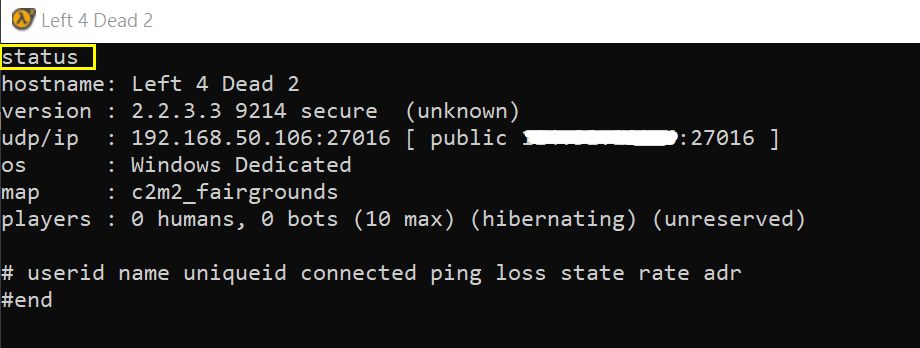
      - hostname 	為房名
      - version 	為遊戲伺服器的版本
      - udp/ip		為伺服器的IP
         - 前半部 192.168.50.106:27016 是**虛擬IP(內網IP)**，只有相同網域的能連線進來
         - 後半部 被塗白的部分 是**公網IP(外網IP)**，全世界任何人能連線進來
         - 🟥其中27016是**網路Port(端口)**，為該伺服器占用
      - os		為電腦系統
      - map	   為當前地圖
      - players		為伺服器內的玩家狀態

   > [!WARNING]
   > 公網IP不要輕易讓任何人知道，因為暴露IP容易被駭客網路攻擊
      
   2. 啟動遊戲－＞打開控制台－＞輸入```connect x.x.x.x:yyyyy``` <br/>
      <br/>
      - ```x.x.x.x:yyyyy``` 為你的伺服器公網IP
      - 請朋友測試連線到你的伺服器公網IP，如果無法連線代表網路的路由器(無線基地台、Router、中華電信的數據機)或電腦的防火牆需要調整
         1. 申請固定IP，並更改路由器的路由表(英文是Routing Table、Forwarding Table、Port Fowarding、Port Routing、Virtual Server)
            * 開放端口27016
            * 每個品牌操作方式不一樣，請自行google

         2. 確認電腦的防火牆
            * 沒有阻擋srcds.exe應用程式
            * 沒有阻擋Port端口
      - 🟥此步驟若不解決，沒有人可以進去你的伺服器，也無法進入下一個步驟
      - [為什麼進不去伺服器](/Questions_問題區/Chinese_繁體中文/伺服器/README.md#為什麼進不去伺服器)

   3. 遊戲連線進去伺服器之後，打開遊戲的控制台輸入```status```用以確認是相同的公網IP與虛擬IP地址 <br/>
   <br/>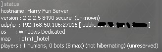

   4. 到此步驟為止，已經完成安裝伺服器，你可以開始管理伺服器
</details>

- - - -
## 設置路由器/網路基地台/防火牆/數據機
> [!CAUTION]
> 🟥 以下類型網路「目前無法架設伺服器給全世界任何人連線進來」
> * 3G/4G/5G/6G... 行動網路              <- 請別用手機網路吃到飽
> * 透過 WiFi 連線的無線網路     <- 公共場所請勿使用
> * 學校、公司、公家機關的宿舍網路         <- 不怕被吉就試試看
> * 任何無法進入基地台/數據機設定的皆無法  <- 只能放棄 

* <details><summary>以我家為範例 (點我展開)</summary>
   
   0. 請使用網路線連接電腦與路由器(數據機)，不要用WiFi
      * 🟥把加速器、VPN，任何會改變網路或IP的軟體都關閉
      * 伺服器後台輸入```status```，記住IP
      <br/>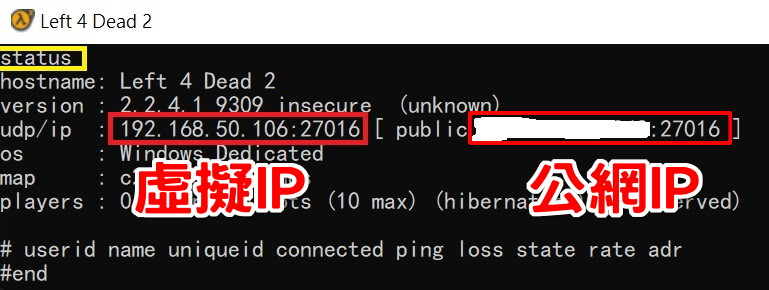
      * 拍照你家的路由器(數據機)，記住型號
      <br/>
         ```c
         電腦系統(System): Windows 10
         網路: 中華電信
         公網IP(外網IP): 圖片中塗白的部分 (如果IP會變，可自行與中華電信申請固定IP)
         路由器、數據機品牌(Router): DSL-6740C
         伺服器的虛擬IP(內網IP): 192.168.50.106
         伺服器的端口(Port): 27016
         ```

   1. 打開網頁，網址輸入```http://192.168.1.1/```，帳密登入路由器(數據機)
      * 每個品牌的帳密與操作方式不一樣，請自行google
         * 🟥最新版的中華電信數據機會有兩組以上不同的帳密可以登入，需要查下完整權限與功能的帳密是哪一組
      * 如果你是租服的(譬如騰訊雲)，那需要詢問客服
      <br/>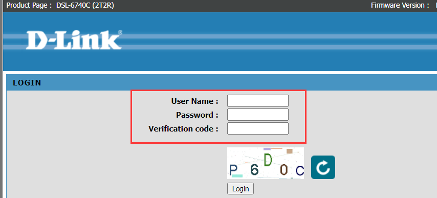

   2. 查看你家網際網路的連線模式，不知道的話可以詢問客服或自己猜
      <br/>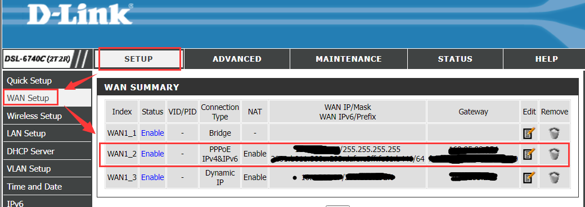
      ```c
      我的網路網路連線模式(Connection Type): PPPoE IPv4&IPv6
      連線模式使用的介面(Interface): WAN1_2
      ```

   3. 設置路由表 (英文是Routing Table、Forwarding Table、Port Fowarding、Port Routing、Virtual Server)
   <br/>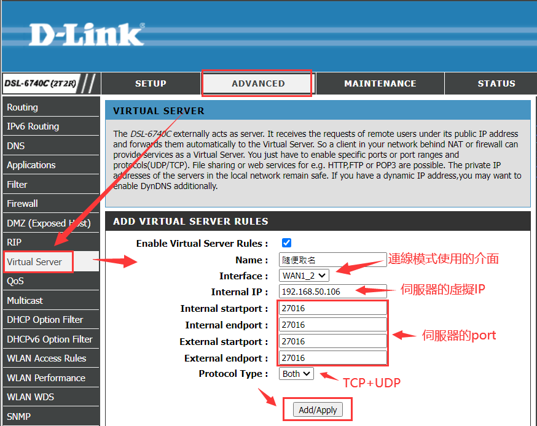

   4. 重啟路由器
      * 必須用網頁重啟
      <br/>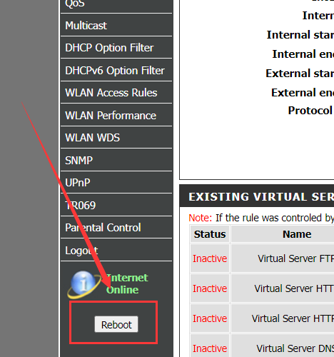
   
   5. 設置電腦的防火牆，"輸入規則"新增兩個，"輸出規則"新增兩個
      * 其他windows系統操作方式，請自行google
      <br/>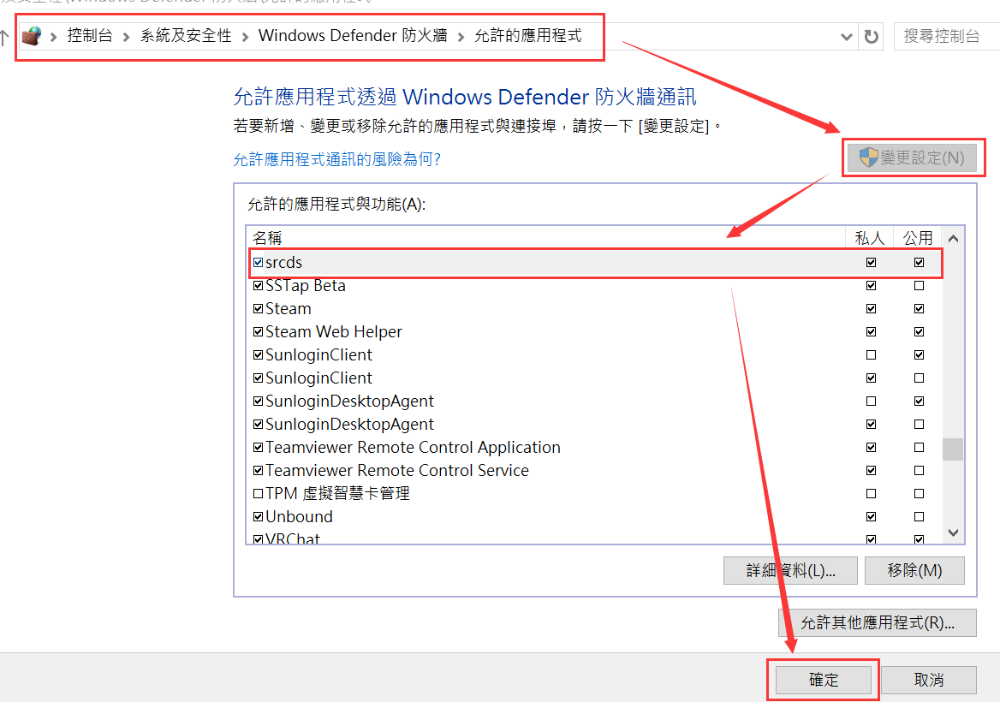
      <br/>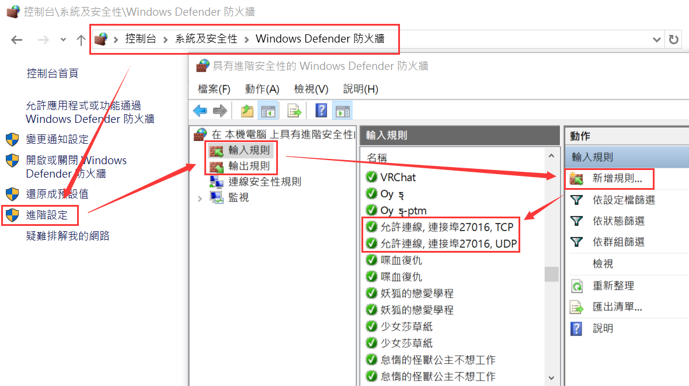
   
   6. 重啟電腦，打開伺服器，請朋友打開遊戲連線進去你的伺服器
      * 啟動遊戲－＞打開控制台－＞輸入```connect x.x.x.x:yyyyy``` (公網IP)

   7. 遊戲連線進去伺服器之後，打開遊戲的控制台輸入```status```用以確認是相同的公網IP與虛擬IP地址 <br/>
      <br/>

   8. 如果IP相同，你已經成功
      * 以上看不懂不會操作，請聯繫我
      * [其他路由器品牌的操作，感謝網友提供](https://forum.gamer.com.tw/Co.php?bsn=11333&sn=133594)
</details>

- - - -
## 如何從大廳匹配到專屬伺服器
* <details><summary>說明 (點我展開)</summary>

   1. 先知道伺服器的**公網IP地址**，到伺服器的後台輸入```status```
      <br/>
      - **udp/ip**	為伺服器的IP
         - 前半部 **192.168.50.106:27016** 是**虛擬IP (內網IP)**
         - 後半部 被塗白的部分 是**公網IP (外網IP)**

   2. 啟動遊戲－＞創建遊戲大廳－＞伺服器類型選擇 **"最佳可用專屬"**－＞打開控制台－＞輸入```mm_dedicated_force_servers x.x.x.x:yyyyy```
      <br/>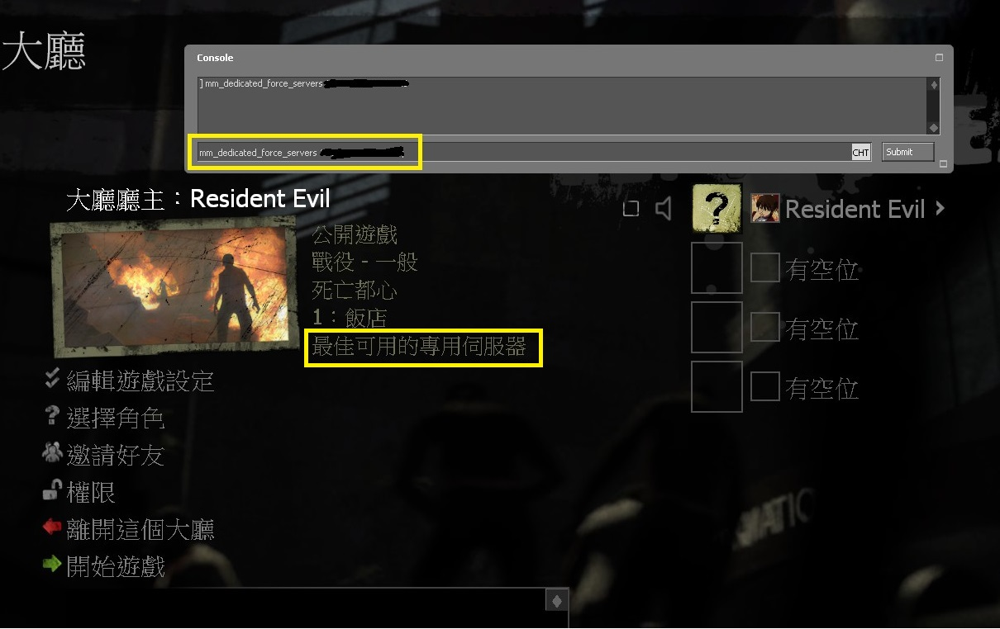
      - ```x.x.x.x:yyyyy``` 為伺服器的公網IP
      - 不能輸入虛擬IP，否則只有你能進去
      - 可以輸入其他人的專屬伺服器公網IP
      
   3. 邀請朋友或等路人進來或者你自己一個人－＞開始遊戲

   4. 連線進去之後遊戲控制台輸入```status```用以確認進到相同的伺服器
      <br/>
      - [為什麼無法進伺服器](/Questions_問題區/Chinese_繁體中文/伺服器/README.md#為什麼進不去伺服器)

   > __Warning__ 
   > * 只有當伺服器沒有人才可以從大廳匹配進去
   > * 如果伺服器有人，那請透過```connect x.x.x.x:yyyyy```方式連線進去　
</details>

- - - -
## 如何成為伺服器的管理員
* <details><summary>說明 (點我展開)</summary>

   1. 首先要知道自己的steam的ID為何，打開steam平台，到自己的steam個人頁面，右鍵點擊"複製頁面網址" 
      <br/>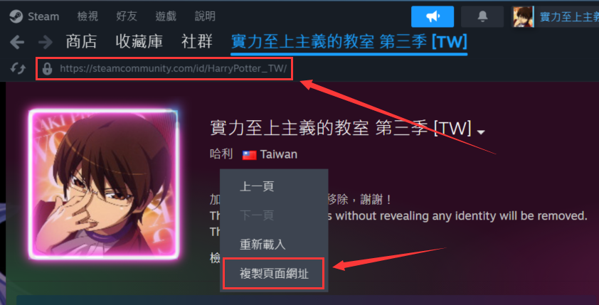

   2. 點擊[Steam ID Finder](https://steamid.xyz/)，將複製的網址貼上去提交，會得到自己的steam ID
      <br/>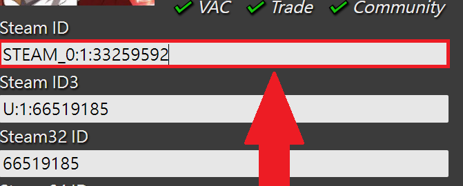

   3. 到伺服器位置addons/sourcemod/configs/ 資料夾找到一個檔案為admins_simple.ini，用筆記本打開文件，在最底下方新增一行內容
      - STEAM_X:X:XXXXXX 為你的steam ID
      ```php
      "STEAM_X:X:XXXXXX" "99:z" //這位玩家是管理員
      ```
      
   4. 儲存，重啟伺服器，進入遊戲之後聊天視窗輸入```!admin```，如果左邊有介面跑出來代表已經成功為伺服器的管理員
      <br/>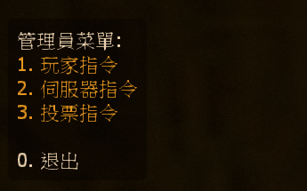
</details>

- - - -
## 如何編譯源碼
* <details><summary>編譯流程說明 (點我展開)</summary>

   1. 此處用Windows系統方便操作，將想要編譯的源碼檔案丟入```addons/sourcemod/scripting/``` 資料夾裡面
      - 不建議修改檔案名稱，不要取中文
      - 源碼檔案的副檔名是.sp
      - 請先開啟顯示副檔名
      <br/>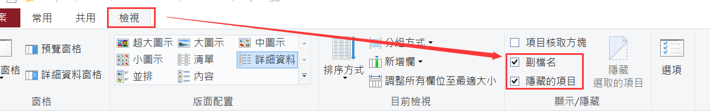

   2. 接著拖曳.sp檔案到同資料夾底下的compile.exe <br/>
      <br/>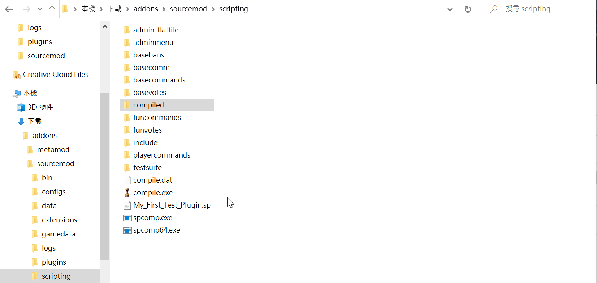

   3. 編譯完成的檔案將會在```addons/sourcemod/scripting/compiled/``` 資料夾裡面
      - 視窗如果顯示編譯失敗(有error文字)，代表缺少安裝必要的檔案或者源碼有錯誤，請洽作者
         * [常見的編譯錯誤訊息](/Questions_問題區/Chinese_繁體中文/插件/README.md#常見的編譯錯誤訊息)
      - 在Windows系統下編譯完成的檔案通用於Windows、Linux、macOs系統，不會有不相容的問題</details>

- - - -
## 如何安裝插件
* <details><summary>安裝流程說明 (點我展開)</summary>

   1. 無論是自己編譯好的插件或是從網路上下載的插件，將檔案放入```addons/sourcemod/plugins```
      - 插件檔案的副檔名是.smx
      - 不建議修改插件名稱，不要取中文

   2. 若安裝包有其他的文件，放入相同資料夾即可
      - 翻譯文件.txt 放入addons/sourcemod/translations
         <details><summary>判斷是否為翻譯文件 (點我展開)</summary>

         檔案名稱: xxxx.phrases.txt
         ```
         "Phrases"
         {
            "You're spectating. Join any team to play."
            {
               "en"	"You're spectating. Join any team to play."
               "zho"	"輸入 !join 加入遊戲..."
               "chi"	"输入 !join 加入游戏..."
            }	
            "[AFK] Inactivity detected! 1"
            {
               "#format"		"{1:d}"
               "en"	"[AFK] Inactivity detected! You'll be moved to spectators in {1} seconds!"
               "zho"	"[AFK] 偵測閒置! 你將於 {1} 秒後強制旁觀."
               "chi"	"[AFK] 探测闲置! 你将于 {1} 秒后强制旁观."
            }	

            ...
         }
         ```
         </details>
         
      - Gamedata文件.txt 放入addons/sourcemod/gamedata
         <details><summary>判斷是否為Gamedata文件 (點我展開)</summary>
         
         檔案名稱: xxxx.txt
         ```
         "Games"
         {
            "left4dead2" //credit: ProdigySim, Shadowysn
            {
               "Addresses"
               {
                  "NextBotCreatePlayerBot.jumptable"
                  {
                     "windows"
                     {
                        "signature"	"CTerrorPlayer::ReplaceWithBot.jumptable"
                        "offset"	"7"
                     }
                  }
               }
               "Signatures"
               {
                  "TakeOverBot"
                  {
                     "library"	"server"
                     "linux"		"@_ZN13CTerrorPlayer11TakeOverBotEb"
                     "windows"	"\x55\x8B\xEC\x81\xEC\x2A\x2A\x2A\x2A\xA1\x2A\x2A\x2A\x2A\x33\xC5\x89\x45\xFC\x53\x56\x8D\x85"
                     /* 55 8B EC 81 EC ? ? ? ? A1 ? ? ? ? 33 C5 89 45 FC 53 56 8D 85 */
                  }
               }

               ...
            }
         }
         ```
         </details>
         
      - 其他文件依照說明書指示放入
      
   3. 重啟伺服器即可完成
   > __Warning__ 有些插件需要其他的檔案輔助才能成功運作，請詳細查看插件說明書或詢問插件作者本人

   * 延伸閱讀: [插件不拿源碼會怎樣](/Questions_問題區/Chinese_繁體中文/插件/README.md#插件不拿源碼會怎樣)
</details>

- - - -
## 如何檢查插件成功運作
* <details><summary>安裝流程說明 (點我展開)</summary>

   > 只要不是自己手殘或眼殘，通常依照插件說明書指示都會成功載入
   1. 到伺服器後台上，輸入```sm plugins info xxxxxx```
      - xxxxxx為插件的檔案名稱 (不用寫副檔名)
         <details><summary>範例 (點我展開)</summary>

         ```php
         ] sm plugins info trigger_horde_notify
         Filename: trigger_horde_notify.smx
         Title: [L4D & L4D2] trigger_horde_notify
         Author: HarryPotter
         Version: 1.0
         Error: Error detected in plugin startup (see error logs)
         ```
         </details>

   2. 看見Error代表此插件無法成功載入，請到sourcemod/logs資料夾查看errors_開頭的文件，閱讀錯誤原因並嘗試解決
      * [常見的插件錯誤訊息](/Questions_問題區/Chinese_繁體中文/插件/README.md#常見的插件錯誤訊息)
      <br/>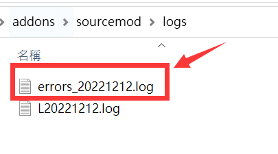

   3. 重新安裝插件之後，重啟伺服器，檢查插件是否成功運作，必須直到沒有error為止
      * 若看不懂錯誤原因請洽作者，將錯誤原文發給開發者，無須一堆廢話
         <details><summary>範例 (點我展開)</summary>

         檔案名稱: errors_xxxxx.log
         ```php
         L 03/28/2022 - 02:24:27: [SM] Exception reported: g_pDirector not available ().
         L 03/28/2022 - 02:24:27: [SM] Blaming: left4dhooks.smx
         L 03/28/2022 - 02:24:27: [SM] Call stack trace:
         L 03/28/2022 - 02:24:27: [SM]   [0] ThrowNativeError
         L 03/28/2022 - 02:24:27: [SM]   [1] Line 5394, C:\Servers\L4D2\left4dead2\addons\sourcemod\scripting\left4dhooks.sp::ValidateAddress
         L 03/28/2022 - 02:24:27: [SM]   [2] Line 6131, C:\Servers\L4D2\left4dead2\addons\sourcemod\scripting\left4dhooks.sp::Native_CDirector_IsAnySurvivorInStartArea
         L 03/28/2022 - 02:24:27: [SM]   [4] L4D_IsAnySurvivorInStartArea
         L 03/28/2022 - 02:24:27: [SM]   [5] Line 172, f:\Stuff\EVERYTHING ELSE\Left 4 Dead 2 Dedicated Servers\left4dead2\addons\sourcemod\scripting\all4dead2.sp::OnPluginStart
         ```
         </details>
      * [為什麼插件沒有運作](/Questions_問題區/Chinese_繁體中文/插件/README.md#為什麼插件沒有運作)
</details>

- - - -
## 如何移除插件
* <details><summary>說明 (點我展開)</summary>

   1. 將不想要的.smx插件從addons/sourcemod/plugins移除
      - 刪除或是移動到別的資料夾
   2. 切換地圖或重啟伺服器
</details>

- - - -
## 如何更新插件
* <details><summary>說明 (點我展開)</summary>

   1. 當發現作者更新了插件版本之後
      - 可以選擇自己拿到新版本的源碼.sp檔案進行編譯
      - 或者直接拿編譯好的.smx檔案
   2. 把.smx檔案放入```addons/sourcemod/plugins```覆蓋即可
      - 若有其他的文件，放入相同資料夾覆蓋即可
      - 🟥若```cfg/sourcemod/``` 有對應的.cfg文件則必須手動刪除🟥
   3. 重啟伺服器
   4. 到伺服器後台上，輸入```sm plugins info xxxxxx```，確認版本有更新
      - xxxxxx為插件的檔案名稱 (不用寫副檔名)
</details>

- - - -
## 如何手動管理插件
* <details><summary>遊戲中途卸載插件 (點我展開)</summary>
  
   1. 到伺服器後台上，輸入```sm plugins unload xxxxxx```
      - xxxxxx為插件的檔案名稱 (不用寫副檔名)
      ```php
         ] sm plugins unload blocktrolls
         [SM] Plugin Block Trolls unloaded successfully.
      ```

   > __Warning__<br/>
   不建議遊戲中途卸載插件，可能導致伺服器殘留插件的作用<br/>
   即使遊戲中途卸載插件，只要.smx插件檔案還在addons/sourcemod/plugins目錄之下，載入下一張地圖插件依然會生效
</details>

* <details><summary>遊戲中途載入插件 (點我展開)</summary>
  
   1. 到伺服器後台上，輸入```sm plugins load xxxxxx```
      - xxxxxx為插件的檔案名稱 (不用寫副檔名)
   ```php
      ] sm plugins load blocktrolls
      [SM] Loaded plugin blocktrolls.smx successfully.
   ```
   2. 切換地圖
</details> 

* <details><summary>遊戲中途重新載入插件 (點我展開)</summary>
  
   1. 到伺服器後台上，輸入```sm plugins reload xxxxxx```
      - xxxxxx為插件的檔案名稱 (不用寫副檔名)
   ```php
      ] sm plugins reload blocktrolls
      [SM] Plugin Block Trolls reloaded successfully.
   ```
   2. 切換地圖
   > __Warning__ 不建議遊戲中途載入或重新載入插件，可能導致插件沒有作用
</details> 

- - - -
## 如何檢查指令值
* <details><summary>查看官方指令有哪些</summary>

	* [L4D Cvars](https://developer.valvesoftware.com/wiki/List_of_L4D_Cvars)
	* [L4D2 Cvars](https://developer.valvesoftware.com/wiki/List_of_L4D2_Cvars)
	* [Counter-Strike: Source Cvars](https://developer.valvesoftware.com/wiki/List_of_CS:S_Cvars)
	* 其他遊戲自行搜索
</details> 

* <details><summary>查看插件指令有哪些</summary>

	* 到伺服器後台上，輸入```sm cvars xxxxxx```
		- xxxxxx為插件的檔案名稱 (不用寫副檔名)
      ```php	
      ] sm cvars show_mic
      [SM] Listing 3 convars for: [L4D2] Voice Announce + Show MIC Hat.
      [Name]                           [Value]
      show_mic_center_hat_enable       1
      show_mic_center_text_enable      0
      show_mic_version                 1.0
      ```
</details> 

* <details><summary>查看指令目前的值</summary>

	* 法一：伺服器後台直接輸入指令名稱，官方指令請前面加上```sm_cvar```
	  ```php
	  ] a4d_always_force_bosses
	  "a4d_always_force_bosses" = "0"
	  notify
	  - Whether or not bosses will be forced to spawn all the time.

	  ] sm_cvar sb_stop
	  [SM] Value of cvar "sb_stop": "1"
	  ```
	* 法二：遊戲內管理員在控制台輸入指令，前面加上```sm_cvar```
	  ```php
	  ] sm_cvar a4d_always_force_bosses
	  [SM] cvar a4d_always_force_bosses 的值為 0
	  ```
	* 法三：遊戲內管理員在聊天視窗輸入指令，前面加上```!cvar```
	  ```php
		Harry : !cvar a4d_always_force_bosses
		[SM] cvar a4d_always_force_bosses 的值為 0
	  ```
</details> 

- - - -
## 如何修改指令
* <details><summary>插件自帶的指令</summary>

   * 有自動產生相對應的.cfg文件
      1. cfg/sourcemod/ 打開對應的.cfg文件－＞修改指令－＞儲存
      2. 切換地圖或重啟伺服器<br/>

   * 沒有自動產生相對應的.cfg文件
      1. cfg/server.cfg 寫入指令－＞儲存
         * 如果沒有server.cfg檔案可以創建
      2. 切換地圖或重啟伺服器
   > __Note__ 有的插件會自動產生.cfg文件，有的插件即使自帶指令也不會產生.cfg文件，全看原作者心情
</details> 

* <details><summary>官方原有的指令</summary>

   1. cfg/server.cfg 寫入指令－＞儲存
      * 如果沒有server.cfg檔案可以創建
   2. 切換地圖或重啟伺服器
   > __Note__ 有些官方指令需要加上sm_cvar 才會生效，譬如```sm_cvar sb_stop 1```
</details> 

* <details><summary>遊戲中途修改指令</summary>

   * 法一：伺服器後台直接輸入指令名稱與修改值，官方指令請前面加上```sm_cvar```
      ```php
      ] a4d_always_force_bosses 1
      
      ] sm_cvar sb_stop 0
      [SM] Changed cvar "sb_stop" to "0".
      ```
   * 法二：遊戲內管理員在控制台輸入指令與修改值，前面加上```sm_cvar```
      ```php
      ] sm_cvar a4d_always_force_bosses 1
      ```
   * 法三：遊戲內管理員在聊天視窗輸入指令與修改值，前面加上```!cvar```
      ```php
         Harry : !cvar a4d_always_force_bosses 1
      ```
   > __Warning__ 即使遊戲中途修改指令，載入下一張地圖之後指令可能會恢復原狀，請利用.cfg文件修改指令
</details> 

- - - -
## 如何使用插件的命令
* <details><summary>查看插件命令有哪些?</summary>
	
   * 到伺服器後台上，輸入```sm cmds xxxxxx```
		- xxxxxx為插件的檔案名稱 (不用寫副檔名)
      ```php	
      ] sm cmds server_GagMuteBanEx
      [SM] Listing commands for: GagMuteBanEx
      [Name]            [Type]   [Help]
      sm_exban          admin        sm_exban to Open exBan Steamid Menu or sm_exban <name> <minutes>
      sm_exbanid        admin        sm_exbansteam <minutes> <STEAM_ID>
      sm_exbansteam     admin        sm_exbansteam <minutes> <STEAM_ID>
      sm_exbansteamid   admin        sm_exbansteam <minutes> <STEAM_ID>
      sm_exgag          admin        sm_exgag to Open exGag Menu or sm_exgag <name> <minutes>
      sm_exmute         admin        sm_exmute to Open exMute Menu or sm_exmute <name> <minutes>
      ```
</details> 

* <details><summary>使用命令方式</summary>

   * 法一：伺服器後台輸入命令名稱
      - 有些命令無法於伺服器後台輸入，自行注意
         ```php
         ] sm_admin
         [SM] This command can only be used in-game.
         ```
   * 法二：遊戲內玩家在控制台輸入命令
      ```php
      ] sm_ban
      [SourceBans++] Usage: sm_ban <#userid|name> <time|0> [reason]
         ```
   * 法三：遊戲內玩家在聊天視窗輸入命令，前面加上```!```符號或```/```符號
      ```php
      Harry : !admin
      Harry : /admin
      ```
   > __Note__<br/>
   有些命令只有管理員才能使用<br/>
   有些命令需要繼續輸入其他資料(又稱參數)，否則沒有效果，請自行摸索<br/>
</details> 

- - - -
## 如何更新專屬伺服器
> __Note__<br/>
當遊戲更新版本之後伺服器也要更新，必須自己手動更新伺服器檔案<br/>
又或者你覺得伺服器有檔案損毀需要驗證完整性

* <details><summary>Windows更新流程 (點我展開)</summary>

   1. 關閉伺服器 (廢話)

   2. 下載[SteamCMD](https://steamcdn-a.akamaihd.net/client/installer/steamcmd.zip)

   3. 解壓縮到電腦上任一路徑，最好自己創建資料夾且路徑不要有中文
      - 譬如```D:\steamcmd```
      <br/>

   4. 執行steamcmd.exe，等它自己跑完套件與更新包
      <br/>

   5. 等到出現Loading Steam API...OK，依序輸入以下指令 <br/>
      <br/>
      - ```force_install_dir "My_Server_Path"```
         - My_Server_Path是你的伺服器檔案主目錄的路徑，也就是srcds.exe所在的資料夾 (請輸入完整路徑)
      - ```login xxxxx yyyyy```
         - xxxxx 是你的steam帳戶的帳號 (不是顯示名稱也不是steam id)
         - yyyyy 是你的steam帳戶的密碼
         - 🟥 請記得空格
         - 🟥 現在steam政策已改，無法匿名登入安裝伺服器
         - 第一次登入需要二次驗證，輸入Steam Guard Mobile驗證碼
      - ```app_update XXXXXX validate```
         - XXXXXX 為遊戲伺服器的App ID
            - 222840 為L4D - Dedicated Server
            - 222860 為L4D2 - Dedicated Server
            - 232330 為Counter-Strike: Source - Dedicated Server
            - 317670 為No More Room in Hell - Dedicated Server

      <br/>

   6. 完成更新之後輸入exit結束steamcmd
      <br/>
</details> 

* <details><summary>Linux更新流程 (點我展開)</summary>

   1. 關閉伺服器 (廢話)

   2. 啟用終端機輸入以下指令 (你可能需要root 權限)
      - ```cd 任一路徑，最好自己創建資料夾且路徑不要有中文```
      - ```wget http://media.steampowered.com/installer/steamcmd_linux.tar.gz```
      - ```tar -xvzf steamcmd_linux.tar.gz```
      - ```./steamcmd.sh```
      <br/>

   3. 等到出現Loading Steam API...OK，依序輸入以下指令
      <br/>
      - ```force_install_dir "My_Server_Path"```
         - My_Server_Path是你的伺服器檔案主目錄的路徑，也就是srcds_run所在的資料夾 (請輸入完整路徑)
      - ```login xxxxx yyyyy```
         - xxxxx 是你的steam帳戶的帳號 (不是顯示名稱也不是steam id)
         - yyyyy 是你的steam帳戶的密碼
         - 🟥 請記得空格
         - 🟥 現在steam政策已改，無法匿名登入安裝伺服器
         - 第一次登入需要二次驗證，輸入Steam Guard Mobile驗證碼
      - ```app_update XXXXXX validate```
         - XXXXXX 為遊戲伺服器的App ID，[steamdb](https://steamdb.info/) 自行搜尋遊戲
            - 222840 為L4D - Dedicated Server
            - 222860 為L4D2 - Dedicated Server
            - 232330 為Counter-Strike: Source - Dedicated Server
            - 317670 為No More Room in Hell - Dedicated Server

      <br/>

   4. 完成更新之後輸入exit結束steamcmd
      <br/>
</details> 

- - - -
## 如何更新Sourcemod
* <details><summary>說明 (點我展開)</summary>

   1. 先備份
         * ```cfg/sourcemod```內的所有cfg文件
         * ```sourcemod/scripting```內的所有源碼
         * ```sourcemod/data```內的所有文件
         * ```sourcemod/configs```內的所有文件
   2. 刪除```addons```資料夾，請全部打掉重練
      * 重新安裝Sourcemod與Metamod
   3. 重新安裝所有插件
      * 必要時，請自己上網查看插件是否有更新
      * 建議一律下載最新版本的插件並更新
      * 建議保留源碼並自己編譯
</details> 

- - - -
## 專業術語介紹
* <details><summary>列表 (點我展開)</summary>

   | 中文        	                     | 英文        		                   | 說明                                                  |
   | ---------------------------------|:----------------------------------:|:----------------------------------------------------:|
   | 客戶端        	                  | client、player   	                  | 	伺服器內的玩家，AI Bot也算 |
   | 伺服器端、服務器                  | Server      					            |   伺服器本身         |
   | 專屬伺服器                        | Dedicated Server      					|   過其他三方軟體開啟伺服器         |
   | 區域伺服器、本地房、本地服、區域房     | Local Server、Listen Server       |  玩家自己打開遊戲創立房間->選擇區域(本地) |
   | 遊戲控制台                        | Game Console    	                  |   客戶端的控制台，打開遊戲後再打開遊戲的控制台  |
   | 伺服器後台、伺服器控制台         | Server Console    	                   |   伺服器後台，輸入各種指令操作伺服器的地方  |
   | .smx 插件                      | Plugin    	                           |   位於addons/sourcemod/plugins裡面的檔案，是已編譯完成的文件  |
   | .sp 源碼                       | Source Code    	                         |   位於addons/sourcemod/scripting裡面的檔案，是插件的源碼  |
   | 掛勾、模塊                      | Extension    	                           |   位於addons/sourcemod/extensions裡面的檔案，輔助伺服器用  |
   | 插件的翻譯文件                      | Translation file    	             |   位於addons/sourcemod/translations裡面的檔案，是幫插件翻譯各國語言的文件  |
   | 插件的簽證、簽名                   | Gamedata file    	               |   位於addons/sourcemod/gamedata裡面的檔案，是幫插件抓取windows與linux系統各種奇葩涵式的文件  |
   | 插件的cfg文件                     | Plugin cfg file    	               |  位於cfg/sourcemod裡面的檔案，是插件自動產生的文件，裡面都是插件自帶的指令  |
   | 記錄檔、伺服器的日誌、紀錄文件     | Log file    	                     |  位於addons/sourcemod/logs裡面的檔案，紀錄伺服器發生的事情，也會記錄插件的資訊或錯誤原因  |
   | 指令                           | Cvar、ConVar    	                     |  遊戲官方原有或插件產生Cvar，譬如sv_cheats、sv_maxplayers  |
   | 命令                           | Cmd、Command    	                     |  插件產生的Cmd，譬如sm_admin、!ban  |
   | 參數                            | Parameter    	                        |  給予命令所需要的資料  |
   | 伺服器的啟動選項、伺服器的啟動參數    | Server Launch Parameter、Server Command Line |  啟動伺服器程式時設定的參數  |

</details> 

- - - -
## 其他
* [安裝其他檔案教學](/Tutorial_教學區/Chinese_繁體中文/Server/安裝其他檔案教學/README.md)
* [安裝區域房與插件](/Tutorial_教學區/Chinese_繁體中文/Server/安裝區域房與插件/README.md)
* [如何戰役模式開八人房](/Tutorial_教學區/Chinese_繁體中文/Game/L4D2/8位玩家遊玩戰役模式)
