# 安裝總攬
> 2025/8/25 更新 by [Harry](https://steamcommunity.com/profiles/76561198026784913)
- [安裝總攬](#安裝總攬)
	- [安裝Stripper](#安裝stripper)
	- [安裝l4dtoolz](#安裝l4dtoolz)
	- [安裝TickrateEnabler](#安裝tickrateenabler)
	- [安裝國家與城市的資料庫](#安裝國家與城市的資料庫)
	- [安裝Accelerator的崩潰檢測工具](#安裝accelerator的崩潰檢測工具)
	- [其他](#其他)

- - - -
## 安裝Stripper
* <details><summary>Stripper 用途是什麼? (點我展開)</summary>

	* 把地圖改造成迷宮
		* [終極地圖](https://github.com/fbef0102/L4D2-Unlimited-Map)
		* [影片範例](https://www.youtube.com/watch?v=I_-QSn8F8Cs)
	* 修改地圖，可以在地圖上新增各種障礙物、道具、機關、屍潮事件、武器變更等等
		* [造物插件](https://github.com/fbef0102/L4D1_2-Plugins/tree/master/l4d2_spawn_props)
		* [地圖修改列表](https://github.com/fbef0102/L4D2-Unlimited-Map#modify--%E5%85%B6%E4%BB%96%E4%BF%AE%E6%94%B9)
</details>

* <details><summary>安裝步驟 (點我展開)</summary>

	1. 到[Stripper:Source網站](https://forums.alliedmods.net/showthread.php?t=39439)點擊SNAPSHOTS AT
	<br/>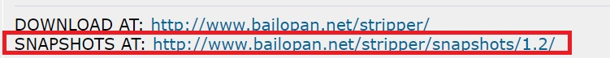

	2. 往下找最新的版本，依照各自的電腦系統下載對應的版本
	<br/>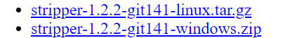

	3. 解壓縮並移動檔案到伺服器相同的路徑上。最後addons資料夾內看起來如圖片所示，多一個 ```stripper``` 資料夾
	<br/>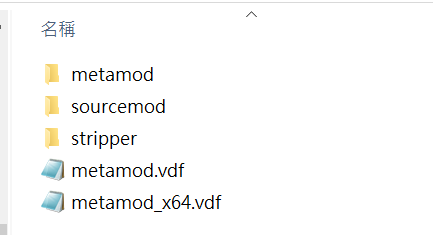

	4. 重啟伺服器，控制台輸入```stripper_version```確認安裝成功
		```php
		] stripper_version
		"stripper_version" = "1.2.2"
		notify singleplayer replicated
		- Stripper Version
		```
</details>

- - - -
## 安裝l4dtoolz
* <details><summary>l4dtoolz 用途是什麼? (點我展開)</summary>

	* 解鎖伺服器人數上限，有八位以上的玩家可以進入伺服器遊玩
		<br/>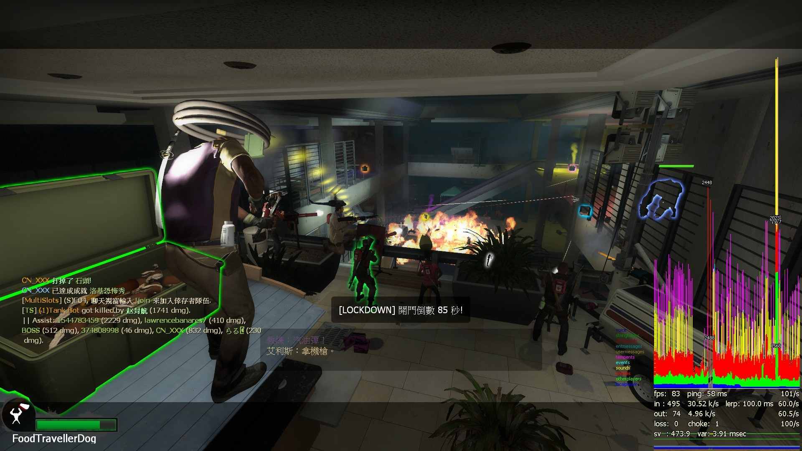
	* 最多只能有31位玩家同時在伺服器裡面 (不能超過31人，否則伺服器會崩潰)
		* [多人插件](https://github.com/fbef0102/L4D1_2-Plugins/tree/master/l4dmultislots)
		* [如何戰役模式開八人房](/Tutorial_教學區/Chinese_繁體中文/Game/L4D2/8位玩家遊玩戰役模式)
</details>

* <details><summary>L4D2 安裝步驟 (點我展開)</summary>

	1. 到[l4dtoolz](https://github.com/lakwsh/l4dtoolz/releases)，下載檔案
	<br/>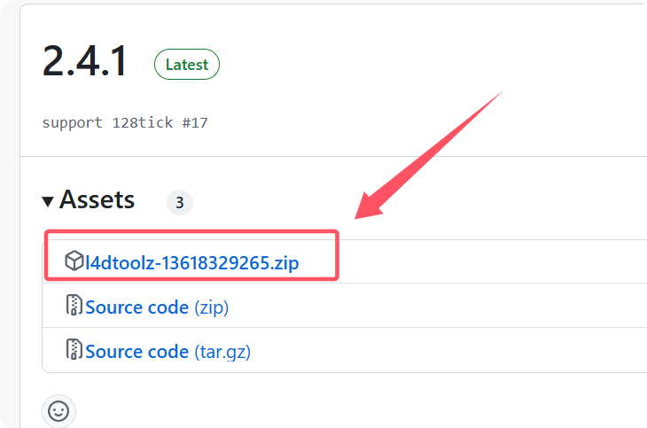

	2. 解壓縮並移動檔案到伺服器相同的路徑上!最後addons資料夾內看起來如圖片所示，多 ```l4dtoolz``` 為名的檔案
	<br/>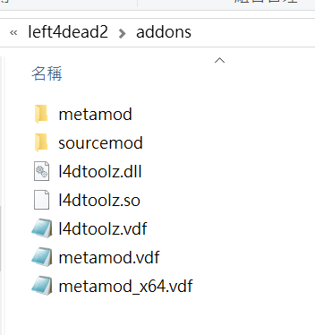

	3. 寫上以下指令
		* (專屬伺服器) 到```cfg/server.cfg``` (🟥如果檔案不存在，可自己創建🟥)
			```php
			// 此指令來自 l4dtoolz extension: https://github.com/lakwsh/l4dtoolz
			// 最大客戶端 (最大玩家數量): 伺服器內能容納玩家的人數，包含真人 + AI Bot 
			// 此數值不准修改 (max: 31)
			sv_setmax 31

			// 真人玩家允許加入伺服器的人數，不包含AI Bot
			// 自行修改此數值 (範圍1~31)
			sv_maxplayers 18

			// 顯示給外面玩家看到的伺服器空位人數
			sv_visiblemaxplayers 18

			// 為0時，可以從遊戲大廳或透過控制台與伺服器列表直連IP加入伺服器
			// 為0時，從大廳匹配時才會有動態大廳(吸引路人)
			// 為0時，可以使用 _cheats 1
			// 為1時，當有動態大廳時，只能從遊戲大廳加入伺服器
			// 為1時，無論第一位玩家用何種方式加入伺服器都會有動態大廳(吸引路人)
			// 為1時，不能使用 _cheats 1
			sv_allow_lobby_connect_only 1

			// 此指令來自 l4dtoolz extension: https://github.com/lakwsh/l4dtoolz
			// 為1時，強制 _allow_lobby_connect_only為0
			// 為1時，不會處理大廳匹配請求(也不會有lobby reservation cookie)
			sv_force_unreserved 0

			// 此指令來自 l4dtoolz extension: https://github.com/lakwsh/l4dtoolz
			// 1=不驗證SteamID, 0=驗證
			// 本功能可以緩解"No Steam logon(code 6)" 玩家莫名其妙被離線的問題 (僅限開啟狀態下進入的玩家)
			// 開啟本功能會削弱伺服器安全性,且禁止家庭共享功能將失效
			// 注意: 開啟此功能會導致A2S_INFO結果異常,可以透過外掛程式修復: github.com/lakwsh/l4d2_vomit_fix/blob/master/l4d2_a2s_fix.sp
			sv_steam_bypass 1

			// 此指令來自 l4dtoolz extension: https://github.com/lakwsh/l4dtoolz
			// 1=禁止家庭共享, 開啟本功能可以完全禁止家庭共享帳號(小號)進入伺服器
			sv_anti_sharing 0
			```
		* (區域房) 到```cfg/listenserver.cfg``` (🟥如果檔案不存在，可自己創建🟥)
			```php
			// 真人玩家允許加入伺服器的人數 (不包含AI Bot)
			// 自行修改此數值 (範圍1~8)
			sv_maxplayers 8

			// 顯示給外面玩家看到的伺服器空位人數
			sv_visiblemaxplayers 8
			```

	4. 遊戲預設玩家人數上限只到18位，如果要改變上限，請修改玩家人數上限
		* (專屬伺服器) 如使用其他開服方式或者是linux系統，請輸入啟動參數```+sv_setmax 31```
		<br/>
		<br/>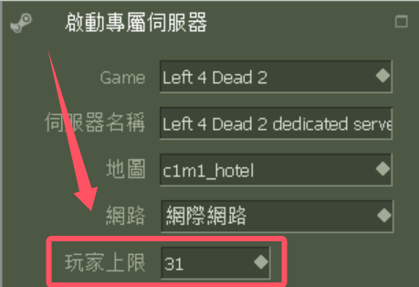
		* (區域房) 啟動選項輸入```+sv_setmax 31```
		<br/>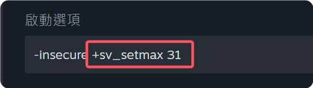
		* 🟥 ```sv_setmax```和```sv_maxplayers```是不同的概念
			* sv_setmax (最大客戶端/最大玩家數量) = 伺服器內能容納玩家的人數，包含真人 + AI Bot 
			* sv_maxplayers = 真人玩家允許加入伺服器的人數，不包含AI Bot
		* 🟥 ```sv_setmax```不能設置超過31位，否則伺服器會崩潰

	5. 啟動伺服器
		* 控制台輸入```plugin_print```確認安裝成功，如果沒出現表示你前面步驟有誤或l4dtoolz版本不對
			```php
			] plugin_print
			Loaded plugins:
			0:      "L4DToolZ v2.4.0, https://github.com/lakwsh/l4dtoolz"
			```
		* 控制台輸入```maxplayers```確認數字為31，如果不是31表示你前面步驟有誤或l4dtoolz版本不對
			```php
			] maxplayers
			"maxplayers" is "31"
			```

	6. 安裝插件
		* (專屬伺服器) [l4d_unreservelobby](https://github.com/fbef0102/L4D1_2-Plugins/tree/master/l4d_unreservelobby): 移除伺服器的大廳人數限制，簡單講就是解鎖伺服器，讓第九位以上的玩家可以加入伺服器
		* (專屬伺服器) [l4d2_a2s_fix](https://github.com/lakwsh/l4d2_vomit_fix): 修復A2S_INFO協議問題 (使用sv_steam_bypass功能時才需安裝)
</details>

* <details><summary>L4D1 安裝步驟 (點我展開)</summary>

	1. 到[l4dtoolz](https://github.com/accelerator74/l4dtoolz/releases)，根據你的遊戲與系統選擇其中一個下載
	<br/>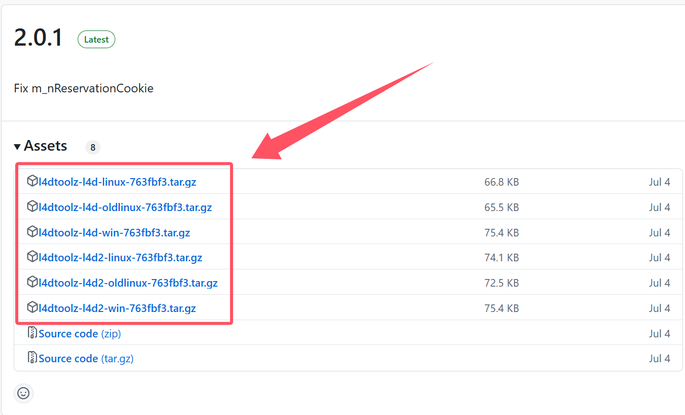

	2. 解壓縮並移動檔案到伺服器相同的路徑上!最後addons資料夾內看起來如圖片所示，多一個 ```l4dtoolz``` 資料夾
	<br/>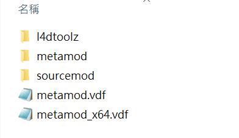

	3. 寫上以下指令
		* (專屬伺服器) 到```cfg/server.cfg``` (🟥如果檔案不存在，可自己創建🟥)
			```php
			// 真人玩家允許加入伺服器的人數 (不包含AI Bot)
			// 自行修改此數值 (範圍1~31)
			sv_maxplayers 18

			// 顯示給外面玩家看到的伺服器空位人數
			sv_visiblemaxplayers 18

			// 為0時，可以從遊戲大廳或透過控制台與伺服器列表直連IP加入伺服器
			// 為0時，從大廳匹配時才會有動態大廳(吸引路人)
			// 為0時，可以使用 _cheats 1
			// 為1時，當有動態大廳時，只能從遊戲大廳加入伺服器
			// 為1時，無論第一位玩家用何種方式加入伺服器都會有動態大廳(吸引路人)
			// 為1時，不能使用 _cheats 1
			sv_allow_lobby_connect_only 1

			// 此指令來自 l4dtoolz extension
			// 為1時，強制 _allow_lobby_connect_only為0
			// 為1時，不會處理大廳匹配請求(也不會有lobby reservation cookie)
			sv_force_unreserved 0
			```
		* (區域房) 到```cfg/listenserver.cfg``` (🟥如果檔案不存在，可自己創建🟥)
			```php
			// 真人玩家允許加入伺服器的人數 (不包含AI Bot)
			// 自行修改此數值 (範圍1~8)
			sv_maxplayers 8

			// 顯示給外面玩家看到的伺服器空位人數
			sv_visiblemaxplayers 8
			```

	4. 遊戲預設玩家人數上限只到18位，如果要改變上限，請修改玩家人數上限
		* (專屬伺服器) 如使用其他開服方式或者是linux系統，請輸入啟動參數```-maxplayers 31```
		<br/>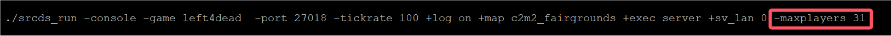
		<br/>
		* (區域房) 啟動選項輸入```-maxplayers 31```
		<br/>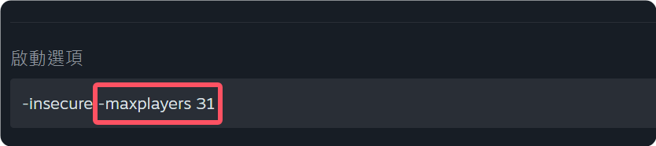
		* 🟥 maxplayers 和 sv_maxplayers 是不同的概念
			* maxplayers (最大客戶端/最大玩家數量) = 伺服器內能容納玩家的人數，包含真人 + AI Bot 
			* sv_maxplayers = 真人玩家允許加入伺服器的人數，不包含AI Bot
		* 🟥 maxplayers 不能設置超過31位，否則伺服器會崩潰

	5. 啟動伺服器
		* 控制台輸入```meta list```確認安裝成功，如果沒出現表示你前面步驟有誤或l4dtoolz版本不對
			```php
			] meta list
			Listing 11 plugins:
			[04] L4DToolZ (2.0.1) by Accelerator, Ivailosp
			```
		* 控制台輸入```maxplayers```確認數字為31，如果不是31表示你前面步驟有誤或l4dtoolz版本不對
			```php
			] maxplayers
			"maxplayers" is "31"
			```

	6. 安裝插件
		* (專屬伺服器) [l4d_unreservelobby](https://github.com/fbef0102/L4D1_2-Plugins/tree/master/l4d_unreservelobby): 移除伺服器的大廳人數限制，簡單講就是解鎖伺服器，讓第九位以上的玩家可以加入伺服器
</details>

- - - -
## 安裝TickrateEnabler
* <details><summary>TickrateEnabler 用途是什麼? (點我展開)</summary>

	* 解鎖伺服器Tickrate只有30的上限，可以突破到100tick
		* 不知道Tickrate是甚麼請自行Google
		* 簡單說，Tickrate越高越能夠帶來非常流暢的遊戲體驗，精準的射擊判定、連貫的動作，相當於伺服器端的fps
	* 把Tickrate想成是一種更新伺服器狀態的頻率，一秒內更新次數越多，越消耗更多電腦資源，所以高Tickrate很吃電腦的cpu，自行斟酌安裝
</details>

* <details><summary>L4D2 安裝步驟 (點我展開)</summary>

	1. 到[l4dtoolz](https://github.com/lakwsh/l4dtoolz/releases)，下載檔案
		* 你沒看錯，這版本的l4dtoolz包含解鎖伺服器人數上限與Tickrate的功能
		<br/>

	2. 解壓縮並移動檔案到伺服器相同的路徑上!最後addons資料夾內看起來如圖片所示，多 ```l4dtoolz``` 為名的檔案
	<br/>

	3. 到cfg/server.cfg寫上以下指令
		* 沒有server.cfg檔案則新建
			```php
			// 這是100 Tick的設定，可以自由修改數值
			sm_cvar sv_minrate 				"100000" 	// tickrate * 1000
			sm_cvar sv_maxrate 				"100000" 	// tickrate * 1000
			sm_cvar sv_minupdaterate 		"101"	 	// tickrate +1
			sm_cvar sv_maxupdaterate 		"101"		// tickrate +1
			sm_cvar sv_mincmdrate 			"101"		// tickrate +1
			sm_cvar sv_maxcmdrate 			"101"		// tickrate +1
			sm_cvar rate					"100000" 	// tickrate * 1000
			sm_cvar net_splitpacket_maxrate "50000" 	// (tickrate÷2) * 1000
			sm_cvar fps_max					"0"
			```
	
	4. 輸入參數
		* (專屬伺服器) 伺服器啟動選項輸入參數 ```-tickrate 100```
		<br/>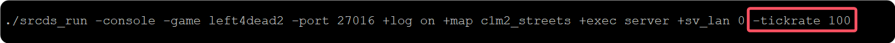
		* (區域房) 啟動選項輸入```-tickrate 100```
		<br/>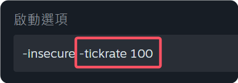
		
	5. 重啟伺服器，控制台輸入```plugin_print```確認安裝成功
		```php
		] plugin_print
		1:　"Tickrate_Enabler 1.5, ProdigySim"
		```

	6. 進入遊戲後，打開遊戲控制台輸入```net_graph 4```，會看到有一堆網路數據出現在你的螢幕上，確認Tickrate 為 100
	<br/>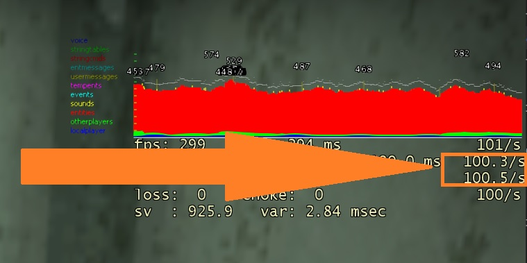

	7. 安裝插件
		* [l4d2_vomit_fix](https://github.com/lakwsh/l4d2_vomit_fix): 修正非30tick對抗模式下boomer噴吐距離問題
</details>

* <details><summary>L4D1 安裝步驟 (點我展開)</summary>

	1. 到[Tickrate-Enabler](https://github.com/accelerator74/Tickrate-Enabler/releases)，根據你的遊戲與系統選擇其中一個下載
	<br/>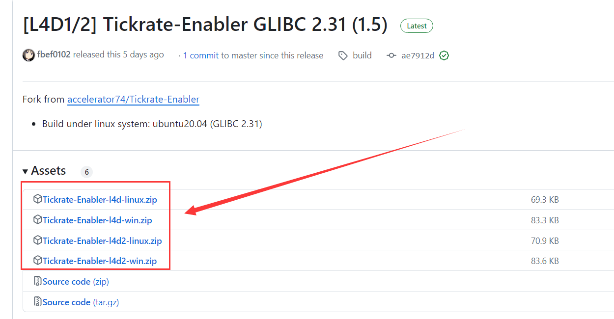

	2. 解壓縮並移動檔案到伺服器相同的路徑上!最後addons資料夾內看起來如圖片所示，多一個 ```tickrate_enabler``` 資料夾
	<br/>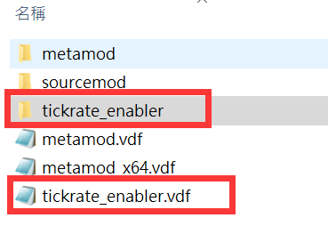

	3. 到cfg/server.cfg寫上以下指令
		* 沒有server.cfg檔案則新建
			```php
			// 這是100 Tick的設定，可以自由修改數值
			sm_cvar sv_minrate 				"100000" 	// tickrate * 1000
			sm_cvar sv_maxrate 				"100000" 	// tickrate * 1000
			sm_cvar sv_minupdaterate 		"101"	 	// tickrate +1
			sm_cvar sv_maxupdaterate 		"101"		// tickrate +1
			sm_cvar sv_mincmdrate 			"101"		// tickrate +1
			sm_cvar sv_maxcmdrate 			"101"		// tickrate +1
			sm_cvar rate					"100000" 	// tickrate * 1000
			sm_cvar net_splitpacket_maxrate "50000" 	// (tickrate÷2) * 1000
			sm_cvar fps_max					"0"
			```
	
	4. 輸入參數
		* (專屬伺服器) 伺服器啟動選項輸入參數 ```-tickrate 100```
		<br/>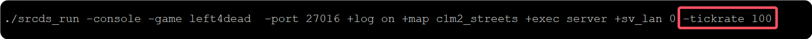
		* (區域房) 啟動選項輸入```-tickrate 100```
		<br/>
		
	5. 重啟伺服器，控制台輸入```plugin_print```確認安裝成功
		```php
		] plugin_print
		1:　"Tickrate_Enabler 1.5, ProdigySim"
		```

	6. 進入遊戲後，打開遊戲控制台輸入```net_graph 4```，會看到有一堆網路數據出現在你的螢幕上，確認Tickrate 為 100
	<br/>
</details>

> __Warning__ 
> * 高Tickrate很吃電腦的cpu，可以自行降低成60 tick、45 tick
> * 調整tickate必須一起修改server.cfg與啟動選項

* <details><summary>問題1: 為什麼windows系統下伺服器的Tickrate只能跑到64?</summary>

	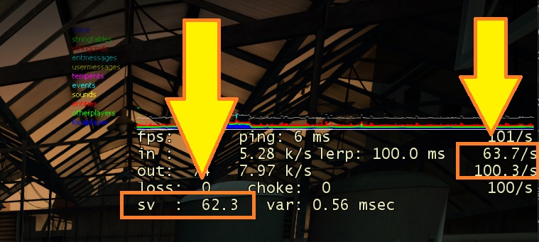

	* 原因: windows系統的問體
	* 解決方式: 
		* 法一：去跟微軟抱怨
		* 法二：windows降級到windows 7
		* 法三：租一台linux系統
		* 法四：[從大廳匹配到專屬伺服器](/Tutorial_教學區/Chinese_繁體中文/Server/安裝伺服器與插件/README.md#如何從大廳匹配到專屬伺服器)，可以將tickrate變回100，至於為何會這樣，我也不知道
		* 法五: [Windows調整時鐘精度工具](https://b23.tv/NQxIT55)，強制解鎖sv
</details>

* <details><summary>問題2: 為什麼我的tickrate網路數據沒有到100?</summary>

	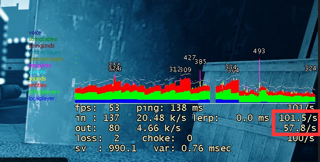

	* 原因: 受限於你的遊戲內fps影響，只會影響你這位玩家，你的遊戲內fps超過100以上才能享有100 tickrate
	<br/>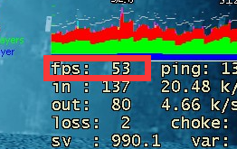
	* 解決方式: 
		* 法一：調高遊戲的fps，到選項->視訊->進階設定->等待垂直同步改成"已停用"，這選項能夠解鎖遊戲的fps
		<br/>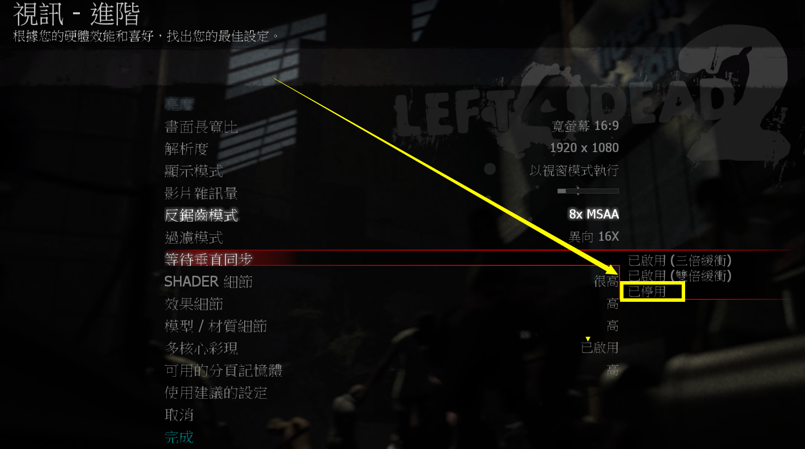
		* 法二：法一沒有用那就去升級你的顯卡
</details>

- - - -
## 安裝國家與城市的資料庫
* <details><summary>何時需要用到? (點我展開)</summary>

	* 有插件需要抓取玩家的IP、國家、城市、地區等等
		* 像是 [cannounce](https://github.com/fbef0102/L4D1_2-Plugins/tree/master/cannounce)
	* 如果你的```addons/sourcemod/extension```資料夾內有安裝geoipcity.ext, geoip2.ext，請移除
</details>

* <details><summary>安裝步驟 (點我展開)</summary>

	1. 註冊 [maxmind.com](https://www.maxmind.com/en/geolite2/signup)

	2. 到個人帳戶: My Account -> MY ACCOUNT -> GeoIP2/GeoLite2 -> Download Files
	<br/>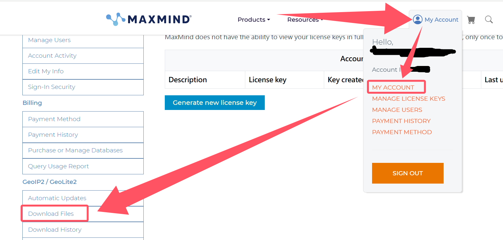

	3. 搜尋 "GeoLite2 Country" 和 "GeoLite2 City" -> 下載資料庫
	<br/>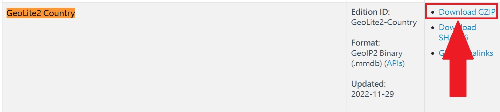
	<br/>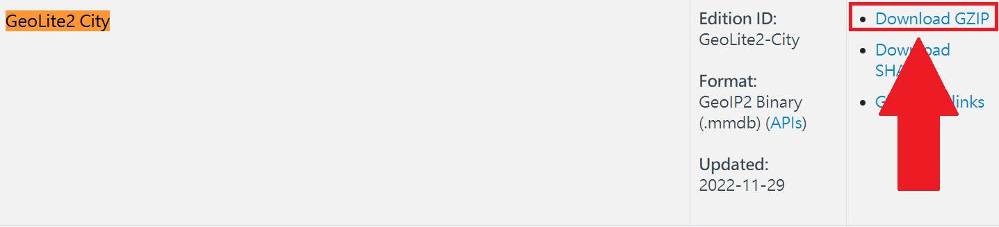

	4. 放 GeoLite2-City.mmdb 與 GeoLite2-Country.mmdb 到路徑 ```addons/sourcemod/configs/geoip/``` 資料夾
	<br/>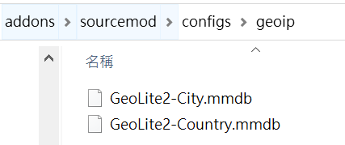
</details>

- - - -
## 安裝Accelerator的崩潰檢測工具
* <details><summary>這用途是什麼?</summary>

	* 當伺服器發生崩潰時，會生成崩潰日誌並上傳到[crash.limetech.org網站](https://crash.limetech.org/)解析
		* 檢測伺服器崩潰, 快速幫服主找出崩潰原因
		* 服主可自行查看崩潰日誌或是分享給有經驗的大佬修復
	* 🟥 目前該工具年久失修，不適用
		* L4D1 linux
		* L4D2 linux且Sourcemod平台為1.12以上的版本
</details>

* <details><summary>安裝步驟 (點我展開)</summary>

	1. 到[Accelerator - Crash Reporting網站](https://forums.alliedmods.net/showthread.php?t=277703)點擊Download，根據你的系統選擇最新版本下載
	<br/>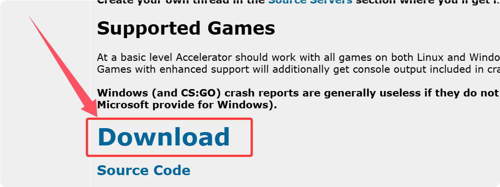
	<br/>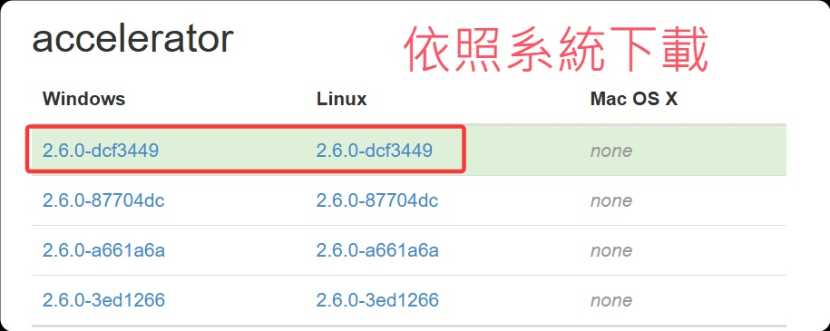

	2. 解壓縮並移動檔案到伺服器相同的路徑上!
	<br/>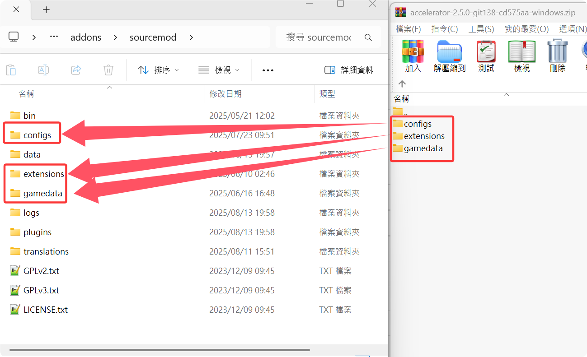

	3. 將以下內容複製貼上到```sourcemod/configs/core.cfg```文件裡面
		* 內容
			```c
			/**
			* SteamID64 (Community ID) that will have ownership of uploaded crash reports.
			* You can share your crash reports with additional users from the website.
			*
			* If unset, your crash reports will be uploaded anonymously and you will not be
			* able to see all of the information.
			*/
			"MinidumpAccount"	"xxxxxxxxxxxxx"

			/**
			* Controls which binaries will be eligible to be processed for symbols and uploaded.
			* Only modules loaded by the server at the time of the crash can be considered.
			*
			* 0 = Disabled: No binaries will be processed or uploaded.
			* 1 = System Only: Only binaries outside of the game directory (where the srcds binary is).
			* 2 = System + Game: Loaded modules outside of the addons/ directory.
			* 3 = System + Game + Addons: All loaded modules.
			*/
			"MinidumpSymbolUpload"	"3"

			/**
			* Controls whether Accelerator can upload complete module binaries when explicitly requested
			* by the processing server. This also respects the value of the MinidumpSymbolUpload setting.
			*/
			"MinidumpBinaryUpload"	"yes"

			/**
			* Controls whether Accelerator does local processing of crash reports before upload.
			* This should only be changed if local processing causes issues such as crashes,
			* the processing server may reject crash reports that have not been presubmitted.
			*/
			"MinidumpPresubmit"	"yes"

			/**
			* URL to upload crash dumps to. Should not be changed.
			*/
			"MinidumpUrl"	"http://crash.limetech.org/submit"

			/**
			* URL to upload processed symbols to. Should not be changed.
			*/
			"MinidumpSymbolUrl"	"http://crash.limetech.org/symbols/submit"

			/**
			* URL to upload binaries to. Should not be changed.
			*/
			"MinidumpBinaryUrl"	"http://crash.limetech.org/binary/submit"
			```
		* 請注意要貼在"Core"{}裡面，如圖片所示
		<br/>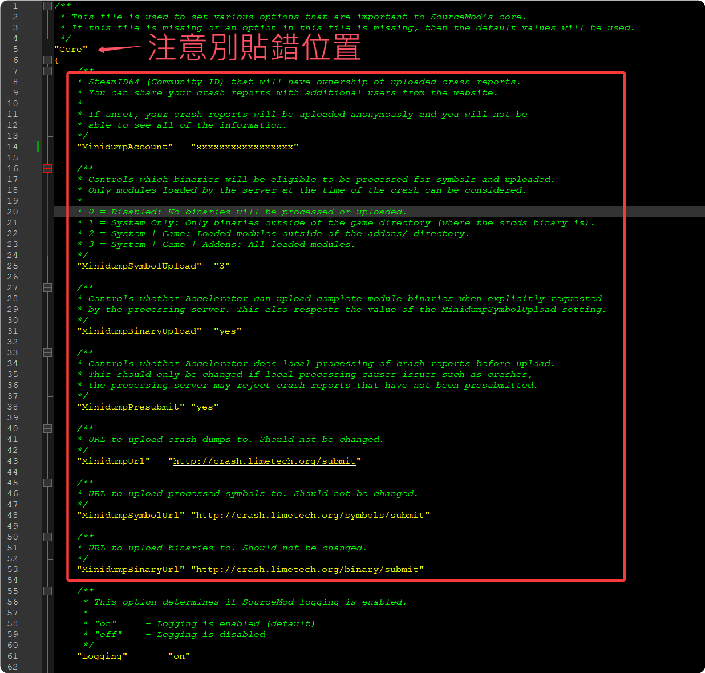
	
	4. ```core.cfg```文件內"xxxxxxxxxxxxxxxxx"請改成你的steamid 64
		* [查找自己的steamid 64](https://steamid.io/)
		<br/>
		<br/>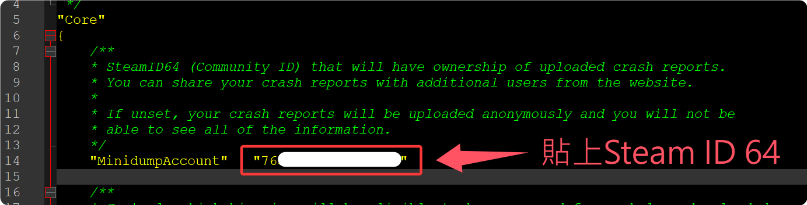

	5. 啟動伺服器
		* 控制台輸入```sm exts list```確認安裝成功，如果沒出現表示你前面步驟有誤
			```php
			] sm exts list
			Loaded plugins:
			[01] Accelerator (2.x.x-xxxxx): SRCDS Crash Handler
			```
		* ```addons\sourcemod\logs```會出現```accelerator.log```文件，如果沒出現表示你前面步驟有誤 (該文件沒有內容屬正常現象)
		<br/>
</details>

* <details><summary>接下來發生伺服器崩潰時</summary>

	1. 當伺服器發生崩潰 (非正常程序關閉)，在下一次啟動伺服器時，將產生崩潰日誌並告知Crash ID
		* ```addons\sourcemod\logs```的```accelerator.log```文件，裡面告訴你崩潰日誌的Crash ID
		* ```addons\sourcemod\logs```會出現```errors_xxxx.log```文件，裡面告訴你崩潰日誌的Crash ID
			```c
			[CRASH] Accelerator uploaded crash dump: Crash ID: WWWWW-YYYY-ZZZZ
			```

	2. 崩潰日誌會自動上傳到[crash.limetech.org網站](https://crash.limetech.org/)，解析需要等到一段時間，要有耐心
		* 將Crash ID輸入即可獲得崩潰日誌
		<br/>
		<br/>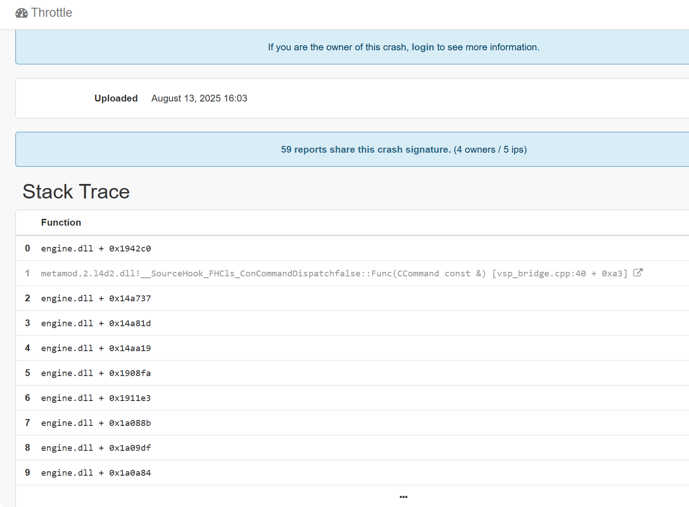
	
	3. 想知道更多崩潰細節需要登入該網站
		* 用Steam帳密登入，怕的話就不要勉強
		<br/>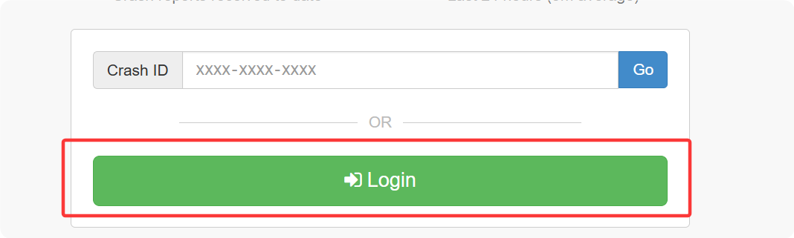
		* 出現你的崩潰日誌列表，如果沒有，表示你在安裝步驟寫的SteamID 64是錯的
		<br/>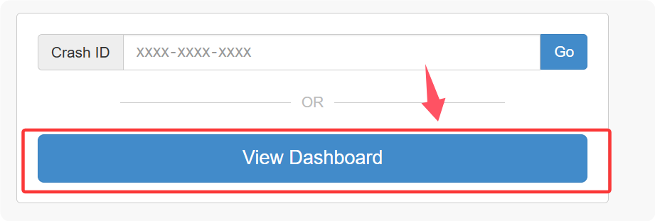
		<br/>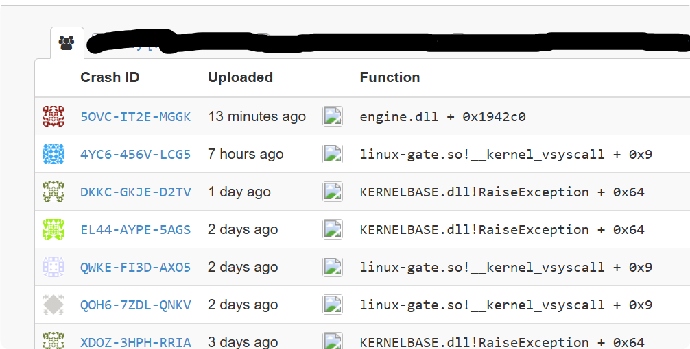
</details>

* <details><summary>怎麼看崩潰日誌?</summary>

	1. 建議用steam登入查看更多細節
	<br/>

	2. 你看不懂崩潰代碼是正常，看得懂你就是valve的工程師，G胖應該邀請你去上班
	
	3. 可以將崩潰日誌分享給有經驗處理過崩潰的大佬或是上網求助
		* (法一) 貼Crash ID給對方
		* (法二) 分享你的崩潰日誌列表給對方，需輸入對方的SteamID 64
		<br/>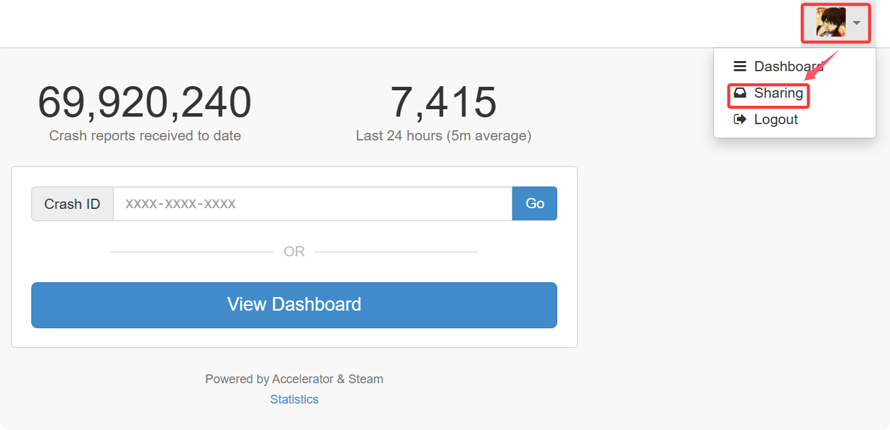
		<br/>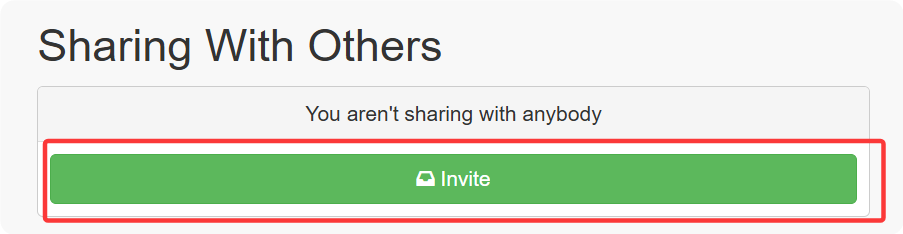
		<br/>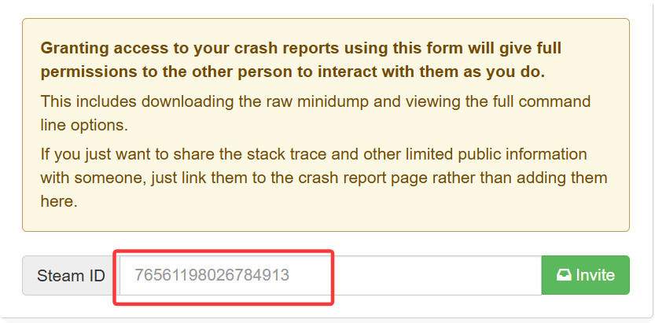
</details>

* <details><summary>自我排除崩潰步驟</summary>

	> 當你崩潰到受不了，幾乎想砸爛電腦時，不仿可以嘗試以下步驟自行減少崩潰的機率

	1. [Sourcemod 有新版本則更新](https://www.sourcemod.net/downloads.php?branch=stable)且必須要是Stable Builds
		<br/>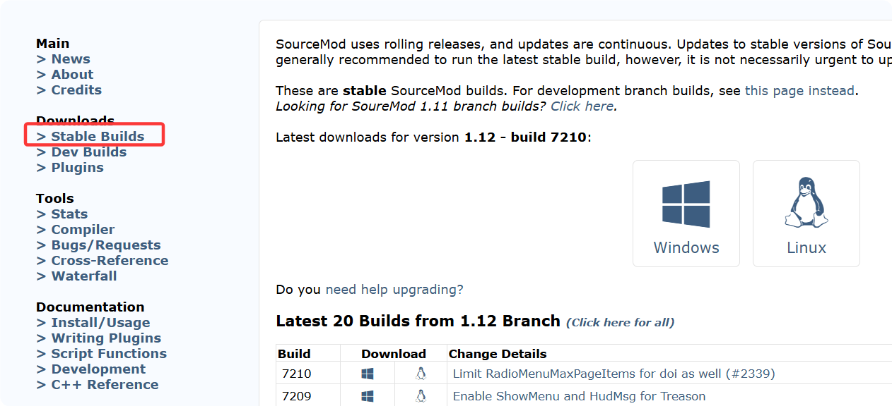

	2. [Metamod 有新版本則更新](https://www.metamodsource.net/downloads.php/?branch=stable)且必須要是Stable Builds
		<br/>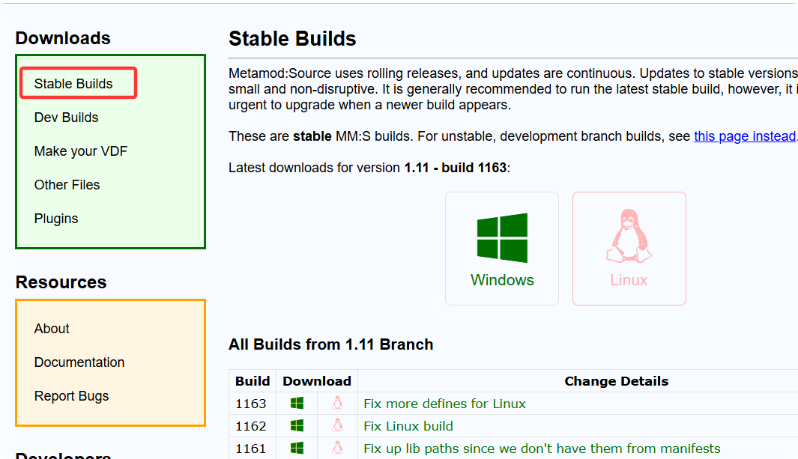

	3. 控制台輸入```sm plugins list``` 查看所有插件列表
		* 一個一個找原始作者或你當初從哪下載插件的連接，插件如果有新版本則更新
		* 🟥 沒有源碼的插件我一律不建議使用，因為壞掉了也無從修復
		* 🟥 超過十年以上的插件很容易年久失修，更不上現在遊戲版本兼容導致出問題
		
	4. 控制台輸入```sm exts list``` 查看所有extension列表
		* 一個一個找原始作者或你當初從哪下載extension的連接，如果有新版本則更新

	5. ```addons/sourcemod/logs```資料夾底下是否由出現```error_xxx.log```的文件
		* 有的話請打開，雖然都是英文但請嘗試找出錯誤原因並修復
		* 看不懂錯誤原因請洽作者，將錯誤原文直接發給開發者，無須一堆廢話
		* 🟥 必須修復到沒有error為止

	6. 嘗試刪除插件直到找到崩潰原因
		* 刪除一半的插件->測試->崩潰->再刪除刪除一半的插件->測試->崩潰->再刪除刪除一半的插件->重複循環...

	7. 嘗試刪除裝在伺服器內的模組或三方圖直到找到崩潰原因
		* 不建議安裝工作仿訂閱模組在伺服器上 (模組副檔名是.vpk，英文叫Mods)
		* 有些奇葩的三方圖與模組自帶腳本干擾伺服器運作
		* 就像爛插件導致崩潰，也會有爛模組與爛的三方圖導致崩潰

	8. 丟給AI分析，AI雖然資料有限但至少會幫你分析可能的原因
		* 使用的是ChatGPT Pro
		<br/>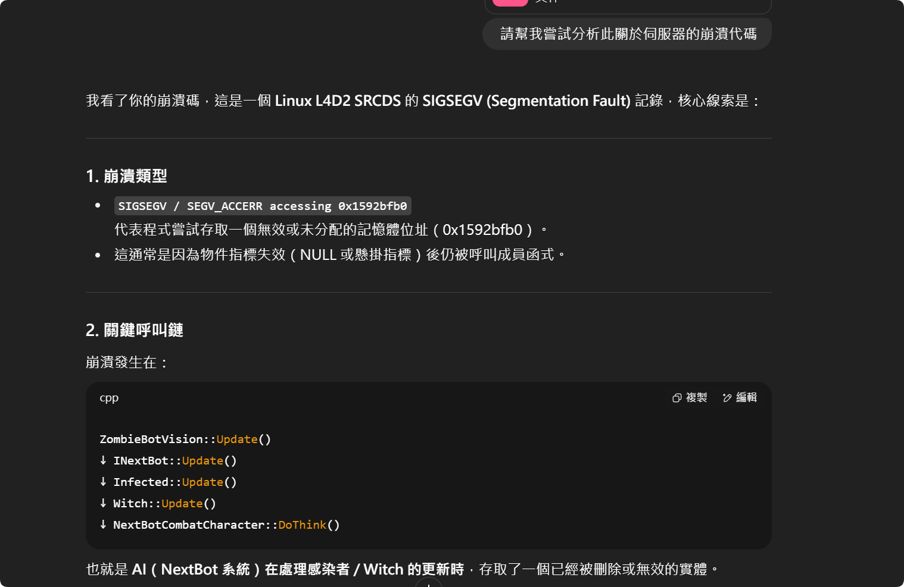
</details>

- - - -
## 其他
* [安裝伺服器與插件](/Tutorial_教學區/Chinese_繁體中文/Server/安裝伺服器與插件)
* [安裝區域房與插件](/Tutorial_教學區/Chinese_繁體中文/Server/安裝區域房與插件)
* [Questions_問題區](/Questions_問題區/Chinese_繁體中文/伺服器)
