# 問題總攬
> 2025/8/25 更新
- [問題總攬](#問題總攬)
  - [甚麼是區域房](#甚麼是區域房)
  - [與專屬伺服器有何差別](#與專屬伺服器有何差別)
  - [如何判定伺服器為區域或專屬](#如何判定伺服器為區域或專屬)
  - [區域房如何安裝Sourcemod](#區域房如何安裝sourcemod)
  - [如何執行區域伺服器](#如何執行區域伺服器)
  - [如何檢查版本](#如何檢查版本)
  - [朋友要如何進去我的區域伺服器](#朋友要如何進去我的區域伺服器)
  - [如何成為伺服器的管理員](#如何成為伺服器的管理員)
  - [如何編譯源碼](#如何編譯源碼)
  - [如何安裝插件](#如何安裝插件)
  - [如何檢查插件成功運作](#如何檢查插件成功運作)
  - [如何移除插件](#如何移除插件)
  - [如何更新插件](#如何更新插件)
  - [如何手動管理插件](#如何手動管理插件)
  - [如何檢查指令值](#如何檢查指令值)
  - [如何修改指令](#如何修改指令)
  - [如何使用插件的命令](#如何使用插件的命令)
  - [如何更新區域伺服器](#如何更新區域伺服器)
  - [如何更新Sourcemod](#如何更新Sourcemod)
  - [其他](#其他)
> __Note__ 本處教學一律是Sourcemod，與AMX Mod X無任何關係
- - - -
## 甚麼是區域房
* <details><summary>說明 (點我展開)</summary>

   * 區域房也叫區域伺服器、本地房、本地服，英文名Listen Server
   * 從遊戲中創建房間->主持區域伺服器、開始玩單人遊戲、指令開房都是區域房
   <br/>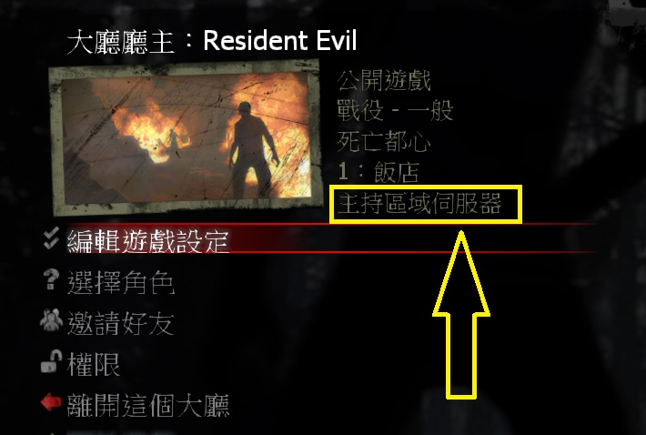

   * 創建房間的房主就是伺服器，伺服器就是房主
      * 只要房主離開遊戲，伺服器就會不存在，所有人都會彈回大廳
      * 房主使用過多的模組或修改大幅度的網路參數會影響整個伺服器
      * 換句話說，伺服器是否流暢與穩定取決於房主的自家網路跟遊戲
</details>

- - - -
## 與專屬伺服器有何差別
- 專屬伺服器英文名是Dedicated Server
- 只要是透過第三方軟體啟動伺服器都是專屬伺服器
- 區域房無須設定任何網路，只要創立大廳並邀請朋友便可遊玩
- 專屬伺服器必須會一點網路與IP知識，如果家裡的路由器與IP喬不好那沒有人可以進入你的伺服器

| 比較        	 | 區域           		| 專屬            |
| -------------  |:-----------------:|:-------------:|
| 英文        	 | listen server    	| 	dedicated server |
| 穩定度         | 普通      					|   佳         |
| 流暢度         | 普通      					|   佳         |
| Plugin插件     | 少部分插件不支援     |  所有插件都支援 |
| 啟動         | 房主開始遊戲    	   |   手動啟動  |
| 操作         | 房主的遊戲控制台    	|   伺服器後台  |
| 關閉         | 房主離開自動關閉    	|   手動關閉  |
| 重啟         | 房主重啟遊戲    	    |   手動重啟  |
| 伺服器更新      | 遊戲本體自動更新    		|  手動更新  |
| 執行的cfg      | cfg/listenserver.cfg |   cfg/server.cfg |
| 網路         | 無須設定           |   必須設定好公網IP |
| 玩家人數上限    | 8位    						|   最高可32位  |
| Tickrate       | 30    						|   最高可達100  |

- 你可以自由選擇Sourcemod要安裝在專屬伺服器還是區域房
	- 安裝專屬伺服器可以看[這篇教學](/Tutorial_教學區/Chinese_繁體中文/Server/安裝伺服器與插件/README.md)
	- 我推薦專屬伺服器，因為[SourceMod不支援區域伺服器](/Questions_問題區/Chinese_繁體中文/伺服器/README.md#sourcemod支援區域伺服器嗎)，且所有插件都可以支援專屬伺服器
	- 絕大部分的插件作者不會鳥你區域伺服器出現問題
	- 🟥Linux 系統無法安裝Sourcemod在區域房

- - - -
## 如何判定伺服器為區域或專屬
* <details><summary>說明 (點我展開)</summary>

   * 進入遊戲之後打開遊戲的控制台，打上```status```
      * [如何開啟遊戲控制台](/Tutorial_教學區/Chinese_繁體中文/Game/README.md#如何開啟遊戲控制台)
      ```php
      ] status
      hostname: Resident Evil
      version : 2.2.2.5 8705 insecure  
      udp/ip  : 192.168.50.106:27015 [ public n/a ]
      os      : Windows Listen
      map     : c10m2_drainage at ( -11074, -9007, -529 )
      players : 1 humans, 0 bots (4 max) (not hibernating) (unreserved)
      ```
   * 查看**os**那一行, **Listen**為區域伺服器，**Dedicated**為專屬伺服器
</details>

- - - -
## 區域房如何安裝Sourcemod
* <details><summary>安裝步驟 (點我展開)</summary>

   1. 先打開[你的遊戲主目錄的資料夾](/Tutorial_教學區/Chinese_繁體中文/Game/README.md#打開遊戲主目錄的資料夾)

   2. [Sourcemod](https://www.sourcemod.net/downloads.php?branch=stable)下載最新版本的安裝包
      - 窗戶圖案的是Windows系統，企鵝圖案的是Linux系統，蘋果圖案的是macOs系統，選擇Windows系統下載即可
      - 紅色圖案代表此版本尚未支援該系統平台
      - [不要下載Dev版本](/Questions_問題區/Chinese_繁體中文/伺服器/README.md#為什麼sourcemod下載有分兩種)
      <br/>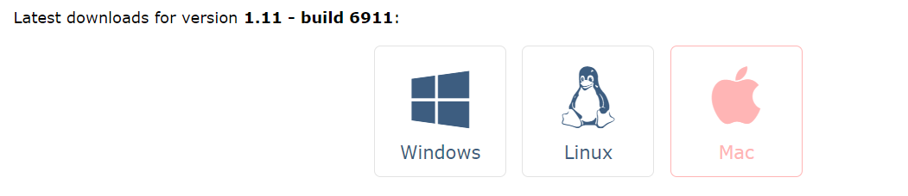

   3. [MetaMod](https://www.sourcemm.net/downloads.php?branch=stable)下載最新版本的安裝包
      - 窗戶圖案的是Windows系統，企鵝圖案的是Linux系統，蘋果圖案的是macOs系統，選擇Windows系統下載即可
      - 紅色圖案代表此版本尚未支援該系統平台
      <br/>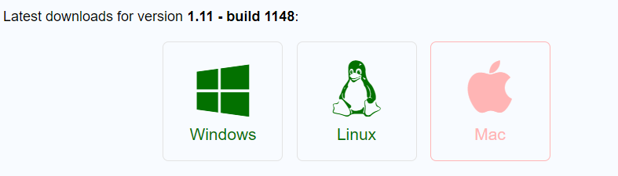
   
   4. 將所有檔案解壓縮到遊戲本體路徑上，最後會看起來如圖片所示 (注意路徑)
      <br/>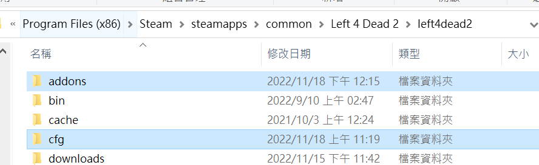
      <br/>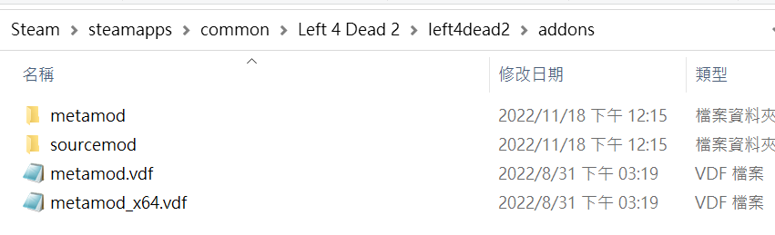

   5. 到[sourcemm.net vdf](https://www.sourcemm.net/vdf)，選擇相對應的遊戲，然後點擊"Generate medamod.vtf"，下載metamod.vtf到addons資料夾上覆蓋原有的檔案
      <br/>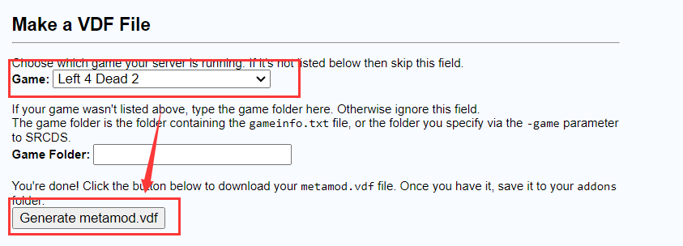
      <br/>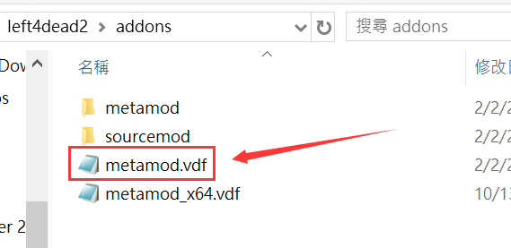
</details>

- - - -
## 如何執行區域伺服器
* <details><summary>說明 (點我展開)</summary>

   1. 依照圖片指示在遊戲啟動選項輸入-insecure
      <br/>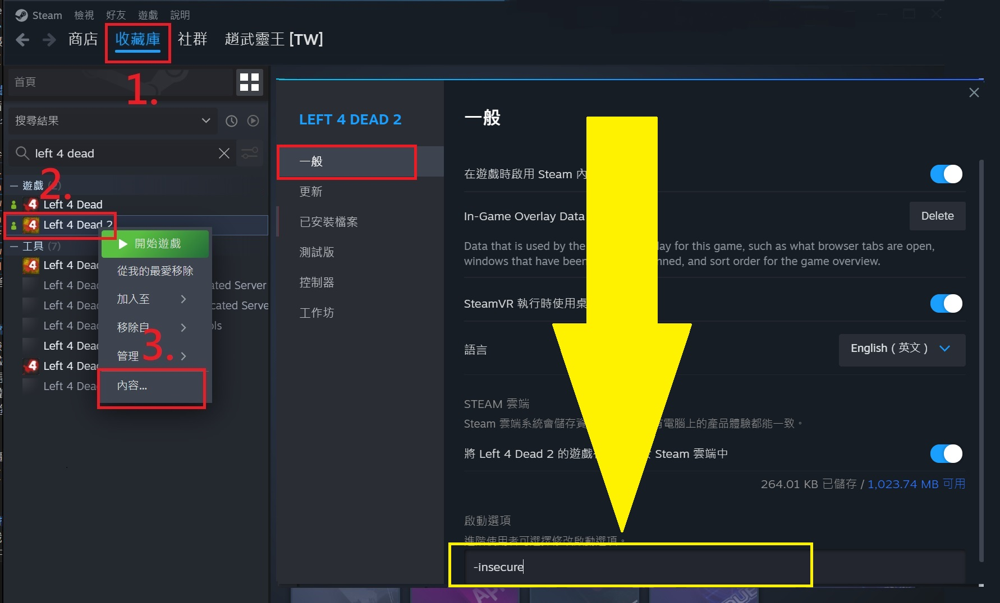

   2. 啟動遊戲，看到警告訊息正常的，請按確定繼續
      <br/>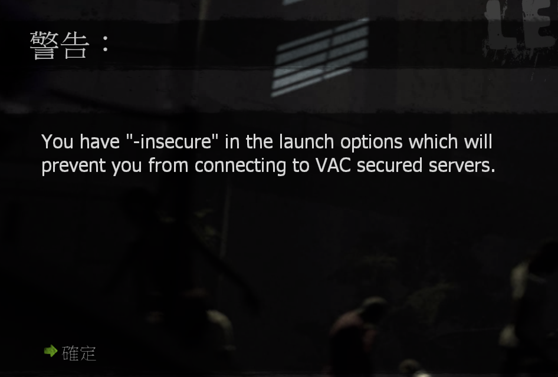

   3. 接下來
      * 法一：單人遊戲
      * 法二：指令開房，打開遊戲控制台輸入```map xxxx```
         * ```xxxx``` 為地圖名
         * [如何開啟遊戲控制台](/Tutorial_教學區/Chinese_繁體中文/Game/README.md#如何開啟遊戲控制台)
      * 法三：創建大廳 => 伺服器類型選擇 "區域伺服器" => 開始遊戲
      <br/>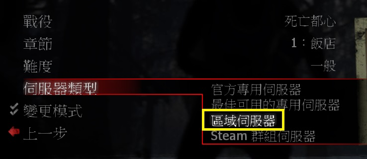

   4. 檢查Sourcemod是否有正常運作
      * 按下~鍵打開控制台，輸入```sm version```，沒有出現如下圖所示的內容代表前面的步驟有誤，請檢查
      <br/>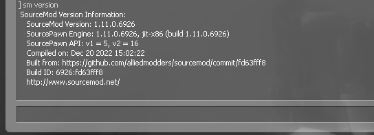
      
   > __Warning__
   > * 要關掉Sourcemod與插件直接在啟動選項刪除-insecure
   > * 啟動選項輸入-insecure會導致你無法進入有VAC保護的伺服器
</details>

- - - -
## 如何檢查版本
* [查看這篇](/Tutorial_教學區/Chinese_繁體中文/Server/安裝伺服器與插件/README.md#如何檢查版本)
* 在區域房裡，伺服器後台為房主的遊戲控制台

- - - -
## 朋友要如何進去我的區域伺服器
* <details><summary>說明 (點我展開)</summary>

   1. 創建大廳
   2. 邀請朋友
   3. 開始遊戲
   4. 或自己開單機模式
</details>

- - - -
## 如何成為伺服器的管理員
* [查看這篇](/Tutorial_教學區/Chinese_繁體中文/Server/安裝伺服器與插件/README.md#如何成為伺服器的管理員)
	 
- - - -
## 如何編譯源碼
* [查看這篇](/Tutorial_教學區/Chinese_繁體中文/Server/安裝伺服器與插件/README.md#如何編譯源碼)
 
- - - -
## 如何安裝插件
* [查看這篇](/Tutorial_教學區/Chinese_繁體中文/Server/安裝伺服器與插件/README.md#如何安裝插件)

- - - -
## 如何檢查插件成功運作
* [查看這篇](/Tutorial_教學區/Chinese_繁體中文/Server/安裝伺服器與插件/README.md#如何檢查插件成功運作)
* 在區域房裡，伺服器後台為房主的遊戲控制台

- - - -
## 如何移除插件
* [查看這篇](/Tutorial_教學區/Chinese_繁體中文/Server/安裝伺服器與插件/README.md#如何移除插件)
* 在區域房裡，伺服器後台為房主的遊戲控制台
- - - -
## 如何更新插件
* [查看這篇](/Tutorial_教學區/Chinese_繁體中文/Server/安裝伺服器與插件/README.md#如何更新插件)
* 在區域房裡，伺服器後台為房主的遊戲控制台

- - - -
## 如何手動管理插件
* [查看這篇](/Tutorial_教學區/Chinese_繁體中文/Server/安裝伺服器與插件/README.md#如何手動管理插件)
* 在區域房裡，伺服器後台為房主的遊戲控制台

- - - -
## 如何檢查指令值
[查看這篇](/Tutorial_教學區/Chinese_繁體中文/Server/安裝伺服器與插件/README.md#如何檢查指令值)
* 在區域房裡，伺服器後台為房主的遊戲控制台

- - - -
## 如何修改指令
* <details><summary>插件自帶的指令</summary>

   * 有自動產生相對應的.cfg文件
      1. cfg/sourcemod/ 打開對應的.cfg文件－＞修改指令－＞儲存
      2. 切換地圖或重啟遊戲<br/>

   * 沒有自動產生相對應的.cfg文件
      1. cfg/listenserver.cfg 寫入指令－＞儲存
         * 如果沒有listenserver.cfg檔案可以創建
      2. 切換地圖或重啟遊戲
   > __Note__ 有的插件會自動產生.cfg文件，有的插件即使自帶指令也不會產生.cfg文件，全看原作者心情
</details>

* <details><summary>官方原有的指令</summary>

   1. cfg/listenserver.cfg 寫入指令－＞儲存
      * 如果沒有listenserver.cfg檔案可以創建
   2. 切換地圖或重啟遊戲
   > __Note__ 有些官方指令需要加上sm_cvar 才會生效，譬如```sm_cvar sb_stop 1```
</details>

* <details><summary>遊戲中途修改指令</summary>

  * 法一：遊戲內管理員在控制台輸入指令與修改值，前面加上```sm_cvar```
    ```php
    ] sm_cvar a4d_always_force_bosses 1
    ```
  * 法二：遊戲內管理員在聊天視窗輸入指令與修改值，前面加上```!cvar```
    ```php
      Harry : !cvar a4d_always_force_bosses 1
    ```
   > __Warning__ 即使遊戲中途修改指令，載入下一張地圖之後指令可能會恢復原狀，請善用.cfg文件修改指令
</details>

- - - -
## 如何使用插件的命令
[查看這篇](/Tutorial_教學區/Chinese_繁體中文/Server/安裝伺服器與插件/README.md#如何使用插件的命令)
* 在區域房裡，伺服器後台為房主的遊戲控制台

- - - -
## 如何更新區域伺服器
* [只要遊戲本體更新版本便可](/Tutorial_教學區/Chinese_繁體中文/Game/README.md#驗證遊戲檔案的完整性)

- - - -
## 如何更新Sourcemod
* <details><summary>說明 (點我展開)</summary>

   1. 先備份
         * ```cfg/sourcemod```內的所有cfg文件
         * ```sourcemod/scripting```內的所有源碼
         * ```sourcemod/data```內的所有文件
         * ```sourcemod/configs```內的所有文件
   2. 刪除```addons```資料夾，請全部打掉重練
      * 重新安裝Sourcemod與Metamod
   3. 重新安裝所有插件
      * 必要時，請自己上網查看插件是否有更新
      * 建議一律下載最新版本的插件並更新
      * 建議保留源碼並自己編譯
</details> 

- - - -
## 其他
* [安裝其他檔案教學](/Tutorial_教學區/Chinese_繁體中文/Server/安裝其他檔案教學/README.md)
* [安裝專屬伺服器與插件](/Tutorial_教學區/Chinese_繁體中文/Server/安裝伺服器與插件/README.md)
* [如何戰役模式開八人房](/Tutorial_教學區/Chinese_繁體中文/Game/L4D2/8位玩家遊玩戰役模式)
