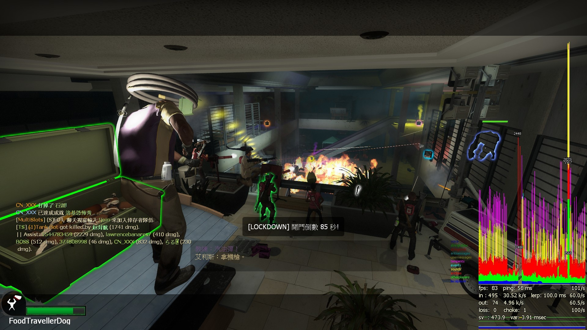

# Navigation
> 2026/2/5 updated
- [Navigation](#navigation)
- [Introduction](#introduction)
- [Prepare](#prepare)
- [Require](#require)
- [Optional](#optional)
- [Fun](#fun)
- [Not Recommended Install](#Not-Recommended-Install)
- [Question](#question)
- [Others](#others)
    
- - - -
## Introduction
> What's the simplest way to install 8-survivors-coop (Including 5+ players fix)?
<br/>
<br/>

* [Chinese Here | 中文教學看這](/Tutorial_教學區/Chinese_繁體中文/Game/L4D2/8位玩家遊玩戰役模式)
* This tutorial applies to L4D1 and L4D2
* Dedicated Server can unlock 8+ or more player slots
* Local listen Server only 8 players and unable to unlock 8+ or more player slots
    * Local listen Server is unstable and easily crash because Sourcemod doesn't support listen server.
* Including 5+ players fix

- - - -
## Prepare
* [Sourcemod](https://wiki.alliedmods.net/Installing_sourcemod)
* [Metamod](https://wiki.alliedmods.net/Installing_Metamod:Source)
* [Stripper:Source](/Tutorial_教學區/English/Server/Install_Other_File#stripper)
* [Left 4 DHooks Direct](https://forums.alliedmods.net/showthread.php?t=321696)
* [8 Slots Lobby Mod](https://steamcommunity.com/sharedfiles/filedetails/?id=2754956355): You can have 8 slots lobby.
    * Subscribe, create lobby and you will see 8 slots.
    * This Mod makes you unable to use ESC->Idle
* [Actions](https://forums.alliedmods.net/showthread.php?t=336374)

- - - -
## Require
* [l4dtoolz EXTENSION](/Tutorial_教學區/English/Server/Install_Other_File#l4dtoolz): Unlock server limit
    * Write down the following cvars in ```cfg/server.cfg``` if dedicated server (🟥if file doesn't exist, create it🟥)
    * Write down the following cvars in ```cfg/listenserver.cfg``` if listen server (🟥if file doesn't exist, create it🟥)
        ```php
        sm_cvar precache_all_survivors 1 // 1=Precache/Load all models of survivors to prevent crash
        sm_cvar sv_consistency 0 // The server enforces file consistency (1: Enable, 0: Disable) 
        ```
    * [My server.cfg](https://github.com/fbef0102/Sourcemod-Server/blob/main/L4D2/Windows%20Server%20Files/left4dead2/cfg/server.cfg)

* [Remove Lobby Reservation (Harry Version)](https://github.com/fbef0102/L4D1_2-Plugins/tree/master/l4d_unreservelobby): Remove the lobby reservation once server is full, so 9+ players can connect to server directly through IP.
    * 🟥Doesn't work in listen server🟥

* [l4dmultislots (Harry Version)](https://github.com/fbef0102/L4D1_2-Plugins/tree/master/l4dmultislots): Allows additional survivor players in server when 5+ player joins the server
    * How could I control the number of bots spawned at the start
    * ```cfg/sourcemod/l4dmultislots.cfg``` (Start server and this file will be auto-generated)
        ```php
        l4d_multislots_min_survivors "8"
        l4d_multislots_spawn_survivors_roundstart "1" 
        ```

* (L4D2) [Defib_Fix](https://forums.alliedmods.net/showthread.php?t=315483): Fixes valve's defib not defibbing correct survivor, sometimes even reviving an alive player

* [Survivor Identity Fix for 5+ Survivors (Shadowysn Version)](https://forums.alliedmods.net/showpost.php?p=2718792&postcount=36): Fix bug where a survivor will change identity when a player connects/disconnects if there are 5+ survivors
    * Fixed an issue where bot characters would be changed when 5+ players disconnected, went idle, or joined the game.
    * Fixed an issue where the dead body would teleport to other player's location when 5+ players died.

* [Survivor_AFK_Fix](https://forums.alliedmods.net/showthread.php?t=326742): Fixes survivor going AFK game function.
    * Fixed an issue in 5+ player games where going idle could incorrectly switch client to another bot using the same character model. If that bot was already occupied by a human player or an idle player, the client would instead be forced into fully spectator.

* [l4dafkfix_deadbot](https://github.com/fbef0102/L4D1_2-Plugins/tree/master/l4dafkfix_deadbot): Fixes issue when a bot die, his IDLE player become fully spectator rather than take over dead bot in 4+ survivors games.

* (L4D2) [lfd_both_fixUpgradePack (Harry Version)](https://github.com/fbef0102/L4D1_2-Plugins/tree/master/lfd_both_fixUpgradePack): Fixes upgrade packs pickup bug when there are 5+ survivors

* (L4D2) [Better_Charger_Collision+patch](https://forums.alliedmods.net/showthread.php?t=315482): Fixes charging only allowing to hit 1 of each survivor character index and allows charger smashing into the same survivor more than once, survivors no longer become a brick wall after being charger smashed once.

* [witch_target_patch](https://github.com/LuxLuma/Left-4-fix/tree/master/left%204%20fix/witch/witch_target_patch): Fixes witch going after wrong clone survivor

* (L4D2) [l4d2_trigger_flow_fix (Harry Version)](https://github.com/fbef0102/L4D1_2-Plugins/tree/master/l4d2_trigger_flow_fix): Prevents custom maps from softlocking due to a poorly filter_activator_model's logic when playing with different survivor models

* (L4D2) [l4d2_vocalizebasedmodel (Harry Version)](https://github.com/fbef0102/L4D1_2-Plugins/tree/master/l4d2_vocalizebasedmodel): Survivors will vocalize based on their model + Fixes conversation stucks when playing with l4d1+2 survivor models in custom maps
    * For example, Nick can not response to the rescue radio with the L4D1 survivor set

* (L4D2) [l4d2_fix_changelevel](https://github.com/Target5150/MoYu_Server_Stupid_Plugins/tree/master/The%20Last%20Stand/l4d2_fix_changelevel): Fix issues due to forced changelevel.

* (L4D2) [l4d2_transition_info_fix](https://github.com/fbef0102/L4D1_2-Plugins/tree/master/l4d2_transition_info_fix): Fix issues after map transitioned, transition info is still retaining when changed new map by other ways.

* (L4D2) [InputKill Kick Prevention](https://forums.alliedmods.net/showthread.php?t=332860): Stops clients from getting kicked via the Kill input
    * Fixed ```Kicked by Console : CBaseEntity::InputKill()```

* [Command and ConVar - Buffer Overflow Fixer](https://forums.alliedmods.net/showthread.php?t=309656): Fixes the server can not reads the plugin's cvars and cmds in cfg files

* [l4d2_maptankfix](https://github.com/fbef0102/L4D1_2-Plugins/tree/master/l4d2_maptankfix): Fix issues where customized map tank does not spawn, cause the map process break 

* [l4d2_rescue_vehicle_multi](https://github.com/fbef0102/L4D1_2-Plugins/tree/master/l4d2_rescue_vehicle_multi): Try to fix extra 5+ survivors bug after finale rescue leaving, such as: die, fall down, not count as alive, versus score bug

* (L4D2 Versus) [Left4Fix](https://forums.alliedmods.net/showthread.php?t=219774): Fixed score bug and provide the following features
    * Each player earn score points
    * When both teams complete chapter with the same score Tiebreak manager will be started
    * Ghost infected can teleport to each survivor

* (L4D2) [Ladder Server Crash - Patch Fix](https://forums.alliedmods.net/showthread.php?t=336298): Fixes a server crash from NavLadder::GetPosAtHeight.
    
* (L4D2) [Fix Mixed Characters](https://github.com/Target5150/MoYu_Server_Stupid_Plugins/tree/master/The%20Last%20Stand/l4d2_fix_character_mixed): Prioritize character searching (Team 4 bots) to hopefully fix issues with 8+ survivors.
    * Fix issues with L4D1 bots on maps like The Passing.
    
* [l4d_full_slot_bot_replace_fix](https://github.com/fbef0102/L4D1_2-Plugins/tree/master/l4d_full_slot_bot_replace_fix): Fix bugs if not enough slots to spawn bots to take over + Kick Previously human-controlled SI bots

* [l4d_fix_target_replace](https://github.com/Target5150/MoYu_Server_Stupid_Plugins/tree/master/The%20Last%20Stand/l4d_fix_target_replace): Fix issues with infected targeting when replacing survivors.

- - - -
## Optional
> __Note__<br/> Not necessary to install
* [AFK and Join Team Commands Improved Version](https://forums.alliedmods.net/showpost.php?p=2719702&postcount=32): Add more commands to let the player spectate and join team. (!afk, !survivors, !infected, etc.), but no changing team abuse.

* (L4D2) [Save Weapon Improved (Harry Version)](https://github.com/fbef0102/L4D1_2-Plugins/tree/master/l4d2_ty_saveweapons): L4D2 coop save weapon when map transition if more than 4 players.

* [AutoTakeOver 5+ Survivors Improved (Harry Version)](https://github.com/fbef0102/L4D1_2-Plugins/tree/master/_AutoTakeOver): Auto Takes Over an alive free bot UponDeath or OnBotSpawn or OnBotReplace in 5+ survivors.

* [l4d_h_csm (Harry Version)](/L4D_插件/Survivor_人類/l4d_h_csm): Allows players to change their L4D1/2 character or model in-game!
    * CSM Remake, typ !csm to open menu

* [Survivor Rescue Closet](https://forums.alliedmods.net/showthread.php?t=340659): Allows a single rescue entity to rescue all eligible survivors.

* [5+ Survivor Friendly Fire Quote Fix](https://forums.alliedmods.net/showthread.php?t=321127): Fixes friendly fire callouts for 5+ survivors.
    * 🟥Doesn't work in listen server🟥
    * Fix friendly fire quotes not playing for 5+ survivors
    * Make Survivors play their minor hurt sounds upon getting pounced/charged

* (L4D2) [Survivor Clones Hunter Pounced Warning Fix](https://forums.alliedmods.net/showthread.php?t=248776): This plugin Re-uses the Generic Hunter Pounced lines from C1M1 so that Nick, Ellis and Coach can warn for a Hunter Pouncing their clones on server with 8+ players where multiple survivor clones are a frequent thing.
    * 🟥Doesn't work in listen server🟥

* (L4D2) [Team Kill Reactions Vocalize Fix (Harry Version)](https://github.com/fbef0102/L4D1_2-Plugins/tree/master/l4d2_team_kill_reactions): There are unused lines for all 8 survivors where they react to players team killing each other, this plugin restores these reactions.
    * 🟥Doesn't work in listen server🟥

* (L4D2) [Survivors mourn fix (Harry Version)](https://github.com/fbef0102/L4D1_2-Plugins/tree/master/l4d2_survivor_mourn_fix): Fixes the bug where any survivor is unable to mourn a L4D1 survivor on the L4D2 set

    * 🟥Doesn't work in listen server🟥

* (L4D2) [8 Player Modified Talker](https://steamcommunity.com/sharedfiles/filedetails/?id=2462741269): Gives reactions to both l4d1 and 2 survivors

* (L4D1) [L4D Modified Talker](https://www.gamemaps.com/details/3863): The L4D Modified Talker is an addon which improves the survivor's conversation. It includes many exclusive dialogues, unused survivor's speeches and every survivor has more than 15 kinds of laughter now

- - - -
## Fun
> __Note__<br/> Choose fun plugins you like

* [L4D2-Unlimited-Map (Harry Version)](https://github.com/fbef0102/L4D2-Unlimited-Map): Original L4D2 maps are modified in this config. Create the Unlimited Map.

* [Survivor Respawn (Harry Version)](https://github.com/fbef0102/L4D1_2-Plugins/tree/master/Survivor_Respawn): When a Survivor dies, will respawn after a period of time.

* [Infected Bots Control Improved](https://github.com/fbef0102/L4D1_2-Plugins/tree/master/l4dinfectedbots): Spawns multi infected bots in any mode + allows playable special infected in coop/survival + unlock infected slots (10 VS 10 available)

* [Lockdown System Improved](https://github.com/fbef0102/L4D1_2-Plugins/tree/master/lockdown_system_l4d): When someone tries to open end saferoom door, it will stay closed until a certain amount of time has passed. All the survivors need to do is to survive the incoming waves of mob and tanks.

* [Adrenaline & Pills Powerups Improved](https://github.com/fbef0102/L4D1_2-Plugins/tree/master/l4d2_powerups_rush): On the use of Adrenaline & Pain Pills, various actions are performed faster (Reloading, weapon firing, and melee swinging)

* [L4D2 gifts (Harry Version)](https://github.com/fbef0102/L4D1_2-Plugins/tree/master/l4d2_gifts): Drop gifts (touch gift to earn reward) when a special infected or a witch/tank killed by survivor.

* [deathcheck (Harry Version)](https://github.com/fbef0102/L4D1_2-Plugins/tree/master/cge_l4d2_deathcheck): Prevents mission loss(Round_End) until all human players have died.

* [CSO SupplyBox](https://github.com/fbef0102/L4D1_2-Plugins/tree/master/l4d2_supply_woodbox): Supply boxes are dropped randomly in the map every certain seconds to provide support for the fight against the zombies.

* [Back 4 Blood Item hint Improved](https://github.com/fbef0102/L4D1_2-Plugins/tree/master/l4d2_item_hint): When using 'Look' in vocalize menu, print corresponding item to chat area and make item glow or create spot marker/infeced maker like back 4 blood.

* [Witch Follow kill Everyone](/L4D_插件/Witch_女巫/l4d_witch_follow_kill_everyone) : Witch will chase another survivor until everyone is incap or dead + witch auto follows survivors

* [5+ Survivors More Supply](/L4D_插件/Survivor_人類/l4d_more_supply): Player can take an item on the map multi times depends on 5+ survivors in server

* [l4d_infected_limit_control](/L4D_插件/Common_Infected_普通感染者/l4d_infected_limit_control): Adjust common infecteds/hordes/mobs depends on 5+ survivors and map

* Other Fun Plugins
    * [Sourcemod-Plugins](https://github.com/fbef0102/Sourcemod-Plugins)
    * [L4D1_2-Plugins](https://github.com/fbef0102/L4D1_2-Plugins)
    * [Game-Private_Plugin](https://github.com/fbef0102/Game-Private_Plugin): Private Plugin List.

- - - -
## Not Recommended Install
> Too many side effects; the drawbacks outweigh the benefits. Use is not recommended.

* <s>[Dialogue Criteria Fix](https://forums.alliedmods.net/showthread.php?t=335875)</s> 
    * Function: For servers that spawn all 8 survivors if you want them to interact more in campaigns instead of being almost always mute
    * 🟥Broken after 2023/05 update, please wait for author to fix🟥

* (L4D2) <s>[Real Survivor Mourn Fix](https://forums.alliedmods.net/showthread.php?t=335903)</s>
    * Function: With this, L4D1 survivors should be able to mourn each other again and L4D2 survivors will be able to mourn them upon seeing their corpses. Both bug-free.
    * 🟥Broken after 2023/05 update, please wait for author to fix🟥

* (L4D2) <s>[Character_manager](https://forums.alliedmods.net/showthread.php?t=309601)</s>
    * Function: Sets bots to least used survivor character when spawned (l4d1+l4d2 survivors possible in game)
    * Conflict: Must remove **Survivor Identity Fix for 5+ Survivors** while using this plugin
    * 🟥Side effect: This plugin modifies the survivor set. The map could soft-lock because the survivor set was changed by this plugin, causing conversations or events to get stuck.

* (L4D2) <s>[Force L4D2 survivor arms, names, icons](https://forums.alliedmods.net/showthread.php?t=345947)</s>
    * Function: Force L4D2 arms, names, and icons for everyone that joins.
    * 🟥Side effect: Sends false information to the client, reporting the game mode as "dash" (C2M2 only) or "shootzones" (all maps).
    * 🟥Side effect: This plugin modifies the survivor set (forcing L4D2 survivors), which may cause some custom maps to soft-lock, as story dialogues and events may fail to trigger properly.

* (L4D2) <s>[The Passing character fix with DHooks](https://forums.alliedmods.net/showthread.php?t=337428)</s>
    * Function: Fixes an issue where survivor players using L4D1 survivors would be kicked or forcibly teleported in The Passing, or in some cusom maps that use L4D1 survivor NPCs.
    * 🟥Side effect: (On C6M1) if players switch to L4D1 survivors and then mission fail and round restart, players will still be teleported to the bridge.
    * 🟥Side effect: L4D1 survivors may fail to properly trigger story dialogues on L4D1 campaigns. Exmaple: Calling the rescue radio in C8M5.

* (L4D2) [The Passing Character Fix with EntityLump](https://forums.alliedmods.net/showthread.php?t=348949): Fixes the bug where players with L4D1 survivors are teleported away or kicked on The Passing map.
    * 🟥Side effect: This plugin will remove l4d1 survivors npc on The Passing map
    * Use **Fix Mixed Characters** to replace this plugin

* <s>[Survivor Character Fixes](https://forums.alliedmods.net/showthread.php?t=336328)</s>
    * Function: Fix internal problems with the "m_survivorCharacter" network property
    * Recommended for servers that have survivor character changing plug-ins
    * 🟥The actual effects of the fix are unclear, and wait for update from the author

- - - -
## Question
* Q1: 5+ players unable to join server via connect ip
    * Answer: Please install l4dtoolz and l4d_unreservelobby and check if they are running

* Q2: 5+ players can join server but unable to join survivor team or infected team
    * Answer: Install multi slots plugin or multi infecteds plugin

- - - -
## Others
* [Questions](/Questions_問題區)

