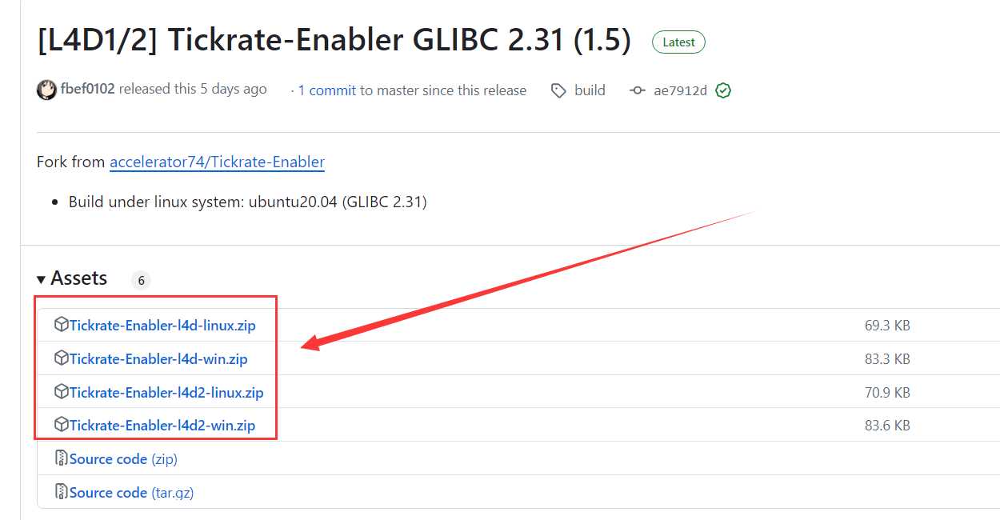
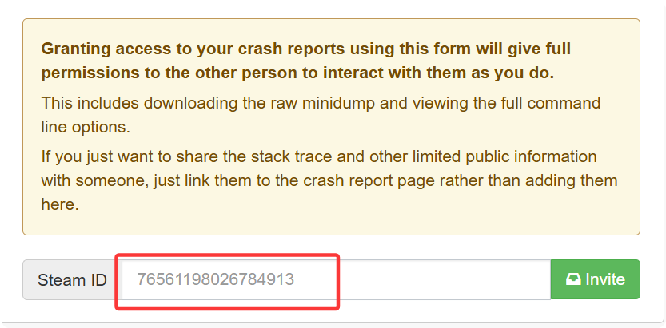

# Navigation
> 2025/8/14 updated
- [Navigation](#navigation)
	- [Stripper](#stripper)
	- [l4dtoolz](#l4dtoolz)
	- [TickrateEnabler](#tickrateenabler)
	- [Country and City Database](#country-and-city-database)
	- [Accelerator Crash Report](#accelerator-crash-report)
	- [Others](#others)

- - - -
## Stripper
* <details><summary>What is stripper?</summary>

	* Build the map by yourself
		* [Unlimited-Map](https://github.com/fbef0102/L4D2-Unlimited-Map)
		* [Video](https://www.youtube.com/watch?v=I_-QSn8F8Cs)
	* Modify, add, delete obstacle, propsm weapons on the map, and even create horde event
		* [l4d2_spawn_props](https://github.com/fbef0102/L4D1_2-Plugins/tree/master/l4d2_spawn_props)
		* [Map Modify](https://github.com/fbef0102/L4D2-Unlimited-Map#modify--%E5%85%B6%E4%BB%96%E4%BF%AE%E6%94%B9)
</details>

* <details><summary>Installation</summary>

	1. Go to [Stripper:Source](https://forums.alliedmods.net/showthread.php?t=39439) and click SNAPSHOTS
	<br/>

	2. Search the latest version and download files depending on your system
	<br/>

	3. Unzip all files to your server same folder, press yes if ask override. You will have ```stripper``` folder in addons folder
	<br/>

	4. Restart Server, type ```stripper_version``` in serve console
		```php
		] stripper_version
		"stripper_version" = "1.2.2"
		notify singleplayer replicated
		- Stripper Version
		```
</details>

- - - -
## l4dtoolz
* <details><summary>What is l4dtoolz?</summary>

	* To unlock server slots limit, you can have 8+ players in your server
		<br/>
	* Max slot limit is 31 in left4dead 1/2
		* [l4dmultislots](https://github.com/fbef0102/L4D1_2-Plugins/tree/master/l4dmultislots)
		* [8+ Survivors In Coop](/Tutorial_教學區/English/Game/L4D2/8%2B_Survivors_In_Coop)
</details>

* <details><summary>L4D2 Installation</summary>

	1. Go to [l4dtoolz](https://github.com/lakwsh/l4dtoolz/releases) and download files
	<br/>

	2. Unzip all files to your server addons folder, press yes if ask override. You will have ```l4dtoolz``` files in addons folder
	<br/>

	3. Write down the following cvars
		* (Dedicated server) in ```cfg/server.cfg``` (🟥if file doesn't exist, create it🟥)
			```php
			// This cvar from l4dtoolz extension: github.com/lakwsh/l4dtoolz
			// Max. clients/players, how many real players + bots allowed in server
			// Do not modify value (max: 31)
			// Also write in server launch parameter
			sv_setmax 31

			// How many real players can join server (Not including AI Bots)
			// Free to modify value (1~31)
			sv_maxplayers 18

			// "maximum players" number that's visible to people in the server browser and server queries
			// Suggest to set the same number as sv_maxplayers
			sv_visiblemaxplayers 18

			// If 0, Allow to join server via matchmaking lobby, connect, or server list
			// If 0, server has reserve match system when from lobby only
			// If 0, Allow to change sv_cheats to 1 anytime
			// If 1, Allow to join this server only when server is reserved
			// If 1, server has reserve match system no matter how players join server 
			// If 1, Not allow to change sv_cheats to 1
			sv_allow_lobby_connect_only 1

			// This cvar from l4dtoolz extension: github.com/lakwsh/l4dtoolz
			// If 1, force sv_allow_lobby_connect_only to be 0
			// If 1, no reserved cookie + don't reply reservation request form lobby
			sv_force_unreserved 0

			// This cvar from l4dtoolz extension: github.com/lakwsh/l4dtoolz
			// 1=bypass SteamID verification, 0=Off
			// This feature can alleviate the No Steam logon (code 6) issue (only for players who enter while the feature is enabled).
			// Enabling this feature will weaken server security, and Family Sharing functionality will be disabled.
			// Note: Enabling this feature will cause abnormal A2S_INFO results, which can be fixed with this plugin: github.com/lakwsh/l4d2_vomit_fix/blob/master/l4d2_a2s_fix.sp
			// Note: Enabling this feature will cause SteamWorks extension not working
			sv_steam_bypass 1

			// This cvar from l4dtoolz extension: github.com/lakwsh/l4dtoolz
			// 1=Activating this function can completely prohibit family shared accounts (alt accounts) from entering the server, 0=Off
			sv_anti_sharing 0
			```
		* (Listen Server) In ```cfg/listenserver.cfg``` if (🟥if file doesn't exist, create it🟥)
			```php
			// How many real players can join server (Not including AI Bots)
			// Free to modify value (1~8)
			sv_maxplayers 8

			// Maximum players" number that's visible to people in the server browser and server queries
			// Suggest to set the same number as sv_maxplayers
			sv_visiblemaxplayers 8
			```

	4. By default, the game engine only allow 18 max players. To change max clients
		* (Dedicated server) If using launch panel/software tool/linux system, please input launch parameter ```+sv_setmax 31```
		<br/>
		<br/>
		* (Listen Server) Launch options ```+sv_setmax 31```
		<br/>
		* 🟥 sv_setmax and sv_maxplayers are different
			* sv_setmax = Max Real players + AI Bots allowed in server
			* sv_maxplayers = How many real players can join server (Not including AI Bots)
		* 🟥 Server would crash if set over 31 Max. players

	5. Restart Server
		* Type ```plugin_print``` in server console. If it doesn't show, that means not install correctly
			```php
			] plugin_print
			Loaded plugins:
			0:      "L4DToolZ v2.4.0, https://github.com/lakwsh/l4dtoolz"
			```
		* Type ```maxplayers``` in server console. If "maxplayers" number is not 31, that means not install correctly or l4dtoolz version is old
			```php
			] maxplayers
			"maxplayers" is "31"
			```

	6. Install plugin
		* (Dedicated server) [l4d_unreservelobby](https://github.com/fbef0102/L4D1_2-Plugins/tree/master/l4d_unreservelobby): Removes lobby reservation when server is full, allow 9+ players to join server
		* (Dedicated server) [l4d2_a2s_fix](https://github.com/lakwsh/l4d2_vomit_fix): Patches A2S_INFO issue (Only when sv_steam_bypass is 1)
		* [l4d2_vomit_fix](https://github.com/lakwsh/l4d2_vomit_fix): Patches Boomer Vomit behavior to fix an issue where vomit range scaled inversely with tickrate.
</details>

* <details><summary>L4D1 Installation</summary>

	1. Go to [l4dtoolz](https://github.com/accelerator74/l4dtoolz/releases) and download files depending on your game and system
		* win: windows system
		* linux: linux system newer version
		* oldlinux: linux system older version
		<br/>

	2. Unzip all files to your server same folder, press yes if ask override. You will have ```l4dtoolz``` folder in addons folder
	<br/>

	3. Write down the following cvars
		* (Dedicated server) in ```cfg/server.cfg``` (🟥if file doesn't exist, create it🟥)
			```php
			// How many real players can join server (Not including AI Bots)
			// Free to modify value (1~31)
			sv_maxplayers 18

			// Maximum players" number that's visible to people in the server browser and server queries
			// Suggest to set the same number as sv_maxplayers
			sv_visiblemaxplayers 18

			//If 0, Allow to join server via matchmaking lobby, connect, or server list
			//If 0, server has reserve match system when from lobby only
			//If 0, Allow to change sv_cheats to 1 anytime
			//If 1, Allow to join this server from matchmaking lobby only
			//If 1, server has reserve match system no matter how players join server 
			//If 1, Not allow to change sv_cheats to 1
			sv_allow_lobby_connect_only 1

			//This cvar from l4dtoolz extension
			//If 1, force sv_allow_lobby_connect_only to be 0
			//If 1, no reserved cookie + don't reply reservation request form lobby
			sv_force_unreserved 0
			```
		* (Listen Server) In ```cfg/listenserver.cfg``` if (🟥if file doesn't exist, create it🟥)
			```php
			// How many real players can join server (Not including AI Bots)
			// Free to modify value (1~8)
			sv_maxplayers 8

			// Maximum players" number that's visible to people in the server browser and server queries
			// Suggest to set the same number as sv_maxplayers
			sv_visiblemaxplayers 8
			```

	4. By default, the game engine only allow 18 max players. To change max clients
		* (Dedicated server) If using launch panel/software tool/linux system, please input launch parameter ```-maxplayers 31```
		<br/>
		<br/>
		* (Listen Server) Launch options ```-maxplayers 31```
		<br/>
		* 🟥 maxplayers and sv_maxplayers are different
			* maxplayers = Max Real players + AI Bots allowed in server
			* sv_maxplayers = How many real players can join server (Not including AI Bots)
		* 🟥 Server would crash if set over 31 Max. players

	5. Restart Server
		* Type ```meta list``` in server console. If it doesn't show, that means not install correctly
			```php
			] meta list
			Listing 11 plugins:
			[04] L4DToolZ (2.0.1) by Accelerator, Ivailosp
			```
		* Type ```maxplayers``` in server console. If "maxplayers" number is not 31, that means not install correctly or l4dtoolz version is old
			```php
			] maxplayers
			"maxplayers" is "31"
			```

	6. Install plugin
		* (Dedicated server) [l4d_unreservelobby](https://github.com/fbef0102/L4D1_2-Plugins/tree/master/l4d_unreservelobby): Removes lobby reservation when server is full, allow 9+ players to join server
</details>

- - - -
## TickrateEnabler
* <details><summary>What is TickrateEnabler?</summary>

	* To unlock server tickrate limit, up to 100 tickrate
		* If you don't know tickrate, please google it
		* Tickrate = Server fps
	* High Tickrate costs more cpu performance
</details>

* <details><summary>L4D2 Installation</summary>

	1. Go to [l4dtoolz](https://github.com/lakwsh/l4dtoolz/releases) and download files
		* This version of l4dtoolz includes the functions to unlock server max players and tickrates
		<br/>

	2. Unzip all files to your server addons folder, press yes if ask override. You will have ```l4dtoolz``` files in addons folder
	<br/>

	3. Write down the following cvars in cfg/server.cfg
		* If you don't have server.cfg, then create it
			```php
			// 100 Tickrate, free to modify value
			sm_cvar sv_minrate 				"100000" 	// tickrate * 1000
			sm_cvar sv_maxrate 				"100000" 	// tickrate * 1000
			sm_cvar sv_minupdaterate 		"101"	 	// tickrate +1
			sm_cvar sv_maxupdaterate 		"101"		// tickrate +1
			sm_cvar sv_mincmdrate 			"101"		// tickrate +1
			sm_cvar sv_maxcmdrate 			"101"		// tickrate +1
			sm_cvar rate					"100000" 	// tickrate * 1000
			sm_cvar net_splitpacket_maxrate "50000" 	// (tickrate÷2) * 1000
			sm_cvar fps_max					"0"
			```
	
	4. Input the Launch Parameters
		* (Dedicated server) Launch Parameters ```-tickrate 100```
		<br/>
		* (Listen Server) Launch options```-tickrate 100```
		<br/>
		
	5. Restart Server, type ```plugin_print``` in serve console
		* This version of l4dtoolz includes the functions to unlock server max players and tickrates
			```php
			] plugin_print
			Loaded plugins:
			0:      "L4DToolZ v2.4.0, https://github.com/lakwsh/l4dtoolz"
			```

	6. Join server, open game console and type ```net_graph 4```, you will see the network usage graph on your screen, make sure tickrate is 100
	<br/>

	7. Install plugin
		* [l4d2_vomit_fix](https://github.com/lakwsh/l4d2_vomit_fix): Patches Boomer Vomit behavior to fix an issue where vomit range scaled inversely with tickrate.
</details>

* <details><summary>L4D1 Installation</summary>

	1. Go to [Tickrate-Enabler](https://github.com/accelerator74/Tickrate-Enabler/releases) and download files depending on your game and system
	<br/>

	2. Unzip all files to your server same folder, press yes if ask override. You will have ```tickrate_enabler``` folder in addons folder
	<br/>

	3. Write down the following cvars in cfg/server.cfg
		* If you don't have server.cfg, then create it
		```php
		// 100 Tickrate, free to modify value
		sm_cvar sv_minrate 				"100000" 	// tickrate * 1000
		sm_cvar sv_maxrate 				"100000" 	// tickrate * 1000
		sm_cvar sv_minupdaterate 		"101"	 	// tickrate +1
		sm_cvar sv_maxupdaterate 		"101"		// tickrate +1
		sm_cvar sv_mincmdrate 			"101"		// tickrate +1
		sm_cvar sv_maxcmdrate 			"101"		// tickrate +1
		sm_cvar rate					"100000" 	// tickrate * 1000
		sm_cvar net_splitpacket_maxrate "50000" 	// (tickrate÷2) * 1000
		sm_cvar fps_max					"0"
		```
	
	4. Input the Launch Parameters
		* (Dedicated server) Launch Parameters ```-tickrate 100```
		<br/>
		* (Listen Server) Launch options```-tickrate 100```
		<br/>
		
	5. Restart Server, type ```plugin_print``` in serve console
		```php
		] plugin_print
		1: 　"Tickrate_Enabler 1.5, ProdigySim"
		```

	6. Join server, open game console and type ```net_graph 4```, you will see the network usage graph on your screen, make sure tickrate is 100
	<br/>
</details>

> __Warning__ 
> * High Tickrate costs more cpu performance, you can adjust tickrate to 60 or 45
> * Need to modify server.cfg and Launch Parameters together to change tickrate

* <details><summary>Q&A 1: Why the windows server Tickrate stuck at 64?</summary>

	

	* Reason: Windows system problem
	* To Solve: 
		* Method 1：Go complain Microsoft
		* Method 2：Using windows 7 instead
		* Method 3：Using linux server instead
		* Method 4：Connect Server from lobby with ```mm_dedicated_force_servers``` command, it will fix 64 tick issue in windows server
		* Method 5: [Windows Unlock Tool](https://b23.tv/NQxIT55), force to unlock sv
</details>

* <details><summary>Q&A 2: Why player's tickrate is not 100?</summary>

	

	* Reason: Limited by your fps, Your in-game fps must be above 100 to enjoy 100 tickrate
	<br/>
	* To Solve: 
		* Method 1：Options->Video->Advanved Settings->WAIT FOR VERTICAL SYNC "Disabled", Unlock fps limit
		<br/>
		* Method 2：Better upgrade Graphics Card (GPU)
</details>

- - - -
## Country and City Database
* <details><summary>When to install?</summary>

	* Plugins that need to retrieve data from client, such as IP, country, region, city.
		* Plugin: [cannounce](https://github.com/fbef0102/L4D1_2-Plugins/tree/master/cannounce)
	* If you have Please geoipcity.ext and geoip2.ext. please REMOVE. They are now included with SourceMod v1.11 or above
</details>

* <details><summary>Installation</summary>

	1. [Register on maxmind.com](https://www.maxmind.com/en/geolite2/signup) to be able to download databases

	2. My Account -> MY ACCOUNT -> GeoIP2/GeoLite2 -> Download Files
	<br/>

	3. Seach "GeoLite2 Country" and "GeoLite2 City" -> download databases.
	<br/>
	<br/>

	4. Put GeoLite2-City.mmdb and GeoLite2-Country.mmdb files to path ```addons/sourcemod/configs/geoip/``` folder
	<br/>
</details>

- - - -
## Accelerator Crash Report
* <details><summary>What is this?</summary>

	* When server crash, it uploads the crash reports to a [community-accessible processing backend](https://crash.limetech.org/)
		* Helpful notices with clear information help server owners quickly resolve crash causes
		* Check the crash reports and try to fix or share with others who can fix
	* 🟥 Does not apply to
		* L4D1 linux
		* L4D2 linux and Sourcemod v1.12 or above
</details>

* <details><summary>Installation</summary>

	1. Go to [Accelerator - Crash Reporting That Doesn't Suck](https://forums.alliedmods.net/showthread.php?t=277703) and click Download, download files depending on your system
	<br/>
	<br/>

	2. Unzip all files to your server same folder
	<br/>

	3. Copy the folloing and paste into ```sourcemod/configs/core.cfg```
		* Configuration
			```c
			/**
			* SteamID64 (Community ID) that will have ownership of uploaded crash reports.
			* You can share your crash reports with additional users from the website.
			*
			* If unset, your crash reports will be uploaded anonymously and you will not be
			* able to see all of the information.
			*/
			"MinidumpAccount"	"xxxxxxxxxxxxx"

			/**
			* Controls which binaries will be eligible to be processed for symbols and uploaded.
			* Only modules loaded by the server at the time of the crash can be considered.
			*
			* 0 = Disabled: No binaries will be processed or uploaded.
			* 1 = System Only: Only binaries outside of the game directory (where the srcds binary is).
			* 2 = System + Game: Loaded modules outside of the addons/ directory.
			* 3 = System + Game + Addons: All loaded modules.
			*/
			"MinidumpSymbolUpload"	"3"

			/**
			* Controls whether Accelerator can upload complete module binaries when explicitly requested
			* by the processing server. This also respects the value of the MinidumpSymbolUpload setting.
			*/
			"MinidumpBinaryUpload"	"yes"

			/**
			* Controls whether Accelerator does local processing of crash reports before upload.
			* This should only be changed if local processing causes issues such as crashes,
			* the processing server may reject crash reports that have not been presubmitted.
			*/
			"MinidumpPresubmit"	"yes"

			/**
			* URL to upload crash dumps to. Should not be changed.
			*/
			"MinidumpUrl"	"http://crash.limetech.org/submit"

			/**
			* URL to upload processed symbols to. Should not be changed.
			*/
			"MinidumpSymbolUrl"	"http://crash.limetech.org/symbols/submit"

			/**
			* URL to upload binaries to. Should not be changed.
			*/
			"MinidumpBinaryUrl"	"http://crash.limetech.org/binary/submit"
			```
		* Note that must be inside the "Core"{}, as the image shows
		<br/>
	
	4. Change "xxxxxxxxxxxxxxxxx" and write your own steamid 64 in ```core.cfg```
		* [Find steamid 64](https://steamid.io/)
		<br/>
		<br/>

	5. Restart Server
		* Type ```sm exts list``` in server console. If it doesn't show, that means not install correctly
			```php
			] sm exts list
			Loaded plugins:
			[01] Accelerator (2.x.x-xxxxx): SRCDS Crash Handler
			```
		* There should be a file named ```accelerator.log``` in ```addons\sourcemod\logs``` folder. If it doesn't appear, that means not install correctly (The file is empty)
		<br/>
</details>

* <details><summary>Next, wait for server crash</summary>

	1. When server crash, it would start to generate crash report and notify Crash ID
		* You will have the Crash ID in file ```addons\sourcemod\logs\accelerator.log```
		* You will have the Crash ID in file ```addons\sourcemod\logs\errors_xxxx.log```
			```c
			[CRASH] Accelerator uploaded crash dump: Crash ID: WWWWW-YYYY-ZZZZ
			```

	2. Uploads the crash reports to [crash.limetech.org](https://crash.limetech.org/), the processing backend analyses crash reports to extract useful information
		* Type Crash ID
		<br/>
		<br/>
	
	3. If you want to know more details about crash report
		* Login with steam account
		<br/>
		* View Dashboard. If there are no any crash reports on the list, that means the steamid 64 is wrong in ```sourcemod/configs/core.cfg```
		<br/>
		<br/>
</details>

* <details><summary>How to analyze crash report?</summary>

	1. Please loign with steam account, you can see more details about crash report
	<br/>

	2. It's normal that unable to understand the crash report. If understand it, you should be hired by Valve company
	
	3. You can share the crash log with experienced sourcemod programmer or ask for help
		* (Method 1) Share Crash ID
		* (Method 2) Share dashboard with other players, type their steam id 64
		<br/>
		<br/>
		<br/>
</details>

* <details><summary>Troubleshooting Crashes</summary>

	> Try the following steps to reduce the probability of server crash

	1. If you are local server (listen server), please get a dedicated server
		* [Sourcemod does not support listen server](https://wiki.alliedmods.net/Installing_SourceMod_(simple)#Your_Server), can't hold too many mods and plugins

	2. [Update Sourcemod Stable Version](https://www.sourcemod.net/downloads.php?branch=stable)
		<br/>

	3. [Update Metamod Stable Version](https://www.metamodsource.net/downloads.php/?branch=stable)
		<br/>

	4. Type ```sm plugins list``` to view all plugins
		* Find the original author or the link where you downloaded one by one, and update the plugin if newer version.
		* 🟥 Suggest not using plugins without source code, because if they are broken, there is no way to repair.
		* 🟥 More than ten years old plugins without any update and fix, please remove.
		
	5. Type ```sm exts list``` to view all extensions
		* Find the original author or the link where you downloaded one by one, and update the plugin if newer version.

	6. Check if any ```error_xxx.log``` in ```addons/sourcemod/logs``` folder
		* Please check the file and try to fix the errors it says.
		* Report the errors to the plugin author
		* 🟥 Must fix until no errors

	7. Try to remove plugins until figure out the reason
		* Remove half plugins -> test -> remove half plugins if crash -> test -> remove half plugins if crash -> repeatedly

	8. Try to remove mods or custom maps until figure out the reason
		* I don't recommend using .vpk mods in server.
		* Some weird mods or maps have custom vscript that could interfere the server.
		* Just as bad plugins cause poor performance and crashes, so do bad mods and bad maps.

	9. Let AI help analyze
		* Using ChatGPT Pro
		* AI may not be correct, but better than nothing
		<br/>
</details>

- - - -
## Others
* [Questions](/Questions_問題區)


