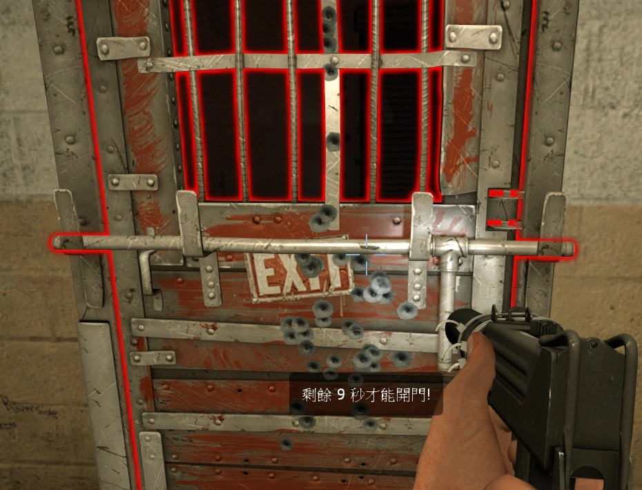

# Description | 內容
Start Saferoom door anti open + teleport survivor back to safe area when leaving out saferoom until certain time pass

> __Note__ <br/>
This plugin is private, Please contact [me](https://github.com/fbef0102/Game-Private_Plugin#私人插件列表-private-plugins-list)<br/>
此為私人插件, 請聯繫[本人](https://github.com/fbef0102/Game-Private_Plugin#私人插件列表-private-plugins-list)

* [Video | 影片展示](https://youtu.be/VdvQwpDcs1A)

* Image | 圖示
	* display timeleft when someone tries to open door
	> 顯示剩餘秒數
	<br/>

* Apply to | 適用於
```
L4D1
L4D2
```

* <details><summary>Changelog | 版本日誌</summary>

	* v2.2
</details>

* Require | 必要安裝
	1. [left4dhooks](https://forums.alliedmods.net/showthread.php?t=321696)

* Related Plugin | 相關插件
	* [lockdown_system-l4d2](https://github.com/fbef0102/L4D1_2-Plugins/tree/master/lockdown_system-l4d2): Locks Saferoom Door Until Someone Opens It.
		> 終點安全門鎖住直到時間結束

* <details><summary>ConVar | 指令</summary>

	* cfg/sourcemod/antisaferoomdooropen.cfg
	```php
    // Allow player to leave safe area after this amount of time. (useful if map doesn't have first saferoom door)
    l4d_anti_left_start_area_time "41"

    // Enable anti saferoom door close  plugin. [0-Disable,1-Enable]
    l4d_anti_saferoom_door_enable "1"

    // Enable anti saferoom door fade after open drop. [0-Disable,1-Enable]
    l4d_anti_saferoom_door_fade "1"

    // saferoom door anti open by survivor after this amount of time
    l4d_anti_saferoom_door_open "40"

    // If 1, Spawn player to safe area if player dies before door open
    l4d_anti_saferoom_door_open_spawn_player "1"

    // If 1, return player to safe area if player spawns or takes over bot before door open.
    l4d_anti_saferoom_door_return_player "1"

    // saferoom door auto open after this amount of time, even if survivors are still inside the safe room.
    l4d_anti_saferoom_force_start_time "60"

    // Turn on the plugin in these game modes. 0=All, 1=Coop, 2=Survival, 4=Versus, 8=Scavenge. Add numbers together.
    l4d_anti_saferoom_modes_tog "0"
	```
</details>

* <details><summary>Command | 命令</summary>

	None
</details>

- - - -
# 中文說明
起始安全室的安全門將會鎖住直到時間結束 + 沒有安全門的關卡一旦離開安全區域會傳送回起始安全區域

* 功能
	1. 自訂時間
	2. 安全門開啟後自動消失
	3. 沒有安全門的第一關也適用

* 原理
	* 第一個真人玩家載入伺服器後才計時