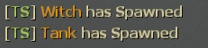

# Description | 內容
Sets a tank and witch spawn point on every map in coop mode

> __Note__ <br/>
This plugin is private, Please contact [me](https://github.com/fbef0102/Game-Private_Plugin#私人插件列表-private-plugins-list)<br/>
此為私人插件, 請聯繫[本人](https://github.com/fbef0102/Game-Private_Plugin#私人插件列表-private-plugins-list)

* Video | 影片展示
<br/>None

* Image | 圖示
	* display message when leaving out saferoom
	> 出門顯示Boss路程
	<br/>
	* display message when this plugin spawns tank/witch
	> Boss生成時顯示訊息
	<br/>

* Apply to | 適用於
```
L4D1
L4D2
```

* <details><summary>Changelog | 版本日誌</summary>

	* v1.3
</details>

* Require | 必要安裝
	1. [left4dhooks](https://forums.alliedmods.net/showthread.php?t=321696)
	2. [[INC] Multi Colors](https://forums.alliedmods.net/showthread.php?t=247770)
	3. [builtinvotes](https://github.com/L4D-Community/builtinvotes/actions)
	4. [[INC] readyup](https://github.com/fbef0102/Game-Private_Plugin/blob/main/left4dead2/scripting/include/readyup.inc)

* Optional | 輔助插件
1. [readyup](https://github.com/SirPlease/L4D2-Competitive-Rework/blob/master/addons/sourcemod/scripting/readyup.sp): Ready Plugin
	* 準備插件，讓Boss路程預先顯示在Ready Hud上面

* Related | 相關插件
1. [l4d_current_survivor_progress](https://github.com/fbef0102/L4D1_2-Plugins/tree/master/l4d_current_survivor_progress): Print survivor progress in flow percents
	* 使用指令顯示人類目前的路程

* Data Example | Data設定範例
	* data/mapinfo.txt
	```php
	"MapInfo"
	{
		"c1m2_streets"　//Map Name
		{
			"no_tank" "0" 		//Allow to spawn tank in this map
			"no_witch" "1"	 	//This map is prohibited to spawn witch
		}
		"c2m2_fairgrounds" //Map Name
		{
			"tank_ban_flow" //ban tank flow
			{
				"tank ban test" //Whatever name
				{
					"min"		"0" //0~20% is prohibited to spawn tank
					"max"		"20"
				}
				"tank ban test 2" //Whatever name
				{
					"min"		"50" //50~80% is prohibited to spawn tank
					"max"		"80"
				}
			}
			"witch_ban_flow" //ban witch flow
			{
				"witch ban test"　 //Whatever name
				{
					"min"		"50" //50~100% is prohibited to spawn tank
					"max"		"100"
				}
			}
		}
	}
	```

* <details><summary>ConVar | 指令</summary>

	* cfg/sourcemod/coopbosses_ifier.cfg
		```php
		// Minimum flow amount witches should avoid tank spawns by, by half the value given on either side of the tank spawn
		l4d_coop_boss_avoid_tank_spawn "10"

		// Disable Tank spawn in Final Map
		l4d_coop_boss_final_tank_spawn_disable "1"

		// Disable Witch spawn in Final Map
		l4d_coop_boss_final_witch_spawn_disable "1"

		// Max fraction of map flow for tank/witch spawn location in coop
		l4d_coop_boss_flow_max "80"

		// Min fraction of map flow for tank/witch spawn location in coop
		l4d_coop_boss_flow_min "20"

		// If 1, Allow for Easy Setup of the Boss Spawns (!voteboss)
		l4d_coop_boss_vote "1"

		// How many players at least to vote Boss Spawns.
		l4d_coop_boss_vote_need_player "4"

		// How many players at least to vote Boss Spawns.
		l4d_coop_boss_vote_need_player "4"
		```
</details>

* <details><summary>Command | 命令</summary>

	* **force witch spawn percent before leaving saferoom (Adm required: ADMFLAG_BAN)**
		```php
		sm_setwitch <number>
		```
	* **force tank spawn percent before leaving saferoom (Adm required: ADMFLAG_BAN)**
		```php
		sm_settank <number>
		```
	* **Display Spawn percent for boss**
		```php
		sm_boss
		sm_tank
		sm_witch
		sm_t
		```
	* **Let's vote to set those Boss Spawns!**
		```php
		sm_voteboss	<tank> <witch>
		sm_bossvote <tank> <witch>
		```
</details>

- - - -
# 中文說明
在戰役模式下每一張地圖挑選隨機路程生成一隻Tank與一個Witch

* 原理
	* 從"l4d_coop_boss_flow_max 80"與"l4d_coop_boss_flow_min 20"指令數值之間取隨機值，假設隨機取75，當人類路程走到75%路程，生成Tank
	* 從"l4d_coop_boss_flow_max 80"與"l4d_coop_boss_flow_min 20"指令數值之間取隨機值，假設隨機取40，當人類路程走到40%路程，生成Witch
	* 如果輔助文件禁止50 ~ 70%生成Boss，則隨機值不會取50 ~ 70

* 功能
	1. 可決定每一關是否該生成 Tank/Witch
	2. 可自行調整關卡，每個章節某些路段禁止生成生成 Tank/Witch
	3. 可自行調製整地圖最遠到哪與最近到哪生成 Tank/Witch

* Data設定範例
	* data/mapinfo.txt
	```php
	"MapInfo"
	{
		"c1m2_streets"　//地圖名
		{
			"no_tank" "0" 		//可在該地圖生成Tank
			"no_witch" "1"	 	//該地圖禁止生成Witch
		}
		"c2m2_fairgrounds" //地圖名
		{
			"tank_ban_flow" //禁止Tank生成的路段
			{
				"tank ban test" //隨便取名
				{
					"min"		"0" //0~20%禁止生成Tank
					"max"		"20"
				}
				"tank ban test 2" //隨便取名
				{
					"min"		"50" //50~80%禁止生成Tank
					"max"		"80"
				}
			}
			"witch_ban_flow" //禁止Witch生成的路段
			{
				"witch ban test"　 //隨便取名
				{
					"min"		"50" //50~100%禁止生成Witch
					"max"		"100"
				}
			}
		}
	}
	```
> 每一張地圖都有地形或地圖問題，<br/>
在某些路段生成Tank/Witch會導致Tank/Witch卡住或對人類來說過於艱難生存，<br/>
(譬如c1m1 Tank生在電梯事件之前一樓樓層無法上來，C2M3 雲霄飛車無限屍潮期間生成Tank)

* <details><summary>指令中文介紹 (點我展開)</summary>

	* cfg/sourcemod/coopbosses_ifier.cfg
		```php
		// Tank 附近前後10% (20除以2) 避開生成witch
		l4d_coop_boss_avoid_tank_spawn "10"

		// 如果為1，最後一關預設不生成Tank
		l4d_coop_boss_final_tank_spawn_disable "1"

		// 如果為1，最後一關預設不生成Witch
		l4d_coop_boss_final_witch_spawn_disable "1"

		// 最遠80%生成 Tank/witch
		l4d_coop_boss_flow_max "80"

		// 最近20%生成 Tank/witch
		l4d_coop_boss_flow_min "20"

		// If 1, 允許玩家打 !voteboss 發起投票決定Tank/Witch 路程
		l4d_coop_boss_vote "1"

		// 發起!voteboss投票所需的玩家數量 
		l4d_coop_boss_vote_need_player "4"
		```
</details>

* <details><summary>命令中文介紹 (點我展開)</summary>

	* **自己決定 witch 路程，請在出去安全室之前決定好**
		```php
		sm_setwitch <數字>
		```
	* **自己決定 tank 路程，請在出去安全室之前決定好**
		```php
		sm_settank <數字>
		```
	* **打印該回合 Tank/Witch 路程**
		```php
		sm_boss
		sm_tank
		sm_witch
		sm_t
		```
	* **投票決定Tank/Witch的路程 ，請在出去安全室之前決定好**
		```php
		sm_voteboss <數字> <數字>
		sm_bossvote <數字> <數字>
		```
</details>
