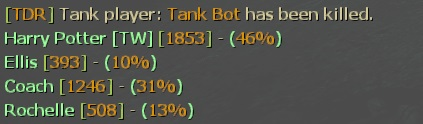

# Description | 內容
Displays Damage Information on Tank Death.

> __Note__ <br/>
This plugin is private, Please contact [me](https://github.com/fbef0102/Game-Private_Plugin#私人插件列表-private-plugins-list)<br/>
此為私人插件, 請聯繫[本人](https://github.com/fbef0102/Game-Private_Plugin#私人插件列表-private-plugins-list)

* Video | 影片展示
<br/>None

* Image | 圖示
	* example
	<br/>

* Apply to | 適用於
```
L4D1
L4D2
```

* <details><summary>Changelog | 版本日誌</summary>

	```php
	//Skyy @ 2012
	//foxhound27 @ 2019
	//Harry @ 2022
	```
	* v1.3
		* Remake Code
	    * More accurate damage done to tank

    * v1.1c
        * [Original Post by Skyy](https://forums.alliedmods.net/showthread.php?p=1677234)
</details>

* Require | 必要安裝
<br/>None

* Similar Plugin | 相似插件
	* [l4d2_assist](https://github.com/fbef0102/L4D1_2-Plugins/tree/master/l4d2_assist): Show damage done to S.I. by survivors
		> 每個特感死亡時顯示對特感傷害統計表

* <details><summary>ConVar | 指令</summary>

	None
</details>

* <details><summary>Command | 命令</summary>

	None
</details>

- - - -
# 中文說明
Tank死亡時顯示對Tank造成傷害統計表