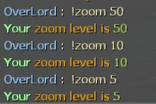

# Description | 內容
Everyone can change zoom level for snipers by command.

> __Note__ <br/>
This plugin is private, Please contact [me](https://github.com/fbef0102/Game-Private_Plugin#私人插件列表-private-plugins-list)<br/>
此為私人插件, 請聯繫[本人](https://github.com/fbef0102/Game-Private_Plugin#私人插件列表-private-plugins-list)

* [Video | 影片展示](https://youtu.be/RJzJAp-aWhI)

* Image | 圖示
	* Use command to change zoom level
    > 狙擊槍改變縮放級別
	<br/>

* Apply to | 適用於
```
L4D2
```

* <details><summary>Changelog | 版本日誌</summary>
    * v1.1
	    * Request by 壹梦
	    * Add cmd: sm_zoom

    * v0.0
	    * [By BHaType](https://forums.alliedmods.net/showthread.php?p=2719630)
</details>

* Require | 必要安裝
    <br/>None

* <details><summary>ConVar | 指令</summary>

    None
</details>

* <details><summary>Command | 命令</summary>
    
    * **Change Zoom Level**
		```php
        sm_zoom <number>
		```
</details>

- - - -
# 中文說明
玩家使用指令調整狙擊鏡的遠近範圍 (可以看得更遠)

* 原理
    * 狙擊鏡自行調整遠近範圍

* 功能
	1. 每個玩家使用命令調整自己的狙擊鏡

* <details><summary>指令中文介紹 (點我展開)</summary>

    * **狙擊槍改變縮放級別，指定數字，數字越小，看得越遠**
        ```php
        sm_zoom <數字>
        ```
</details>
