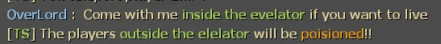

# Description | 內容
When someone presses the elevator button or enters the CEDA Trailer, a timer will display how many time left. If a player is not inside the evelator/CEDA Trailer, slay him

> __Note__ <br/>
This plugin is private, Please contact [me](https://github.com/fbef0102/Game-Private_Plugin#私人插件列表-private-plugins-list)<br/>
此為私人插件, 請聯繫[本人](https://github.com/fbef0102/Game-Private_Plugin#私人插件列表-private-plugins-list)

* [Video | 影片展示](https://youtu.be/B1oghdYb_gE)

* Image | 圖示
	* display message
	> 提示大家進去電梯否則中毒受傷
	<br/>
	* count down timer
	> 倒數計時
	<br/>

* Apply to | 適用於
```
L4D1
L4D2
```

* <details><summary>Changelog | 版本日誌</summary>

	* v1.0
		* Initial Release
</details>

* Require | 必要安裝
	1. [[INC] Multi Colors](https://forums.alliedmods.net/showthread.php?t=247770)

* Related Plugin | 相關插件
	1. [l4d_rescue_vehicle_leave_timer](https://github.com/fbef0102/L4D1_2-Plugins/tree/master/l4d_rescue_vehicle_leave_timer): When rescue vehicle arrived and a timer will display how many time left for vehicle leaving. If a player is not on rescue vehicle or zone, slay him
		> (公開) 救援來臨之後，未在時間內上救援飛機逃亡的玩家將處死

* <details><summary>ConVar | 指令</summary>

	* cfg/sourcemod/l4d_elevator_getin_timer.cfg
	```php
	// 0=Plugin off, 1=Plugin on.
	l4d_elevator_getin_timer_allow "1"

	// Changes how count down tumer hint displays. (0: Disable, 1:In chat, 2: In Hint Box, 3: In center text)
	l4d_elevator_getin_timer_announce_type "2"

	// Path to the Soundfile being played on each damaging Interval (Empty=Disable)
	l4d_elevator_getin_timer_damage_sound "player/survivor/voice/choke_5.wav"

	// If 1, Enable the Damage Shake 
	l4d_elevator_getin_timer_shake_enable "1"
	```
</details>

* <details><summary>Command | 命令</summary>
	
	None
</details>

* Data Example
	* data/l4d_elevator_info.txt
	```php
	"elevator"
	{
		"c1m1_hotel"	//map name
		{
			"num"		"1"		//total numbers of evelator in this map
			"1"
			{
				"button_name"				"elevator_button" //evelator button targetname (please do not modify)
				"trigger_multiple_hammerid"		"1227567" 	//evelator trigger multiple hammerid (please do not modify)
				"get_inside_time"			"30"		//a timer will display how many time left
				"outside_damage"			"10"		//cause the damage to players outside the evelator
				"message"				"elevator"	//info everyone this is evelator
			}
		}
		"c5m2_park"
		{
			"num"		"1"
			"1"
			{
				"ceda_trailer"				"1"			// CEDA Trailer
				"door_name"				"finale_cleanse_exit_door" // CEDA Trailer Exit door targetname (please do not modify)
				"trigger_multiple_hammerid"		"456409" 		//CEDA Trailer trigger multiple hammerid (please do not modify)
				"get_inside_time"			"50"	 		//a timer will display how many time left
				"outside_damage"			"10" 			//cause the damage to players outside the CEDA Trailer
				"message"				"CEDA Trailer" 		//info everyone this is CEDA Trailer
			}
		}
	}
	```

- - - -
# 中文說明
當有人按下電梯按鈕或是進入CEDA大拖車時，開始倒數計時，未在時間內進入電梯或CEDA大拖車的玩家將處死

* 原理
	* 總有傻B不進入電梯在外面閒晃，害得大家一直等待被特感打到滅團
	* 第一位玩家按下電梯按鈕時，開始倒數計時，等待全部玩家進入電梯內且電梯啟動之後才會停止倒數計時
	* 第一位玩家進入CEDA大拖車（教區第二關），開始倒數計時，等到末端門打開之後才會停止倒數計時
	* 當時間到之後，還在外面的玩家將處在中毒狀態，每秒受到傷害
	* 支援所有官方地圖
	* 三方圖不支援，請自行利用stripper_dump尋找地圖上的電梯或付錢

* 功能
	1. 可設置倒數計時秒數
	2. 可設置傷害
	3. 可設置不同位置的訊息提示
	4. 可設置中毒的音效
	5. 可設置中毒時螢幕搖晃

* Data設定範例
	* 文件位於data/l4d_elevator_info.txt
	```php
	"elevator"
	{
		"c1m1_hotel"	// 地圖名，必須一模一樣
		{
			"num"		"1"		// 該地圖電梯總數
			"1"
			{
				"button_name"				"elevator_button" 	// 電梯按鈕的專屬targetname (不能修改)
				"trigger_multiple_hammerid"		"1227567" 		// 電梯區域的專屬hammerid (不能修改)
				"get_inside_time"			"30"			// 倒數計時秒數
				"outside_damage"			"10"			// 每秒對電梯外的玩家造成的傷害
				"message"				"elevator"		// 通知所有人這是電梯 (可自行修改)
			}
		}
		"c5m2_park"
		{
			"num"		"1"
			"1"
			{
				"ceda_trailer"				"1"				// 這是CEDA拖車
				"door_name"				"finale_cleanse_exit_door"	// CEDA拖車末端門的專屬targetname (不能修改)
				"trigger_multiple_hammerid"		"456409" 			// CEDA拖車區域的專屬hammerid (不能修改)
				"get_inside_time"			"50"	 			// 倒數計時秒數
				"outside_damage"			"10" 				// 每秒對電梯CEDA拖車外的玩家造成的傷害
				"message"				"CEDA Trailer" 			// 通知所有人這是CEDA拖車 (可自行修改)
			}
		}
	}
	```
