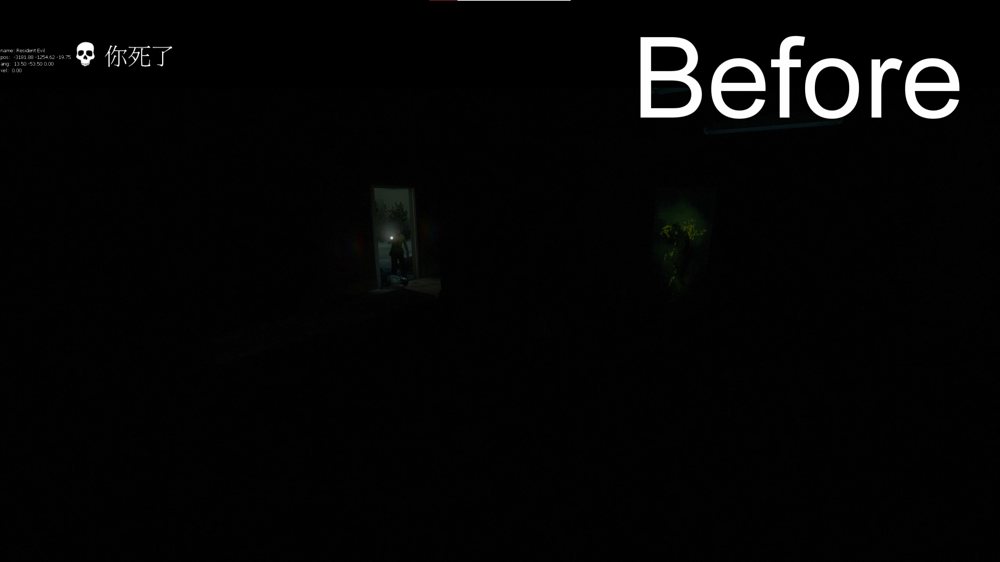

# Description | 內容
Attaches an extra flashlight to spectators and dead survivors.

> __Note__ <br/>
This plugin is private, Please contact [me](https://github.com/fbef0102/Game-Private_Plugin#私人插件列表-private-plugins-list)<br/>
此為私人插件, 請聯繫[本人](https://github.com/fbef0102/Game-Private_Plugin#私人插件列表-private-plugins-list)

* [Video | 影片展示](https://youtu.be/PWrf20wtx0Y)

* Image | 圖示
	* Before
	> 裝載插件之前
	<br/>
	* After
	> 裝載插件之後
	<br/>

* Apply to | 適用於
```
L4D1
L4D2
```

* Translation Support | 支援翻譯
```
English
繁體中文
简体中文
Russian
Spanish
```

* <details><summary>Changelog | 版本日誌</summary>

	* v1.0h
		* Remove unnecessary codes and cvars
		* Add Spectator/Dead Survivor Flashlight Only

	* 2.25
		* [Original Plugin By Silvers](https://forums.alliedmods.net/showthread.php?p=1606588)
</details>

* Require | 必要安裝
	1. [[INC] Multi Colors](https://forums.alliedmods.net/showthread.php?t=247770)

* Related Plugin | 相關插件
	1. [l4d2_spectating_cheat](https://github.com/fbef0102/L4D2-Plugins/tree/master/l4d2_spectating_cheat): A spectator who watching the survivor at first person view can now see the infected model glows though the wall
		> 旁觀者能看到特感的光圈，主要是用來更好的觀看體驗

* <details><summary>ConVar | 指令</summary>

	* cfg/sourcemod/l4d_flashlight_speconly.cfg
	```php
	// 0=Plugin off, 1=Plugin on.
	l4d_flashlight_speconly_allow "1"

	// Brightness of the light <10-1000> (changes Distance value).
	l4d_flashlight_speconly_bright "450.0"

	// The default light color. Three values between 0-255 separated by spaces. RGB Color255 - Red Green Blue.
	l4d_flashlight_speconly_colour "80 80 80"

	// Players with these flags may use the sm_lightspec command. (Empty = all).
	l4d_flashlight_speconly_flags ""

	// 0=Off, 1=Show intro message to players entering spectator or death.
	l4d_flashlight_speconly_hints "0"

	// 0=Let players set their flashlight color, 1=Force to cvar specified.
	l4d_flashlight_speconly_lock "0"

	// 0=Off, 1=Save client preferences for flashlight color and state.
	l4d_flashlight_speconly_save "1"
	```
</details>

* <details><summary>Command | 命令</summary>
	
	* **Toggle the attached spec flashlight. Usage: sm_lightspec [R G B|off|random|red|green|blue|purple|cyan|orange|white|pink|lime|maroon|teal|yellow|grey]**
		```php
		sm_lightspec
		```

	* **Opens the spec flashlight color menu.**
		```php
		sm_lightspec_menu
		```
</details>

- - - -
# 中文說明
給死亡玩家或旁觀者手電筒，照亮地圖

* 原理
	* 當倖存者玩家死亡時或切換到旁觀者，給予手電筒，只有該玩家能看光亮
	* 適合用於對抗模式的伺服器，旁觀者能看到黑暗房間內的情況
	* 適合用於戰役模式三方圖的伺服器，死亡玩家能在地圖上幫忙探路

* 功能
	1. 可設置特定權限的人士才能使用旁觀者手電筒
	2. 可設置手電筒預設的顏色
	3. 可設置手電筒光亮度
	4. 有命令能開關手電筒
