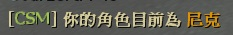
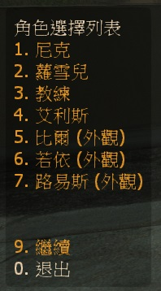

# Description | 內容
Allows players to change their L4D1/2 character or model in-game!

> __Note__ <br/>
This plugin is private, Please contact [me](https://github.com/fbef0102/Game-Private_Plugin#私人插件列表-private-plugins-list)<br/>
此為私人插件, 請聯繫[本人](https://github.com/fbef0102/Game-Private_Plugin#私人插件列表-private-plugins-list)

* [Video | 影片展示](https://youtu.be/C9xKKmD8KwU)

* Image | 圖示
	* display message
	> 訊息
	<br/>
	* display menu
	> CSM 角色選擇介面
	<br/>

* Apply to | 適用於
```
L4D1
L4D2
```

* Translation Support | 支援翻譯
```
English
繁體中文
简体中文
```

* <details><summary>Changelog | 版本日誌</summary>

	```php
	//mi123645 @ 2009 - 2010
	//Harry @ 2022
	```
	* v1.0h
		* Remake code
		* Remove unuseful cvars
		* Safely change character and model
		* Request by Yabi

	* 2.5a/b
		* [By mi123645](https://forums.alliedmods.net/showthread.php?t=107121)
</details>

* Require | 必要安裝
	1. [left4dhooks](https://forums.alliedmods.net/showthread.php?t=321696)
	2. [[INC] Multi Colors](https://forums.alliedmods.net/showthread.php?t=247770)

* Related Plugin | 相關插件
	1. [l4d2_vocalizebasedmodel](https://github.com/fbef0102/L4D2-Plugins/tree/master/l4d2_vocalizebasedmodel): Survivors will vocalize based on their model
		> (公開) 依照目前模組給予相對應的角色語音

* <details><summary>ConVar | 指令</summary>

	* cfg/sourcemod/l4d_h_csm.cfg
	```php
	// Players with these flags have access to open Character Select Menu (Empty = Everyone, -1: Nobody)
	l4d_h_csm_access_flag ""

	// Sets the number of times clients can change their character per round.
	l4d_h_csm_change_limit "9999"

	// 0=Plugin off, 1=Plugin on.
	l4d_h_csm_enable "1"

	// Changes how message displays. (0: Disable, 1:In chat, 2: In Hint Box, 3: In center text)
	l4d_h_csm_type "1"
	```
</details>

* <details><summary>Command | 命令</summary>
	
	None
</details>

* Notice
    * If you only change model only, charactor voice still not changed. To fix this problem, install [l4d2_vocalizebasedmodel](https://github.com/fbef0102/L4D2-Plugins/tree/master/l4d2_vocalizebasedmodel)

- - - -
# 中文說明
允許玩家在遊戲中更換一二代角色(外觀, 手 和 語音) 或是模組(只有外觀)

* 原理
	* 此為CSM插件重製版，輸入!csm打開角色選擇介面
	* 一代地圖上玩家可以切換一代角色，不能換二代角色，只可切換二代角色外觀模組
	* 二代地圖上玩家可以切換二代角色，不能換一代角色，只可切換一代角色外觀模組
	* 三方圖自動判定主角為一代還是二代角色

* 注意事項
    * 選擇更換模組只有外觀改變，語音還是原本的角色，如果要修正語音請安裝[l4d2_vocalizebasedmodel](https://github.com/fbef0102/L4D2-Plugins/tree/master/l4d2_vocalizebasedmodel)

* 功能
	1. 可設置特定權限的人士才能使用CSM角色選擇介面
	2. 管理員幫真人玩家更換角色或模組
	3. 可設置更換次數限制
