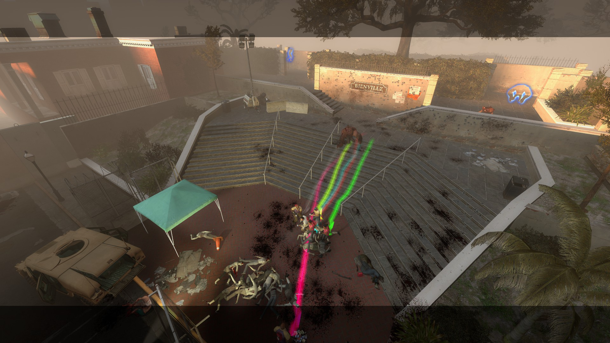

# Description | 內容
l4d player tail effect (prop_dynamic_override)

> __Note__ <br/>
This plugin is private, Please contact [me](https://github.com/fbef0102/Game-Private_Plugin#私人插件列表-private-plugins-list)<br/>
此為私人插件, 請聯繫[本人](https://github.com/fbef0102/Game-Private_Plugin#私人插件列表-private-plugins-list)

* [Video | 影片展示](https://youtu.be/tUjLWu1Hg2w)

* Image | 圖示
	* image 1
	<br/>
	* image 2
	<br/>
	* image 3
	<br/>
	* image 4
	<br/>

* Apply to | 適用於
```
L4D1
L4D2
```

* <details><summary>Changelog | 版本日誌</summary>
	* v1.2
	    * Original Request by 壹梦
</details>

* Require | 必要安裝
	1. [left4dhooks](https://forums.alliedmods.net/showthread.php?t=321696)
	2. [[[INC] Multi Colors](https://forums.alliedmods.net/showthread.php?t=247770)

* Similar Plugin | 相似插件
	1. [l4d_player_spritetrail](https://github.com/fbef0102/Game-Private_Plugin/tree/main/l4d_player_spritetrail)
	> 一樣式尾巴特效，看自己喜歡用哪一種

* Note | 注意事項
	* l4d_player_tail_lifetime must greater than or equal to l4d_player_tail_changecolor_interval
	* Tail could temporarily disappear if player stop moving

* <details><summary>ConVar | 指令</summary>

	* cfg/sourcemod/l4d_player_tail.cfg
	```php
	// Players with these flags have access to have tail effect and use tail command. (Empty = Everyone, -1: Nobody)
	l4d_player_tail_access_flag ""

	// If 1, Enable Tail effect for Bot Infected
	l4d_player_tail_bot_infected_enable "1"

	// If 1, Enable Tail effect for Bot Survivor
	l4d_player_tail_bot_survivor_enable "1"

	// Time interval to change tail color to random (0=Don't change color)
	l4d_player_tail_changecolor_interval "4.0"

	// The default tail color. Three values between 0-255 separated by spaces. RGB Color255 - Red Green Blue. [-1 -1 -1: Random]
	l4d_player_tail_color "-1 -1 -1"

	// Transparency of the tail (10-255).
	l4d_player_tail_color_alpha "100"

	// 1=Enable Tail effect for everyone default? [1-Enable/0-Disable]
	l4d_player_tail_default_value "1"

	// The width of the beam when it has full expanded.
	l4d_player_tail_endwidth "1.0"

	// The default attached tail height
	l4d_player_tail_height "5.0"

	// How long the beam is shown. (Tail could temporarily disappear if player stop moving)
	l4d_player_tail_lifetime "5.0"

	// The width of the beam to the beginning.
	l4d_player_tail_startwidth "10.0"
	```
</details>

* <details><summary>Command | 命令</summary>

	* **Toggle the attached tailed. Usage: sm_tail [R G B|off|random|red|green|blue|purple|cyan|orange|white|pink|lime|maroon|teal|yellow|grey]**
		```php
		sm_tail
		sm_tails
		sm_harrypotter
		sm_hy
		```
</details>

- - - -
# 中文說明
玩家走路，會有尾巴特效 (使用物件: prop_dynamic_override)

* 效果
	* 線條色塊，逐漸變色

* 功能
	1. 可自定義尾巴特效的寬度，消逝時間
	2. 玩家可打命令自行決定尾巴的顏色
	3. 尾巴過一段時間會隨機變色

* 注意事項
	* "l4d_player_tail_lifetime" 指令數值必須大於或等於 "l4d_player_tail_changecolor_interval" 指令數值
	* 如果倖存者不動，尾巴特效會短暫消失，建議"l4d_player_tail_lifetime" 指令數值不要設置太高

* <details><summary>命令中文介紹 (點我展開)</summary>

	* **!tail <顏色名稱或R G B>. 顏色: red, green, blue, purple, orange, yellow, white. 或是 3 個 0-255 RGB之值. 譬如: !tail red 或是 !tail 255 0 0**
		```php
		sm_tail
		sm_tails
		sm_harrypotter
		sm_hy
		```
</details>
	

