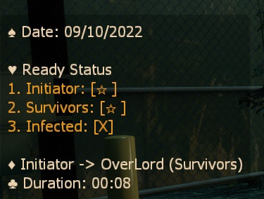

# Description | 內容
Pause plugin

> __Note__ <br/>
This plugin is private, Please contact [me](https://github.com/fbef0102/Game-Private_Plugin#私人插件列表-private-plugins-list)<br/>
此為私人插件, 請聯繫[本人](https://github.com/fbef0102/Game-Private_Plugin#私人插件列表-private-plugins-list)

* [Video | 影片展示](https://youtu.be/ljO6RGqQguk)

* Image | 圖示
	* Pause hud
	> 準備介面
	<br/>
	* Message
	> 顯示訊息
	<br/>

* Apply to | 適用於
```
L4D1 Coop/Versus
L4D2 Coop/Versus/Realism
```

* <details><summary>Changelog | 版本日誌</summary>

	* v1.0h
	    * Request by Anzu
		* Individual plugin

	* 6.7
	    * [Original Work by CanadaRox, Sir, Forgetest](https://github.com/SirPlease/L4D2-Competitive-Rework/blob/master/addons/sourcemod/scripting/pause.sp)
</details>

* Require | 必要安裝
	1. [left4dhooks](https://forums.alliedmods.net/showthread.php?t=321696)
	2. [[INC] Multi Colors](https://forums.alliedmods.net/showthread.php?t=247770)
	3. [builtinvotes](https://github.com/L4D-Community/builtinvotes/actions)
	4. [[INC] readyup](https://github.com/fbef0102/Game-Private_Plugin/blob/main/left4dead2/scripting/include/readyup.inc)

* <details><summary>ConVar | 指令</summary>

	* cfg/sourcemod/pause.cfg
		```php
		// Enable beep on unpause
		l4d_pause_blips "1"

		// Number of seconds to count down before the round goes live.
		l4d_pause_delay "3"

		// Require or not the pause initiator should ready before unpausing the game
		sm_initiatorready "1"

		// Delay to apply before a pause happens.  Could be used to prevent Tactical Pauses
		sm_pausedelay "0"
		```
</details>

* <details><summary>Command | 命令</summary>

	* **Pauses the game**
		```php
		sm_pause
		sm_p
		```
	* **Marks your team as ready for an unpause**
		```php
		sm_unpause
		sm_up
		sm_ready
		sm_r
		sm_unready
		sm_nr
		```

	* **Toggles your team's ready status**
		```php
		sm_toggleready
		```

	* **Hides the pause panel so other menus can be seen**
		```php
		sm_show
		```

	* **Shows a hidden pause panel**
		```php
		sm_hide
		```

	* **Pauses the game and only allows admins to unpause (Adm required: ADMFLAG_BAN)**
		```php
		sm_fp
		```

	* **Unpauses the game regardless of team ready status. Must be used to unpause admin pauses (Adm required: ADMFLAG_BAN)**
		```php
		sm_fs
		```
</details>

- - - -
# 中文說明
暫停遊戲的插件

* 原理
	* 當有玩家有急事需要暫停遊戲需求時可以輸入!pause，遊戲就會被強制暫停
	* 玩家幫自己隊伍準備好之後(戰役下倖存者陣營，對抗下特感陣營＋倖存者陣營)，遊戲就會解除暫停
	* 還有陣營沒有準備好，那遊戲就一直暫停下去

* 功能
	1. 可設置解除暫停的倒數秒數
	2. 管理員可以強制暫停，也只有管理員能解除暫停
